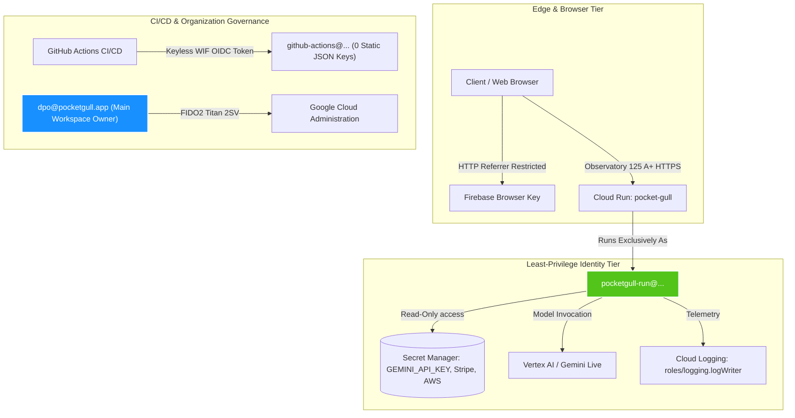

# Google Cloud Security & IAM Architecture Guard

This skill guides agents in designing, verifying, and maintaining a top-tier **100 / 100 (Grade A+)** Google Cloud Security and IAM posture across Cloud Run microservices, service accounts, Secret Manager, API keys, and deployment pipelines.

## Benchmark Frameworks Grounding
1. **[0] Shared Responsibility & Shared Fate**: Google secures infrastructure, hardware roots of trust (Titan silicon), and network fabric. The customer owns identity, least privilege, application boundaries, and egress controls.
2. **[1] IAM Service Account Best Practices**: Strict principle of least privilege. Prohibition of primitive `roles/editor` or `roles/owner` on compute service accounts. Mandatory dedicated runtime service accounts per workload.
3. **[2] Service Account Key Rotation & Keyless Auth**: Elimination of user-managed static JSON keys. 100% Keyless Workload Identity Federation (WIF) and short-lived credentials.
4. **[3] API Key Restrictions**: Two-tier hardening: strict API target restrictions (single-purpose per key), HTTP referrer restrictions on browser keys, and dynamic Secret Manager encapsulation for backend LLM credentials. Prompt revocation of superseded/rotated keys.
5. **[4] 2-Step Verification & Titan Hardware Security**: Enforcement of phishing-resistant FIDO2 / WebAuthn physical security keys (Titan/YubiKey) on all project owner and administrative identities.
6. **[5] Architecture Framework: Security Pillar**: Defense-in-depth spanning Identity, Compute & Workload Security (non-root containers, SLSA provenance), Data Privacy (HIPAA Safe Harbor), and Network Egress.
7. **[6] Landing Zone Security Architecture**: Resource hierarchy, centralized logging, and Organization Policies (`iam.disableServiceAccountKeyCreation`, `storage.uniformBucketLevelAccess`, `compute.skipDefaultNetworkCreation`).

---

## The 100 / 100 GCP IAM Architecture Standard



### Core Invariants

1. **Workload Service Account Isolation**:
   - Cloud Run services MUST always deploy with `--service-account=pocketgull-run@${TARGET_PROJECT}.iam.gserviceaccount.com`.
   - Never omit `--service-account`, which causes Cloud Run to default to the over-privileged Compute Engine service account.
   - The default compute service account must have zero primitive `roles/editor`, `roles/run.admin`, or `roles/bigquery.admin` privileges.

2. **100% Keyless Workload Identity Federation (WIF)**:
   - CI/CD pipelines (GitHub Actions) MUST authenticate strictly via Keyless Workload Identity Federation (`google-github-actions/auth@v3`).
   - Zero static user-managed JSON service account keys are permitted in repository secrets, developer filesystems, or GCP IAM.
   - Verification command:
     `gcloud iam service-accounts keys list --iam-account=<SA_EMAIL> --managed-by=user` (must return 0 items).

3. **Two-Tier API Key Scoping**:
   - Every Google Cloud API key must enforce explicit `restrictions.apiTargets` (e.g. only `generativelanguage.googleapis.com` or `aiplatform.googleapis.com`).
   - Browser-facing API keys MUST enforce `browserKeyRestrictions.allowedReferrers` (e.g. `https://pocketgull.app/*`).
   - Server-side and LLM keys MUST be stored in Google Cloud Secret Manager and accessed dynamically in memory (`SecretManagerServiceClient`) rather than baked into containers or exposed in environment manifests.
   - Any rotated API key must be immediately deleted once the successor key is propagated.

4. **Sovereign Organization Ownership**:
   - The primary organization workspace identity (`dpo@pocketgull.app`) must be maintained as active `roles/owner` with comprehensive administrative suites (`aiplatform.admin`, `bigquery.admin`, `storage.admin`, `run.admin`, `secretmanager.admin`).

---

## Automated Verification & Gating

Agents must run the automated GCP IAM posture audit before concluding cloud infrastructure turns or executing deployments:

```powershell
npm run gcp:audit
```

Script source: [`scripts/audit-gcp-security-posture.mjs`](file:///c:/Users/philg/Pocketgull/pocketgull/scripts/audit-gcp-security-posture.mjs).  
The audit automatically evaluates the 5 critical checks and enforces a minimum Grade A+ score of 100/100.
