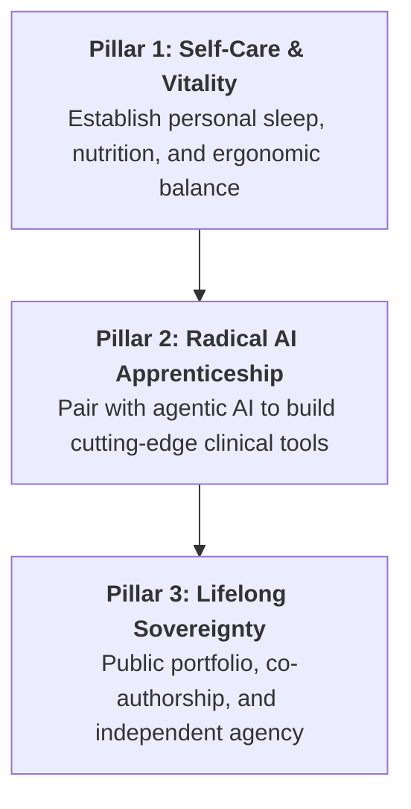

# 🎓 The Pocket-Gull Apprenticeship & Fellowship Charter

> **Learn, Build, Heal: A Life-Changing Apprenticeship in Healthcare AI & Personal Vitality.**

---

## 🌟 The 3 Pillars of the Fellowship

---

## 📋 Week 1: "Live the Medicine" Onboarding

Before writing your first line of production code, you will experience the platform as a patient and learner:

1. **Establish Your Personal Baseline**:
   * Use Pocket-Gull’s **Precision Nutrition & Chronobiology Calculator** to map your circadian eating windows and optimal sleep routines.
   * Configure your developer workstation for ergonomic neutral posture to protect your spine and wrists.
2. **Launch Your Cloud Studio**:
   * Open the repository in GitHub Codespaces with 1-click. Zero local toolchain headaches.
   * Run the test suite: `npx vitest run` (watch 660+ tests pass in seconds).
3. **Your First Pair Session**:
   * Pair with senior maintainers using Antigravity / Gemini 2.5 Flash to solve your first bite-sized clinical issue.

---

## 🚀 The Fellowship Tracks

| Milestone | Deliverables | Skills Acquired |
| :--- | :--- | :--- |
| **Phase 1: Evidence & Grounding** | Add 3 landmark clinical trials to Oxford CEBM Grader | Oxford CEBM, Cochrane RoB 2, PubMed API |
| **Phase 2: Edge Intelligence** | Build an interactive WebGPU / WASM symptom scorer | WebGPU shaders, Angular Signals, WASM |
| **Phase 3: Deep Imaging Vision** | Train an RSNA Knee anomaly slice detector on Kaggle | PyTorch, GroupKFold, DICOM, ASL Loss |
| **Phase 4: Capstone & Release** | Ship an ONC HTI-2 certified clinical decision tool | OpenAPI 3.1, FHIR R4, Cloud Run, CI/CD |

---

## 🤝 Community & Mentorship Pledge

* **Psychological Safety**: There are no silly questions. Every complex architecture is broken down with patience and Socratic teaching.
* **Celebration of Flourishing**: We celebrate taking time off, resting, and recovering just as enthusiastically as we celebrate shipping a feature.
* **Direct Micro-Stipends**: As you complete fellowship milestones, micro-grants are disbursed directly to you via Stripe or GitHub Sponsors.

---

### Ready to Begin?
Open a discussion under [GitHub Discussions](https://github.com/pocketgull-app/pocketgull/discussions) or reach out to **`fellowship@pocketgull.com`**!
