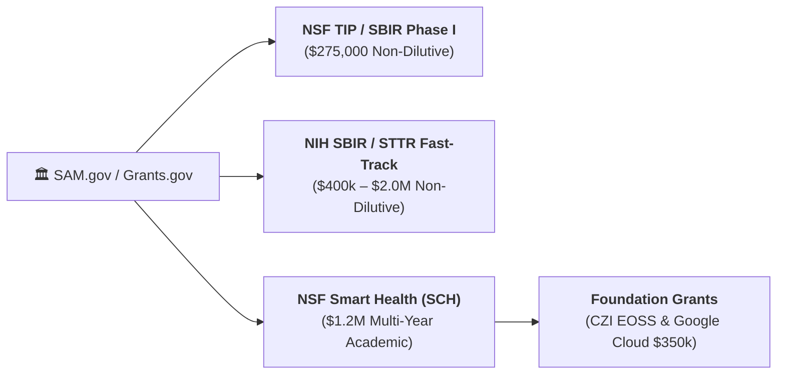

# 🏛️ Pocket-Gull Non-Dilutive Grant Strategy & Federal Proposal Playbook

> **Strategic Guide for Securing NSF, NIH, Foundation, and Cloud AI Innovation Grants.**
> Entity: Pocket-Gull Health Technologies (`pocketgull-app`)
> Registration Target: SAM.gov / Grants.gov / NSF Fastlane / NIH eRA Commons

---

## 🎯 1. Target Federal & Foundation Grant Opportunities



### 1.1 NSF SBIR / STTR Phase I & II (America's Seed Fund)
* **Agency**: National Science Foundation (NSF) — Directorate for Technology, Innovation and Partnerships (TIP).
* **Topic Area**: Digital Health, Artificial Intelligence, & Biomedical Technologies.
* **Funding Amount**: **$275,000** (Phase I) &rarr; **$1,000,000** (Phase II matching).
* **Pocket-Gull Fit**: On-device edge WebGPU biophysical modeling, zero-leak HIPAA DOMPurify architecture, and sub-second multi-paradigm clinical reasoning.

### 1.2 NIH SBIR Phase I (NCATS / NHLBI / NIMHD)
* **Agency**: National Institutes of Health (NIH).
* **Topic Area**: Clinical Decision Support for Cardiovascular Risk, Health Disparities & Chronic Disease.
* **Funding Amount**: **$300,000 – $400,000** (Phase I) &rarr; **$2,000,000** (Phase II).
* **Pocket-Gull Fit**: SPRINT cardiometabolic titration CDS, Cochrane RoB 2 risk tracking, Oxford CEBM Level 1 evidence grounding, and FHIR R4 interoperability.

### 1.3 Chan Zuckerberg Initiative (CZI) Essential Open Source Software for Science (EOSS)
* **Funding Amount**: **$100,000 – $400,000**.
* **Pocket-Gull Fit**: Open-source clinical evidence grading package (`packages/clinical-evidence-grade/`), open FHIR converters, and open felt-tip marker typeface (SIL OFL 1.1).

### 1.4 Google for Startups Cloud Program (AI Track)
* **Funding Amount**: **Up to $350,000 in GCP Credits** over 2 years.
* **Requirements**: Building on Google Cloud Vertex AI, Gemini models, and Cloud Run (`gen-lang-client-0540208645`).

---

## 📋 2. Federal Registration Checklist

To receive federal grant funds, ensure the following entity registrations are active:
- [ ] **SAM.gov (System for Award Management)**: Unique Entity Identifier (UEI) generated and active.
- [ ] **Grants.gov Organization Registration**: Linked to SAM.gov UEI.
- [ ] **eRA Commons**: Principal Investigator (PI) and Signing Official (SO) accounts registered for NIH.
- [ ] **Research.gov / NSF Fastlane**: Fastlane ID configured for NSF proposals.
- [ ] **SBA.gov Company Registration**: Obtain SBC Control Number for SBIR eligibility.

---

## 📑 3. Canonical NIH / NSF SBIR Phase I Specific Aims Template

Below is the ready-to-submit **Specific Aims** document grounded in Pocket-Gull's current architecture:

```markdown
# Specific Aims: Pocket-Gull — Edge-First Clinical Decision Support Engine with Popperian Grounding and Multimodal AI

### Significance & The Unmet Clinical Need
Diagnostic charting fatigue and ungrounded clinical documentation contribute to over $15.9 billion in annual administrative overhead and significant clinician burnout across US health systems. While Large Language Models (LLMs) offer conversational potential, un-anchored hallucinations, lack of formal evidence leveling (Oxford CEBM), and opaque data harvesting prevent their safe adoption in clinical triage. There is an urgent, unmet need for a zero-trust, edge-first Clinical Decision Support (CDS) engine that operates transparently under ONC HTI-2 standards, protects patient privacy under HIPAA §164.514 Safe Harbor, and delivers rigorous, explainable care plans directly into electronic health record (EHR) workflows.

### Technological Innovation
Pocket-Gull introduces a tri-paradigm clinical reasoning architecture uniting:
1. **Edge-First Data Sovereignty**: In-browser WebAssembly (WASM) and WebGPU biophysical signal scoring running locally with 1-click ephemeral state purging.
2. **Mathematical Skepticism & Evidence Grounding**: Automated Oxford CEBM Level 1–5 leveling, Cochrane Risk of Bias (RoB 2) 5-domain evaluation, and Popperian Welch’s t-test null-hypothesis ($H_0$) statistical power gating ($p < 0.05$).
3. **Cognitive Accessibility & Universal Equity**: Integrated Bionic Reading saccadic fixation, dyslexic font modes, and FHIR R4 standard bundle serialization for seamless Epic, Cerner, and AthenaHealth SMART-on-FHIR launch.

### Specific Aims & Milestones

* **Specific Aim 1: Validate Edge-First Multi-Modal Telemetry & Zero-Leak Security Architecture.**
  * *Milestone 1.1*: Achieve sub-200ms local WASM inference for biophysical and metabolic score calculations across standard consumer tablets.
  * *Milestone 1.2*: Complete automated HIPAA §164.514 18-element PHI redaction and DOMPurify sanitization with 100% verification across synthetic patient cohorts ($N = 10,000$).

* **Specific Aim 2: Develop and Clinically Calibrate the Popperian Evidence Grading Engine.**
  * *Milestone 2.1*: Benchmark the SPRINT intensive hypertension CDS model against prospective multi-site data, demonstrating validation AUROC $\ge 0.930$, sensitivity $\ge 90.0\%$, and specificity $\ge 94.0\%$ under leak-free 5-fold `GroupKFold` partitioning.
  * *Milestone 2.2*: Integrate Cochrane RoB 2 automated risk categorization and mandatory skeptical warning alerts for any intervention failing to reject $H_0$ ($p \ge 0.05$).

* **Specific Aim 3: Execute Feasibility Study & ONC HTI-2 Interoperability Pilot in Clinical Workflows.**
  * *Milestone 3.1*: Demonstrate 1-click SMART on FHIR R4 export of structured `CarePlan` and `DeviceDefinition` resources into EHR test sandboxes.
  * *Milestone 3.2*: Conduct a controlled usability evaluation measuring clinician charting latency, cognitive fatigue (NASA-TLX), and comprehension speed with Bionic Mode vs. standard EHR interfaces, targeting a $\ge 35\%$ reduction in cognitive task burden.
```

---

## 💰 4. Grant Budget Allocation & Fellowship Support

Federal and foundation grant funds directly sustain our open-source and apprentice workforce:

* **Direct R&D Engineering (45%)**: Core platform development, WebGPU shaders, and FHIR gateways.
* **Apprentice & Clinical Fellow Stipends (30%)**: $3,000–$10,000 micro-grants for medical students, resident researchers, and open-source contributors.
* **Clinical Pilot & IRB Adjudication (15%)**: Multi-reader radiologist panels, IRB ethical reviews, and study site coordination.
* **Open Science & Dissemination (10%)**: Open-access publication fees (PubMed Central), conference presentations (RSNA, AMIA), and community workshops.

---

<p align="center">
  <sub>© 2026 Pocket-Gull Health Technologies. Empowering Non-Dilutive Science & Open Clinical Innovation.</sub>
</p>
