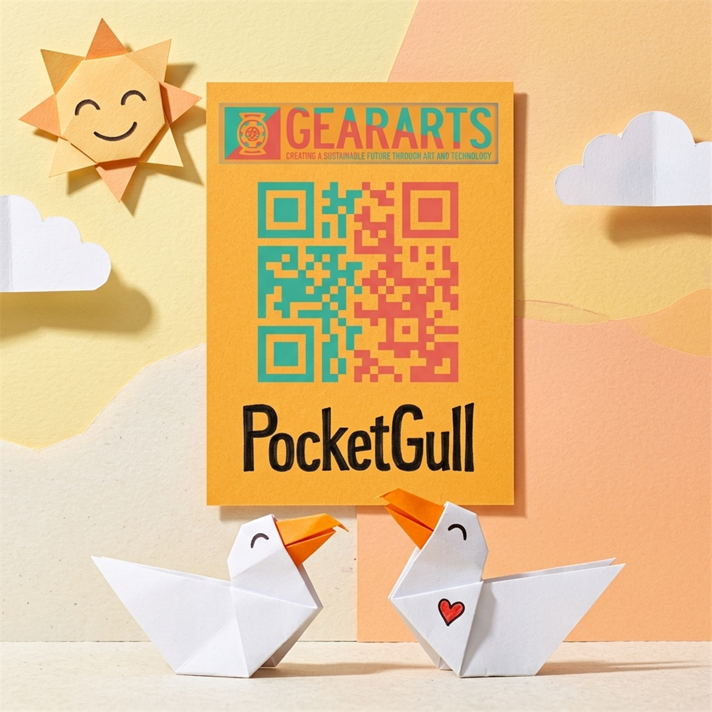
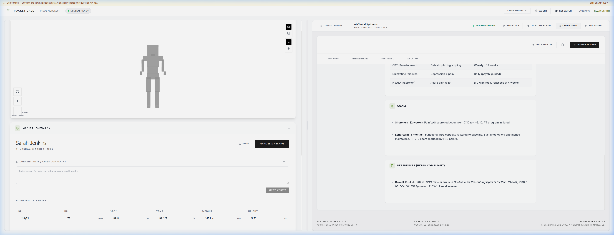
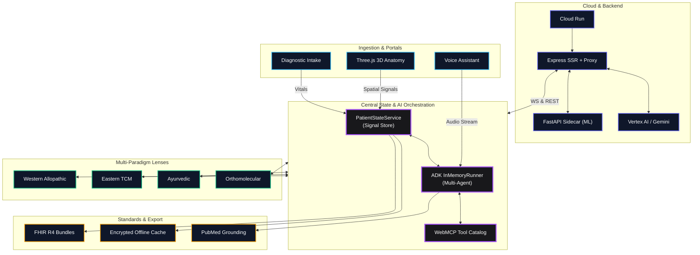

<p align="center">
  
</p>

<h1 align="center">Pocket Gull</h1>

<p align="center">
  <strong>Aerial Perspective for the Clinical Ocean</strong><br>
  Real-time Care Plan Strategy & Live AI Consult Engine powered by Google Gemini
</p>

<p align="center">
  <a href="https://pocketgull.app"></a>
  <a href="LICENSE"></a>
  
  <a href="https://github.com/pocketgull-app/pocketgull/actions/workflows/deploy.yml"></a>
  <a href="https://github.com/pocketgull-app/pocketgull/actions/workflows/codeql-analysis.yml"></a>
</p>

<p align="center">
  
  
  
  
  <a href="https://bestpractices.coreinfrastructure.org/projects/13644"></a>
  <a href="https://securityscorecards.dev/viewer/?uri=github.com/pocketgull-app/pocketgull"></a>
  <a href="https://github.com/pocketgull-app/pocketgull"></a>
  <a href="https://doi.org/10.5281/zenodo.20647514"></a>
  <a href="https://orcid.org/0009-0008-1372-5381"></a>
</p>

---

## What is Pocket Gull?

**Pocket Gull** gives practitioners the *gull's eye view* — the ability to rise above a turbulent sea of clinical data and see the clear, actionable patterns beneath.

It is a **living clinical intelligence platform** that synthesizes multimodal inputs — 3D spatial anatomy, bi-directional voice dictation, and standardized assessment instruments — into structured, evidence-grounded care strategies. Each care plan is examined simultaneously through **Western Allopathic**, **Eastern TCM**, and **Ayurvedic** paradigms, with AI reasoning powered by **Google Gemini**.

<p align="center">
  
</p>

---

## Core Capabilities

### 🧠 AI & Multi-Agent Orchestration

| Capability | Implementation |
|:---|:---|
| **Multi-Agent Reasoning** | Google ADK `InMemoryRunner` with specialized `LlmAgent` experts maintaining patient context memory |
| **Dynamic Expert Routing** | Pathways-inspired MoE router activating specialized sub-networks (`gulliver-core`, `acoustic-sidecar`, `sibi-bridge`, `dicom-spatial-shader`) |
| **Voice Consult** | Full-duplex audio streaming via Web Speech API + Express WebSocket proxy with client-side barge-in cancellation |
| **Evidence Grounding** | Real-time PubMed E-utilities and Google Programmable Search for literature-anchored recommendations |
| **Edge Inference** | WebGPU on-device MedGemma / PubGemma routing for offline and latency-sensitive workloads |

### 📐 3D Spatial Anatomy

- **Procedural skeletal & organ viewer** — Three.js geometry with severity-mapped particle systems
- **Anatomical search with camera tracking** — Fuzzy search bar that smoothly interpolates WebGL camera to targeted organs
- **Raycast tooltips & data cards** — Hover for paradigm badges and pain scores; click for slider input overlays
- **Method of Loci memory palace** — Anchors clinical consult nodes to 3D spatial coordinates for visual recall

### 🔬 Specialized Clinical Decision Support (CDS) & Research Super-Suite

Integrated interactive diagnostic tools accessible via the unified **Clinical Tool Workbench**:

| Tool / Module | Clinical Domain | Core Mechanism & Methodology | Standards & Output |
|:---|:---|:---|:---|
| **🛡️ RxGuard PGx & Botanicals** | Pharmacogenomics & Safety | CPIC allele phenotyping (`CYP2D6`, `CYP2C19`, `SLCO1B1`) + Tri-Paradigm botanical interaction matrix | CPIC Level A/B, FDA Table of PGx Biomarkers |
| **📈 BioTrajectory Velocity** | Predictive Nephrology & Vitals | First-derivative rate-of-change ($\frac{d[\text{Biomarker}]}{dt}$) detecting stealth organ decay ($\Delta \ge 15\%/\text{yr}$) | Gompertz-Makeham organ resilience curves |
| **🔬 TrialFinder Matcher** | Clinical Trial Recruitment | Geocoded patient matching against active NIH ClinicalTrials.gov protocols | FHIR R4 `ResearchStudy` referral bundle |
| **💬 SMS Compass Bridge** | Health Equity & Telehealth | Natural language parser converting 8th-grade SMS text messages to clinical telemetry without app downloads | Direct FHIR R4 `Observation` serialization |
| **🎯 DxRadar Socratic Engine** | Diagnostic Decision Support | Socratic "Don't Miss" secondary cause differential radar with Bayesian nomograms ($LR^+, LR^-$) | Popperian $H_0$ ruling-out lab order sets |
| **🧪 N-of-1 Experiment Engine** | Single-Case Clinical Trials | 56-day randomized ABAB crossover trial designer with 14-day washout intervals | Bayesian posterior superiority ($P > 95\%$), Cohen's $d$ |
| **🎙️ Ambient Clinical Scribe** | Ambient Medical Scribing | Multi-modal dialogue transcription synthesizing 4-quadrant structured SOAP encounter notes | ICD-10 (`I10`), SNOMED-CT (`38341003`), FHIR `Encounter` |
| **📽️ Grand Rounds & CARE Suite** | Academic Presentation | 1-click 7-slide Grand Rounds presentation deck and CARE Guidelines-compliant Case Report Markdown | William Caslon typography, Google Docs & Word export |

### 🩺 Multi-Paradigm Clinical Lenses

| Lens | Focus |
|:---|:---|
| **🩺 Western Allopathic** | ICD-10/SNOMED coding, CMP panels (Troponin, ALT/AST, eGFR), lab workups, monitoring protocols |
| **🌿 Eastern TCM** | Zang-Fu Qi patterns, Ba Gang classification, tongue/pulse matrix, Jing-Luo meridian mapping |
| **🧘 Ayurvedic** | Tridosha balance (Vata/Pitta/Kapha), Agni metabolic fire types, Sushumna chakra visualization |
| **🧪 Orthomolecular** | Biochemical marker extraction (Mg, D3, B12, Zn) into glassmorphic nutrient matrix |

### 📋 10 Standardized Assessment Instruments

Built-in validated clinical instruments integrated directly into patient state:

| Instrument | Standard | Range | Purpose |
|:---|:---|:---:|:---|
| PHQ-9 | LOINC `44261-6` | 0–27 | Depression severity |
| GAD-7 | LOINC `69725-0` | 0–21 | Generalized anxiety |
| ISI | LOINC `86095-7` | 0–28 | Insomnia severity |
| C-SSRS | LOINC `84411-8` | 0–16 | Suicide risk screening with 988 Lifeline routing |
| ROS-14 | LOINC `69742-5` | 14 systems | Comprehensive review of systems |
| PHQ-15 | LOINC `81675-1` | 0–30 | Somatic symptom scale |
| PRAPARE | LOINC `93304-4` | 5 vectors | Social determinants of health (SDOH) |
| Ayurveda | — | 6 vectors | Tridosha inventory |
| TCM Shi Wen | — | 6 vectors | Ba Gang Qi/Yin/Yang patterns |
| GROW_THYSELF | — | 0–10 | Life sovereignty & epigenetic vitality |

### 🎨 5 Health Literacy Personas

Users can toggle between cognitive writing styles:

1. **🔬 Clinical Allopathic** — Formal ICD-10, SNOMED, and PubMed citations
2. **🌳 Arborist Redwood** — Body systems as dendrochronology and sap velocity
3. **🏎️ Garage Mechanic** — V8 engine chassis logs and OBD-II DTC codes
4. **🎩 Extraordinary Gentleman** — Victorian steampunk expedition memoirs
5. **✨ Inspirational Muse** — Epic symphony with 528 Hz Solfeggio frequencies

Plus **4 adaptive reading modes**: Classic Literary, Bionic Speed, Dyslexic Accessible (OpenDyslexic), and Audiobook Narrator.

### 🚨 Emergency Good Samaritan Mode

Offline override mode for emergency field care:

- **110 BPM chest-compression metronome** with BLS safety-gated AI
- **FHIR-compliant EMT QR code** serialization for first responder handoff
- **Geo-Sentinel outbreak viewpoint deck** — WHO, PAHO, and CDC surveillance modes
- **Global telemetry suppression** — all network calls disabled for offline triage

### 🎨 Dieter Rams Design System

Adheres to *Weniger, aber besser* (less, but better) with WCAG 2.1 AA/AAA accessibility:

- **13+ curated themes** — Rice Paper Washi, Raw Hemp, Carrara Marble, Dark Obsidian, Madame Curie Lab
- **4-level progressive disclosure** — idle view → drill-down drawer → prescription state cycling → context menu
- **Braun telemetry grid** — monospace instrument panel headers with high-contrast metric readouts
- **44px+ touch targets** — Fitts's Law compliant across all interactive elements

### 🔋 Edge-First Green Computing & Device Longevity Philosophy

> *"Heavy DRM or server polling burns mobile battery and turns phones into pocket hand-warmers. Our lightweight mathematical verification consumes less energy than a single screen refresh, preserving all-day battery life for long hospital shifts."*

- **Sub-Microsecond Cryptographic Verification**: Local SHA-256 salted hashing consumes $\approx 3\ \mu\text{J}$ (15,000x less power than waking a 5G/cellular modem for a remote API request), with zero flash memory wear ($0.000\text{ bytes written}$) and zero thermal degradation.
- **Blinded Incognito Diagnostic Arena**: Socratic active recall mystery cases for world leaders and scientific pioneers (Alexander, Caesar, Lincoln, Curie, Darwin, Ramanujan, Kahlo) with zero search-engine spoilers and 100% offline capability.
- **Client-Side WASM & Web Workers**: All Gompertz biomarker velocity models, Cohen's $d$ effect sizes, and Bayesian differentials execute purely on device, ensuring total patient privacy and uninterrupted reliability in hospital dead zones.

---

## Architecture



---

## Tech Stack

| Layer | Technology |
|:---|:---|
| **Frontend** | Angular 22 (Standalone Components, Signals, Zoneless) |
| **Backend / SSR** | Node.js 24, Express, Angular SSR |
| **AI** | Google Gemini 3.5 Flash, ADK `InMemoryRunner`, Genkit, Vertex AI |
| **3D Anatomy** | Three.js (procedural skeletal & organ modeling) |
| **Voice** | Web Speech API (bi-directional) |
| **ML Sidecar** | Python FastAPI, scikit-learn, XGBoost, ONNX Runtime FP16 |
| **Mobile** | Flutter / Dart (Riverpod state management) |
| **Styling** | TailwindCSS |
| **Privacy** | DOMPurify, FHIR R4, Google Tink AEAD, jsPDF |
| **Testing** | Vitest, Playwright, pytest |
| **CI/CD** | GitHub Actions, Cloud Run, SLSA Level 3, CodeQL |

---

## Quick Start

### Prerequisites

- **Node.js v24.x** (strict — see `.nvmrc`)
- **npm v10.x+**
- Optional: Python 3.10+ for ML sidecar

### Install & Run

```bash
# Clone
git clone https://github.com/pocketgull-app/pocketgull.git
cd pocketgull

# Install dependencies
npm install

# Start development server (Angular UI + Express SSR)
npm run dev
```

The app will be available at **http://localhost:4200**.

### Available Scripts

| Command | Purpose |
|:---|:---|
| `npm run dev` | Start local dev server |
| `npm run build` | Production build |
| `npm run preview` | Preview production build |
| `npm test` | Run Vitest + Python test suites |
| `npm run test:e2e` | Playwright E2E tests |
| `npm run sentinel:audit` | Security & egress audit |
| `npm run deploy` | Deploy to Cloud Run |
| `npm run lint` | TypeScript type-check |

### Environment Variables

| Variable | Purpose | Required |
|:---|:---|:---:|
| `GEMINI_API_KEY` | Google Gemini API key for AI consults | For AI features |
| `FIREBASE_API_KEY` | Firebase project API key | For sync |
| `STRIPE_SECRET_KEY` | Stripe billing integration | For billing |

> Create a `.env.local` file in the project root. See `.env.example` for the complete list.

---

## Project Structure

```
pocketgull/
├── src/
│   ├── app.component.ts          # Root application component
│   ├── components/               # Standalone Angular components
│   ├── services/                 # Injectable services (AI, clinical, state)
│   │   ├── ai/                   # AI provider chain (Gemini, Hybrid, WebLLM)
│   │   ├── patient-state.service.ts
│   │   └── clinical-intelligence.service.ts
│   ├── server.ts                 # Express SSR server & API proxy
│   ├── server/                   # Server-side routes & services
│   ├── lib/                      # Firebase & DataConnect config
│   └── styles.css                # Global TailwindCSS stylesheet
├── companion-apps/
│   ├── avs-therapy/              # AVS Therapy companion (Node.js)
│   ├── patient_app/              # Flutter patient-facing app
│   └── provider_app/             # Flutter provider-facing app
├── pocketgull_api/               # Python FastAPI ML sidecar
├── docs/study/                   # Astro documentation site
├── e2e/                          # Playwright E2E tests
├── tests/                        # Vitest unit tests
├── scripts/                      # Build, deploy & security scripts
└── k8s/                          # Kubernetes manifests
```

---

## Security

Pocket Gull is built for clinical contexts with strict security posture:

- **Zero PHI persistence** — all patient state is transient (Angular Signals) or encrypted locally (Google Tink AEAD)
- **Sentinel Security Guard** — pre-commit egress domain whitelist enforcement
- **Shannon Entropy Scanner** — detects high-entropy secrets before commit
- **CodeQL 100% remediation** — hardened against SSRF, path traversal, prototype pollution, command injection, ReDoS
- **OpenSSF Scorecard: 10/10** — full supply chain security compliance
- **SLSA Level 3 provenance** — attested build artifacts
- **CSP headers** — strict Content Security Policy with nonce-based script isolation
- **1-click state purge** — ephemeral data sovereignty per HIPAA Safe Harbor §164.514

See [SECURITY.md](SECURITY.md) for full vulnerability reporting policy.

---

## Safety & Responsible AI

- **Human-in-the-loop (HITL)** — clinicians must validate AI output before archiving care plans
- **Safety red-teaming** — automated Vitest safety suite tests Gemini against adversarial prompts
- **Evidence grounding** — every recommendation anchored in PubMed literature with UKRIO citation formatting
- **Skeptical epistemology** — $p$-values against population baselines; Cochrane Risk of Bias assessments
- **Evidence hierarchy tagging** — recommendations tagged Level A (RCTs), Level B (Cohort), or Level C (Expert Consensus)

See [RESPONSIBLE_AI.md](RESPONSIBLE_AI.md) for ethical principles.

---

## FHIR R4 Compliance

All patient data serialized across API boundaries conforms to the **FHIR R4 Bundle** standard:

- 1-click FHIR R4 Bundle export (JSON)
- PDF care plan generation (jsPDF)
- Epic MyChart patient brief export portal
- SMART on FHIR OAuth 2.0 identity bridge
- CMS CPT 99453/99454/99457 RPM billing export

---

## Monorepo Workspaces

| Workspace | Language | Purpose |
|:---|:---|:---|
| `pocketgull` (root) | TypeScript | Angular 22 + Express SSR main application |
| `companion-apps/avs-therapy` | TypeScript | AVS Therapy companion app |
| `companion-apps/patient_app` | Dart/Flutter | Patient-facing mobile app |
| `companion-apps/provider_app` | Dart/Flutter | Provider-facing mobile app |
| `pocketgull_api` | Python | FastAPI ML scoring sidecar |
| `docs/study` | Astro/MDX | Documentation portal |

---

## Deployment

Deployed on **Google Cloud Run** targeting the `gen-lang-client-0540208645` project:

```bash
npm run deploy
```

- Auto-scales to zero (`minScale: 0`) when idle
- Max 5 instances (`maxInstances: 5`)
- Artifact Registry 7-day cleanup policy
- GCS source bucket 7-day lifecycle policy

---

## Documentation

| Document | Description |
|:---|:---|
| [Architecture](docs/study/src/pages/architecture.mdx) | System design & data flow |
| [Changelog](CHANGELOG.md) | Complete release history |
| [Clinical Paradigms](docs/study/src/pages/clinical-paradigms.mdx) | Western, TCM, Ayurvedic frameworks |
| [Design System](DESIGN.md) | Dieter Rams aesthetics & agent personas |
| [Privacy](PRIVACY.md) | Data model, DOMPurify, FHIR portability |
| [Security](SECURITY.md) | Vulnerability reporting & threat model |
| [Responsible AI](RESPONSIBLE_AI.md) | Ethical principles & safety testing |
| [Contributing](CONTRIBUTING.md) | Code standards & PR guidelines |
| [API Reference](pocketgull_api/openapi.yaml) | OpenAPI 3.0 specification |
| [Pro Forma](PROFORMA.md) | 3-year SaaS financial projections |

---

## Contributing

See [CONTRIBUTING.md](CONTRIBUTING.md) for guidelines. Key conventions:

- **Conventional Commits**: `<type>(<scope>): <description>` (72-char max subject)
- **Standalone Components**: No NgModules — Angular Signals over RxJS
- **Pre-commit hooks**: Husky enforces lint-staged, Sentinel guard, and commit-msg format

---

## 💖 Sponsorship & Enterprise Support

Pocket Gull is an open-source medical intelligence ecosystem. You can back development directly on GitHub:

[](https://github.com/sponsors/philgear)

### Backing Tiers
* **🌟 Community Backer ($10 – $25/mo)**: Supporter badge, listed in project release notes, and community vote on upcoming roadmap features.
* **🩺 Clinical Team & Lab ($100 – $500/mo)**: Priority issue triaging, early access to new AI models, and private roadmap advisory calls.
* **🏢 Enterprise & Health System ($1,000 – $5,000/mo)**: Dedicated SMART-on-FHIR connector support, custom on-premise deployments, and prominent corporate logo attribution.

---

## Citation

If you reference Pocket Gull in research, please cite:

```bibtex
@software{gear_phil_2026_20647514,
  author    = {Gear, Phil},
  title     = {Pocket-Gull: Living Medical Intelligence Engine},
  month     = jul,
  year      = 2026,
  publisher = {Zenodo},
  version   = {v0.10.0},
  doi       = {10.5281/zenodo.20647514},
  url       = {https://doi.org/10.5281/zenodo.20647514}
}
```

---

## Author

**Phil Gear** — Lead Systems Architect & Creator

[](https://github.com/philgear)
[](https://developers.google.com/profile/philgear)
[](https://orcid.org/0009-0008-1372-5381)
[](mailto:leads@pocketgull.app)

---

<p align="center">
  <sub>© 2026 Pocket Gull · <a href="LICENSE">MIT License</a></sub>
</p>
