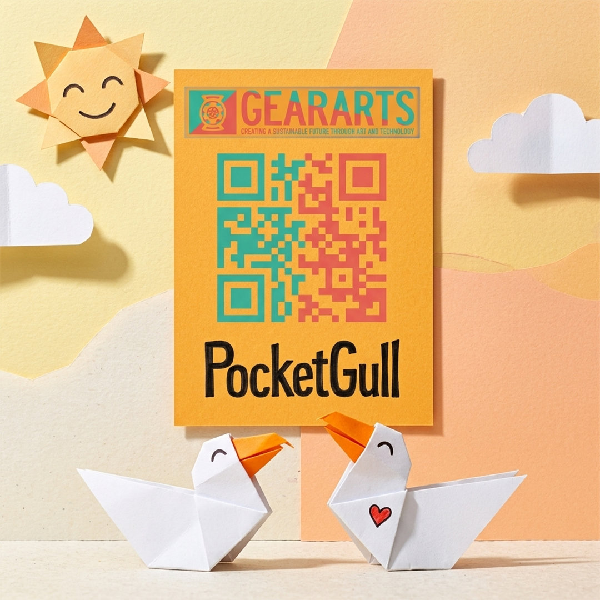
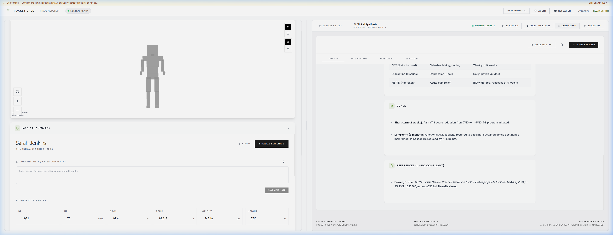
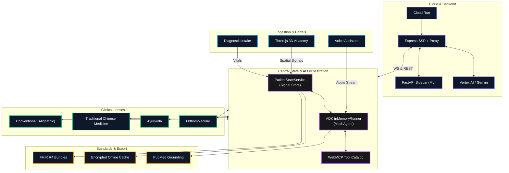

<p align="center">
  
</p>

<h1 align="center">Pocket Gull</h1>

<p align="center">
  <strong>An AI care-plan assistant for clinicians.</strong><br>
  Evidence-grounded care-plan strategy and live voice consults powered by Google Gemini, with FHIR R4 interoperability.
</p>

<p align="center">
  <a href="https://github.com/pocketgull-app/pocketgull/actions/workflows/ci.yml"></a>
  <a href="https://scorecard.dev/viewer/?uri=github.com/pocketgull-app/pocketgull"></a>
  <a href="https://www.bestpractices.dev/projects/13644"></a>
  <a href="LICENSE"></a>
  <a href="https://doi.org/10.5281/zenodo.20647514"></a>
</p>

<p align="center">
  <a href="https://pocketgull.app"><strong>Live app</strong></a> ·
  <a href="docs/FEATURES.md"><strong>Features</strong></a> ·
  <a href="https://huggingface.co/philgear"><strong>Models</strong></a> ·
  <a href="ARCHITECTURE.md"><strong>Architecture</strong></a> ·
  <a href="SECURITY.md"><strong>Security</strong></a>
</p>

> [!IMPORTANT]
> **Research preview.** Pocket Gull is clinical decision support and educational software for licensed clinicians, who remain responsible for every clinical decision. It is not a medical device, does not diagnose, and is not intended for emergency use. In an emergency, contact local emergency services. See the [regulatory notice](#regulatory--clinical-use-notice).

<p align="center">
  
</p>

---

## What it does

- **Care-plan strategy.** Turns symptoms, vitals, and validated instruments (PHQ-9, GAD-7, C-SSRS, ISI, PRAPARE, and more) into structured care plans that a clinician reviews before anything is saved.
- **Live AI consult.** Streaming text and full-duplex voice consults with Gemini, with patient context held by a multi-agent [Google ADK](https://google.github.io/adk-docs/) runtime.
- **Evidence grounding.** Recommendations cite PubMed literature and are tagged by evidence level (A: RCTs, B: cohort, C: expert consensus).
- **Interoperability.** HL7® FHIR® R4 Bundle export, SMART on FHIR identity, LOINC / SNOMED CT coding, and PDF care plans.
- **Privacy by default.** No server-side PHI persistence: patient state lives in memory or is encrypted on device, with optional on-device inference through Chrome built-in AI and WebGPU.
- **3D anatomy.** An interactive Three.js body map for locating and grading symptoms.

Optional complementary lenses (Traditional Chinese Medicine, Ayurveda) are presented alongside, never in place of, the conventional plan and are labelled with their evidence level.

The complete module catalogue (clinical tools, assessment instruments, agent personas, accessibility modes, and distributables) is in **[docs/FEATURES.md](docs/FEATURES.md)**.

## Who it's for

| Audience | Start here |
| :--- | :--- |
| **Clinicians** | [Live app](https://pocketgull.app) · [User walkthrough](docs/WALKTHROUGH.md) |
| **Researchers** | [Case Studies Commons](https://pocketgull.com/case-studies) · [Commons methodology](docs/CLINICAL_CASE_STUDIES_COMMONS.md) · [Citation](#citation) |
| **Developers** | [Quickstart](#quickstart) · [Architecture](ARCHITECTURE.md) · [Contributing](CONTRIBUTING.md) |
| **Health systems** | [EHR sidecar integration](docs/ENTERPRISE_EHR_SIDECAR.md) · [Privacy & HIPAA](docs/SIGSAC_HIPAA_ZERO_TRUST_PRIVACY.md) · [Contact](mailto:dpo@pocketgull.app) |

---

## Quickstart

**Prerequisites:** Node.js 24.x (see `.nvmrc`), npm 10+. Python 3.10+ is optional and only needed for the ML sidecar.

```bash
git clone https://github.com/pocketgull-app/pocketgull.git
cd pocketgull
npm install
npm run dev        # Angular UI + Express SSR on http://localhost:4200
```

Create a `.env.local` file in the project root for optional integrations:

| Variable | Purpose | Required for |
| :--- | :--- | :--- |
| `GEMINI_API_KEY` | Google Gemini API access | AI consults |
| `FIREBASE_API_KEY` | Firebase project key | Sync |
| `STRIPE_SECRET_KEY` | Stripe billing | Billing |

Without a `GEMINI_API_KEY`, use the built-in demo mode (de-identified sample patients) to explore the interface.

| Command | Purpose |
| :--- | :--- |
| `npm run dev` | Local development server |
| `npm run build` | Production build |
| `npm test` | Vitest and Python unit tests |
| `npm run test:e2e` | Playwright end-to-end tests |
| `npm run lint` | TypeScript type-check |

---

## Architecture


```mermaid
graph TB
    classDef cloud fill:#0f172a,stroke:#6366f1,stroke-width:2px,color:#f8fafc
    classDef ingestion fill:#0f172a,stroke:#38bdf8,stroke-width:2px,color:#f8fafc
    classDef hub fill:#18181b,stroke:#a855f7,stroke-width:3px,color:#fafafa
    classDef lenses fill:#0f172a,stroke:#10b981,stroke-width:2px,color:#f8fafc
    classDef foundation fill:#0f172a,stroke:#f59e0b,stroke-width:2px,color:#f8fafc

    subgraph Cloud ["Cloud & Backend"]
        CloudRun["Cloud Run"]
        Express["Express SSR + Proxy"]
        FastAPI["FastAPI Sidecar (ML)"]
        Vertex["Vertex AI / Gemini"]
    end

    subgraph Ingestion ["Ingestion & Portals"]
        Body3D["Three.js 3D Anatomy"]
        Voice["Voice Assistant"]
        Intake["Diagnostic Intake"]
    end

    subgraph Hub ["Central State & AI Orchestration"]
        State["PatientStateService\n(Signal Store)"]
        ADK["ADK InMemoryRunner\n(Multi-Agent)"]
        WebMCP["WebMCP Tool Catalog"]
    end

    subgraph Lenses ["Clinical Lenses"]
        Western["Conventional (Allopathic)"]
        TCM["Traditional Chinese Medicine"]
        Ayurvedic["Ayurveda"]
        Ortho["Orthomolecular"]
    end

    subgraph Foundation ["Standards & Export"]
        FHIR["FHIR R4 Bundles"]
        Cache["Encrypted Offline Cache"]
        PubMed["PubMed Grounding"]
    end

    CloudRun --> Express
    Express <--> FastAPI
    Express <--> Vertex

    Body3D -->|Spatial Signals| State
    Voice -->|Audio Stream| ADK
    Intake -->|Vitals| State

    Express <-->|WS & REST| Hub

    State <--> ADK
    ADK <--> WebMCP

    Hub <--> Western & TCM & Ayurvedic & Ortho

    State --> FHIR & Cache
    ADK --> PubMed

    class CloudRun,Express,FastAPI,Vertex cloud
    class Body3D,Voice,Intake ingestion
    class State,ADK,WebMCP hub
    class Western,TCM,Ayurvedic,Ortho lenses
    class FHIR,Cache,PubMed foundation
```

| Layer | Technology |
| :--- | :--- |
| Frontend | Angular 22 (standalone components, Signals, zoneless), Tailwind CSS |
| Backend / SSR | Node.js 24, Express, Angular SSR |
| AI | Google Gemini, Google ADK, Genkit, Vertex AI |
| 3D / Voice | Three.js, Web Speech API |
| ML sidecar | Python FastAPI, scikit-learn, XGBoost, ONNX Runtime |
| Mobile | Flutter / Dart (Riverpod) |
| Privacy | DOMPurify, Google Tink AEAD, FHIR R4 |
| Quality | Vitest, Playwright, pytest, CodeQL, SLSA provenance |

| Workspace | Language | Purpose |
| :--- | :--- | :--- |
| `/` (root) | TypeScript | Angular + Express SSR application |
| `companion-apps/avs-therapy` | TypeScript | AVS therapy companion |
| `companion-apps/patient_app`, `provider_app` | Dart / Flutter | Mobile companion apps |
| `pocketgull_api` | Python | FastAPI ML scoring sidecar ([OpenAPI](pocketgull_api/openapi.yaml)) |

---

## Open models & demos

Fine-tuned Gemma models and interactive demos are published on [Hugging Face](https://huggingface.co/philgear). They are research artifacts and have not been validated for clinical use.

| Model | Focus |
| :--- | :--- |
| [`pocketgull-compass-2b`](https://huggingface.co/philgear/pocketgull-compass-2b) | Stepped-care triage and health-literacy explanations |
| [`pocketgull-scribe-soap`](https://huggingface.co/philgear/pocketgull-scribe-soap) | On-device SOAP / SBAR note drafting |
| [`pocketgull-rxguard-pgx`](https://huggingface.co/philgear/pocketgull-rxguard-pgx) | Pharmacogenomic and supplement interaction screening |
| [`pocketgull-tern-edge`](https://huggingface.co/philgear/pocketgull-tern-edge) | Lightweight WebGPU / mobile inference |

All six models and four Spaces are listed in [docs/FEATURES.md](docs/FEATURES.md#-live-demos--open-hugging-face-ecosystem). To run them locally with [Ollama](https://ollama.com):

```bash
bash ollama/install_models.sh                                        # macOS / Linux
powershell -ExecutionPolicy Bypass -File ollama/install_models.ps1   # Windows
ollama run pocketgull-compass-2b
```

---

## Security & responsible AI

- **Human in the loop.** Clinicians must review AI output before a care plan is saved.
- **No PHI persistence.** Patient state is transient or encrypted locally; one-click state purge.
- **Hardened delivery.** Strict nonce-based CSP, CodeQL scanning, egress allow-listing, secret scanning, and SLSA build provenance.
- **Safety testing.** Automated adversarial prompt suites run against model integrations.
- **De-identified data only.** Sample patients and research cohorts follow HIPAA §164.514 Safe Harbor.

Details: [SECURITY.md](SECURITY.md) · [THREAT_MODEL.md](THREAT_MODEL.md) · [RESPONSIBLE_AI.md](RESPONSIBLE_AI.md) · [Google AI Principles alignment](docs/GOOGLE_RESPONSIBLE_AI_ALIGNMENT.md)

To report a vulnerability, follow the private disclosure process in [SECURITY.md](SECURITY.md).

---

## Documentation

| Document | Description |
| :--- | :--- |
| [Feature catalogue](docs/FEATURES.md) | Every module, instrument, model, and distributable |
| [User walkthrough](docs/WALKTHROUGH.md) | Primary user flows and pathways |
| [Architecture](ARCHITECTURE.md) | System design, data flow, and reactive state |
| [Enterprise EHR sidecar](docs/ENTERPRISE_EHR_SIDECAR.md) | Epic®, Oracle® Cerner®, and MEDITECH® integration |
| [Edge AI architecture](docs/GEMMA4_EDGE_ARCHITECTURE.md) | Chrome built-in AI and on-device models |
| [Privacy & HIPAA](docs/SIGSAC_HIPAA_ZERO_TRUST_PRIVACY.md) | Safe Harbor de-identification and data handling |
| [Roadmap](ROADMAP.md) · [Changelog](CHANGELOG.md) | Planned and released work |
| [Governance](GOVERNANCE.md) · [Maintainers](MAINTAINERS.md) | Project governance |

The full documentation index is at the end of [docs/FEATURES.md](docs/FEATURES.md#documentation-index).

## Contributing

Contributions are welcome. Please read [CONTRIBUTING.md](CONTRIBUTING.md) and the [Code of Conduct](CODE_OF_CONDUCT.md). In short: Conventional Commits, standalone Angular components with Signals, and passing pre-commit checks.

## Support

Pocket Gull is open source. You can support development through [GitHub Sponsors](https://github.com/sponsors/philgear). For pilots, integrations, or enterprise support, contact [dpo@pocketgull.app](mailto:dpo@pocketgull.app).

## Citation

If you use Pocket Gull in research, please cite it (see also [CITATION.cff](CITATION.cff)):

```bibtex
@software{gear_phil_2026_20647514,
  author    = {Gear, Phillip},
  title     = {Pocket-Gull: Living Medical Intelligence Engine},
  month     = sep,
  year      = 2026,
  publisher = {Zenodo},
  version   = {v1.38.0},
  doi       = {10.5281/zenodo.20647514},
  url       = {https://doi.org/10.5281/zenodo.20647514}
}
```

The methodological and scientific lineage behind the algorithms is listed in [docs/FEATURES.md](docs/FEATURES.md#methodological--scientific-lineage).

---

## Regulatory & clinical-use notice

Pocket Gull is intended as clinical decision support and educational software designed to meet the non-device criteria of §520(o)(1)(E) of the U.S. Federal Food, Drug, and Cosmetic Act: recommendations are transparent, grounded in cited literature, and require independent clinician review before any order is placed. It is not an autonomous diagnostic device.

Modules that analyze physiological signals (for example ECG/PPG waveforms) or that relate to emergencies (for example the Good Samaritan CPR mode and red-flag interceptor models) are **research and educational demonstrations only** and fall outside this intended use.

<sub>Epic® is a registered trademark of Epic Systems Corporation. Oracle® and Cerner® are registered trademarks of Oracle Corporation and/or its affiliates. MEDITECH® is a registered trademark of Medical Information Technology, Inc. Google®, Gemini™, Chrome®, and Android™ are trademarks of Google LLC. HL7® and FHIR® are registered trademarks of Health Level Seven International. SNOMED CT® is a registered trademark of SNOMED International. LOINC® is a registered trademark of Regenstrief Institute, Inc. Pocket Gull is independent software; references to these marks do not imply sponsorship, affiliation, or endorsement.</sub>

---

<p align="center">
  Created by <a href="https://orcid.org/0009-0008-1372-5381">Phillip Gear</a><br>
  <sub>© 2026 PocketGull LLC &amp; Phillip Gear · <a href="LICENSE">Apache 2.0 License</a></sub>
</p>
