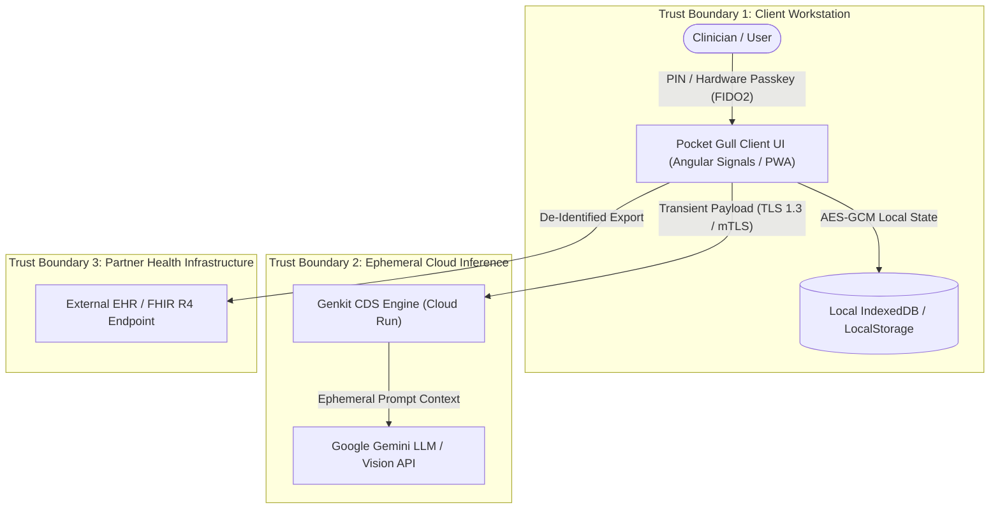

# STRIDE Threat Model: Pocket Gull Clinical Decision-Support System

**System**: Pocket Gull (Clinical CDS Co-Pilot & Typeface Superfamily)  
**Security Architect / Author**: Phil Gear  
**Date**: 2026-09-24  
**Classification**: Regulated Health Tech (FDA 21 CFR §520(o), HIPAA §164.514 Safe Harbor, NHS DTAC)  
**Standard Alignment**: (ISC)² CISSP CBK, NIST SP 800-53 Rev. 5, NIST CSF 2.0, OWASP Top 10 for LLM

---

## 1. System Overview & Architecture

Pocket Gull is a client-side clinical decision-support (CDS) tool designed for healthcare providers. It processes patient health observations, clinical notes, and medical images via ephemeral edge WebAssembly, WebGPU, and transient Google Gemini Genkit flows.

---

## 2. Trust Boundaries & Invariants

1. **TB-1 (Browser / Device Boundary)**: Patient health data stays local to the clinician's current device profile in ephemeral Angular signals and local browser storage.
2. **TB-2 (Ephemeral Transport & Inference Boundary)**: Payloads transmitted to Genkit / Gemini are strictly transient (stateless). Zero PHI is persisted to any remote database. Zero payloads are stored for model training.
3. **TB-3 (EHR / External Boundary)**: All data flowing out to external FHIR R4 endpoints must pass through HIPAA Safe Harbor de-identification filters before transmission.

---

## 3. STRIDE Threat Analysis Matrix (CISSP & NIST Control Mapping)

| Threat Category | Potential Scenario in Pocket Gull | Impact | Mitigation / Security Control in Place | NIST SP 800-53 Rev. 5 Control | CISSP Domain |
| :--- | :--- | :---: | :--- | :--- | :--- |
| **Spoofing** | Attacker impersonates an attending clinician to authorize high-risk medication orders or bulk record exports. | **Critical** | Hardware FIDO2/WebAuthn step-up authentication. Mandiant Dual-Custody (M-of-N) approval for bulk exports or state purges. | **IA-2, IA-5, AC-3** | **Domain 5**: Identity & Access Management |
| **Tampering** | Malicious alteration of clinical CDS prompts or dosage formulas in transit or in the repository. | **Critical** | Ed25519 SSH commit signing on code; immutable container image digests in Cloud Run; SHA-256 package lockfiles. | **SI-7, CM-3, SC-8** | **Domain 3**: Security Architecture & Engineering |
| **Repudiation** | Clinician denies triggering a STAT emergency override or altering a clinical plan. | **High** | Immutable SHA-256 forensic snapshot audit log (`IIncidentForensicSnapshot`) generated on all emergency overrides. | **AU-2, AU-3, AU-9** | **Domain 7**: Security Operations |
| **Information Disclosure** | Leakage of Protected Health Information (PHI) via accidental commit, API telemetry, or prompt leakage. | **Critical** | Global `gitleaks` pre-commit scanning; transient zero-remote-database architecture; stripping zero-width Unicode characters. | **SC-8, SC-28, SI-4** | **Domain 2**: Asset Security & **Domain 8**: Software Dev Security |
| **Denial of Service** | Abuse of complex medical imaging OCR flows causing compute exhaustion or Cloud Run throttling. | **Medium** | Client-side rate limiting, maximum payload size constraints (Vite/Node), Cloud Run auto-scaling caps and request quotas. | **SC-5, SI-4** | **Domain 4**: Communication & Network Security |
| **Elevation of Privilege** | Indirect Prompt Injection (OWASP LLM01) where untrusted clinical text instructs the LLM to ignore safety filters. | **Critical** | `DefensiveGuardrailsService`; structural prompt partitioning (`[CLINICAL DIRECTIVE CONTEXT]`); DOMPurify sanitization. | **SI-10, SA-11, AC-6** | **Domain 8**: Software Development Security |

---

## 4. Anti-Surveillance & Data Sovereignty Mandate
* **Edge-First Computation**: Biophysical equations and telemetry classifications run locally via WASM/WebGPU.
* **Zero Third-Party Trackers**: Zero tracking pixels (Meta Pixel, Google Analytics, Mixpanel).
* **1-Click Ephemeral State Purge**: Clinicians can flush all in-memory patient signals and transient caches on demand (`purge_transient_patient_state`).

---

## 5. Continuous Verification & Audit Schedule
* **Static Code Analysis**: Daily local pre-commit scanning (`gitleaks`), GitHub CodeQL / Dependabot.
* **Adversarial Testing**: Automated prompt-injection test suite in `tests/safety.spec.ts`.
* **Runtime Verification**: Continuous container analysis on GCP Artifact Registry and Mozilla Observatory 125+ header verification.
