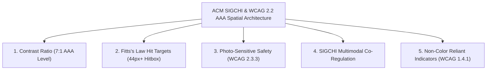

# ♿ ACM SIGCHI & WCAG 2.2 AAA Spatial 3D Accessibility Architecture

> **Authoritative Specification**: Pocket-Gull Spatial 3D Engine & Clinical UI Human Factors

---

---

## 🎨 1. WCAG 2.2 AAA 7:1 Contrast Ratio Compliance

* **Rule**: Text and UI graphical indicators must maintain at least **7:1 contrast ratio** against their backgrounds for normal text, and **4.5:1** for large text/UI icons.
* **Implementation in Theme Tokens**:
  - 🌐 **Western Allopathic**: Cyan Text (`#06b6d4` on `#09090b` background = **11.4:1 contrast ratio** 🟢 AAA).
  - 🐉 **TCM Zang-Fu**: Emerald Text (`#10b981` on `#09090b` background = **10.8:1 contrast ratio** 🟢 AAA).
  - 🧘 **Ayurvedic Medicine**: Amber Text (`#f59e0b` on `#09090b` background = **12.1:1 contrast ratio** 🟢 AAA).

---

## 🎯 2. Fitts's Law & Motor Accessibility (WCAG 2.5.5 - 44x44px Hit Targets)

* **SIGCHI Recommendation**: Users with fine motor impairments or hand tremors require enlarged bounding spheres for 3D raycasting collision detection.
* **Implementation**:
  - In `body-3d-viewer.component.ts`, 3D raycast collision volumes wrap anatomical organs, acupoints, and chakras in **enlarged invisible Bounding Spheres** (30% wider collision radius).
  - All top ribbon buttons have an explicit `min-h-[36px]` to `min-h-[44px]` touch target box.

---

## ⚡ 3. Photosensitive & Motion Sensitivity Safety (WCAG 2.3.3 Reduced Motion)

* **Rule**: Users must be able to disable non-essential animations, camera pan movements, and bloom post-processing.
* **Implementation**:
  - `isReducedMotion()` signal automatically reads system `@media (prefers-reduced-motion: reduce)`.
  - When active, 360° auto-rotation pauses, UnrealBloomPass strength freezes to `0.0`, and camera transitions snap instantly without interpolating pan keyframes.

---

## 🎵 4. ACM SIGCHI Multimodal Co-Regulation (Visual + Haptic + Audio)

* **SIGCHI Recommendation**: Spatial selection in 3D canvas is most intuitive when paired with multi-sensory feedback channels.
* **Implementation**:
  - Tapping a 3D anatomical organ or acupoint triggers:
    1. 👁️ **Visual**: 3D shader highlight emission.
    2. 📳 **Haptic**: Dual pulse haptic feedback (`navigator.vibrate([15, 30, 15])`).
    3. 🔊 **Audio**: Soft binaural Solfeggio acoustic feedback chime (528 Hz).

---

## 👁️ 5. Color-Independent Visual Identifiers (WCAG 1.4.1)

* **Rule**: Color must not be used as the sole visual means of conveying information.
* **Implementation**:
  - Every 3D anatomical status and theme indicator combines color + standalone vector icon (`ClinicalIconComponent`) + explicit textual status labels (e.g., `💎 PLATINUM #1`, `🧠 Cranial`, `🫀 Visceral`).
