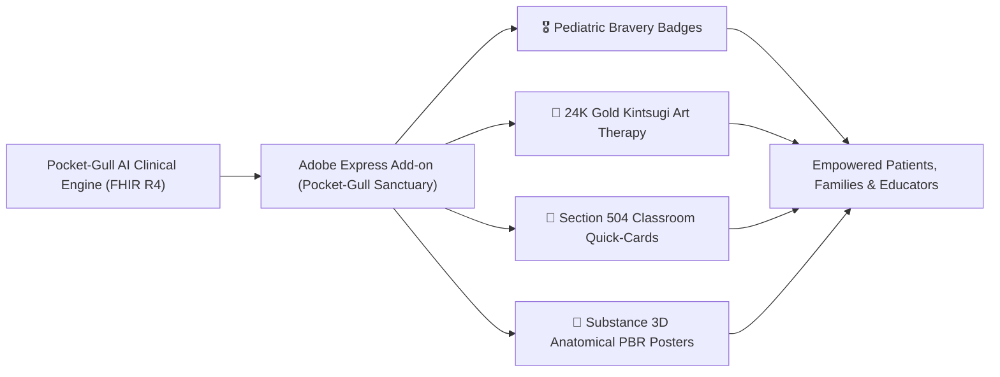

# Pocket-Gull &times; Adobe Fund for Design Proposal

**Project Title**: Pocket-Gull Sanctuary — Empowering Clinical Art Therapy, Pediatric Courage Keepsakes, and Patient Design Equity on Adobe Express  
**Applicant**: Pocket-Gull Open Science Consortium  
**Adobe Organization**: `00AF226E687833EB0A495CEE@AdobeOrg`  
**Adobe Developer Console Project**: [`224161 / 4566206088345737575`](https://developer.adobe.com/console/projects/224161/4566206088345737575/overview)  
**Target Program**: [Adobe Fund for Design](https://developer.adobe.com/fund-for-design/)  
**Grant Track**: Creative & Humanitarian Add-ons for Adobe Express & Creative Cloud  

---

## 1. Executive Summary

Clinical care plans, hospital discharge summaries, and special education Section 504 accommodations are routinely delivered as intimidating, 40-page black-and-white clinical records. For pediatric patients, chronic illness fighters, and their families, navigating this medical jargon exacerbates trauma and emotional exhaustion.

**Pocket-Gull Sanctuary** bridges medical informatics (FHIR R4) and the Adobe Creative Ecosystem to transform complex clinical data into **dignifying, personalized art therapy keepsakes, pediatric bravery medals, 504 school classroom folios, and biophysical anatomical posters** directly inside **Adobe Express**, powered by **Adobe Firefly** and **Substance 3D**.

---

## 2. Key Creative Features Built on Adobe Platforms

### A. Official Adobe Express Add-on (`pocketgull-express-addon`)
- **Pediatric Courage Keepsakes**: 1-click insertion of customizable superhero recovery diplomas, milestone bravery medals, and courage awards.
- **Section 504 School Classroom Quick-Cards**: Converts 20-page legal accommodation plans into high-contrast, beautiful 1-page visual guides for teachers (e.g. snack breaks, sensory decompression, hydration).
- **Expressive Kintsugi & Chromesthesia**: Inserts Japanese gold fracture repair seams and 528 Hz bio-resonance mandalas onto the canvas, turning scars and trauma into symbols of strength.

### B. Adobe Firefly & Substance 3D PBR Substrate Engine
- Synthesizes micro-cellular textures (osteon cortical bone, micro-vascular endothelial webs, Type I/III collagen scaffolds) grounded in the historic **Edwin Smith Surgical Codex**.
- Enables medical illustrators and educators to render biophysically accurate anatomical models directly in Adobe Express and Three.js.

### C. Model Context Protocol (MCP) Integration
- Direct integration with the `@adobe/express-developer-mcp` server, enabling AI pair programmers and clinical illustrators to scaffold and automate add-on workflows with zero friction.

---

## 3. Human & Economic Impact

1. **Pediatric Oncology & Chronic Illness Support**: Brings joy, agency, and dignity to pediatric patients facing difficult clinical journeys.
2. **Special Education Equity**: Empowers special education teachers, occupational therapists, and parents to communicate accommodation needs without bureaucratic stigma.
3. **Creative Opportunities for Medical Illustrators**: Opens a new marketplace for design-led healthcare communication on Adobe Exchange.

---

## 4. Requested Grant Allocation ($50,000 Tier)

| Milestone | Deliverables & Scope | Timeline | Allocation |
| :--- | :--- | :--- | :--- |
| **Phase 1: Adobe Express Add-on Marketplace Release** | Full Adobe Spectrum UI polish, automated FHIR R4 JSON/PDF import bridge, Adobe App Store submission. | Month 1–2 | **$15,000** |
| **Phase 2: Substance 3D & Firefly Generative Synthesis** | Deep integration with Substance 3D Asset library, custom Firefly texture generation presets for anatomical education. | Month 3–4 | **$20,000** |
| **Phase 3: Child Life & School District Pilot Launch** | 5-hospital pilot with pediatric child life specialists, open-source template repository for Section 504 folios. | Month 5–6 | **$15,000** |
| **Total Grant Request** | | | **$50,000** |

---

## 5. Technical Verification & Open Source Repository

- **MCP Configuration**: Verified and active in `~/.gemini/config/mcp_config.json` with `@adobe/express-developer-mcp`.
- **Add-on Source Code**: [`companion-apps/adobe-express-addon/`](file:///c:/Users/philg/Pocketgull/pocketgull/companion-apps/adobe-express-addon/)
- **Live Local Demo**: `http://localhost:4200/` (Art Therapy Canvas & Genesis Biophysical Substrate Lens).
