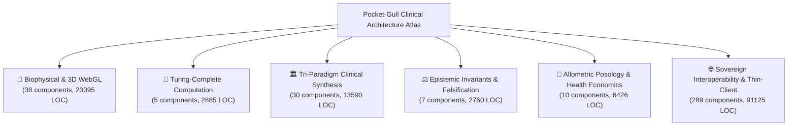

# 🏛️ Pocket-Gull Architectural Atlas & Visual Topology

> *"From 3D WebGL biophysics and Turing-complete state machines to tri-paradigm clinical reasoning and allometric posology."*

## 📊 Executive System Metrics

| Metric | Total |
| :--- | :--- |
| **Total Standalone Components** | `379` |
| **Total Clinical Services** | `341` |
| **Total Component Lines of Code** | `139,881 LOC` |
| **Total Unit Test Lines** | `13,299 LOC` |
| **Component Test Ratio** | `48.8% (185/379 components tested)` |

---

## 🌐 The 6 Computational Spheres

### 🥽 Biophysical & 3D WebGL
- **Components**: `38`
- **Lines of Code**: `23095 LOC`
- **Test Coverage**: `26/38` components with explicit `.spec.ts`

| Component | Selector | LOC | Tested | Description |
| :--- | :--- | :---: | :---: | :--- |
| `[BiophilicPathway3dViewerComponent](file:///C:/Users/philg/Pocketgull/pocketgull/src/components/anatomy-3d/biophilic-pathway-3d-viewer.component.ts)` | `<app-biophilic-pathway-3d-viewer>` | 267 | ✅ | Clinical component for biophilic-pathway-3d-viewer telemetry and interactive workflow. |
| `[BiophysicalTwinTimelineComponent](file:///C:/Users/philg/Pocketgull/pocketgull/src/components/anatomy-3d/biophysical-twin-timeline.component.ts)` | `<app-biophysical-twin-timeline>` | 256 | ⏳ | Clinical component for biophysical-twin-timeline telemetry and interactive workflow. |
| `[Body3DViewerComponent](file:///C:/Users/philg/Pocketgull/pocketgull/src/components/anatomy-3d/body-3d-viewer.component.ts)` | `<app-body-3d-viewer>` | 4026 | ✅ | Clinical component for body-3d-viewer telemetry and interactive workflow. |
| `[BodyViewerComponent](file:///C:/Users/philg/Pocketgull/pocketgull/src/components/anatomy-3d/body-viewer.component.ts)` | `<app-body-viewer>` | 1132 | ✅ | Clinical component for body-viewer telemetry and interactive workflow. |
| `[CernLhc3dVisualizerComponent](file:///C:/Users/philg/Pocketgull/pocketgull/src/components/anatomy-3d/cern-lhc-3d-visualizer.component.ts)` | `<app-cern-lhc-3d-visualizer>` | 615 | ⏳ | Clinical component for cern-lhc-3d-visualizer telemetry and interactive workflow. |
| `[GenesisBiophysicalSubstrateComponent](file:///C:/Users/philg/Pocketgull/pocketgull/src/components/anatomy-3d/genesis-biophysical-substrate.component.ts)` | `<app-genesis-biophysical-substrate>` | 346 | ✅ | Clinical component for genesis-biophysical-substrate telemetry and interactive workflow. |
| `[Holographic3DAnatomyComponent](file:///C:/Users/philg/Pocketgull/pocketgull/src/components/anatomy-3d/holographic-3d-anatomy.component.ts)` | `<app-holographic-3d-anatomy>` | 719 | ⏳ | Clinical component for holographic-3d-anatomy telemetry and interactive workflow. |
| `[InstantBodyCarePlanSheetComponent](file:///C:/Users/philg/Pocketgull/pocketgull/src/components/anatomy-3d/instant-body-care-plan-sheet.component.ts)` | `<app-instant-body-care-plan-sheet>` | 1008 | ✅ | Clinical component for instant-body-care-plan-sheet telemetry and interactive workflow. |
| `[Medical3DViewerComponent](file:///C:/Users/philg/Pocketgull/pocketgull/src/components/anatomy-3d/medical-3d-viewer.component.ts)` | `<app-medical-3d-viewer>` | 650 | ⏳ | Clinical component for medical-3d-viewer telemetry and interactive workflow. |
| `[RadialPieMenuComponent](file:///C:/Users/philg/Pocketgull/pocketgull/src/components/anatomy-3d/radial-pie-menu.component.ts)` | `<app-radial-pie-menu>` | 137 | ✅ | Clinical component for radial-pie-menu telemetry and interactive workflow. |
| `[RosettaStoneAnatomyComponent](file:///C:/Users/philg/Pocketgull/pocketgull/src/components/anatomy-3d/rosetta-stone-anatomy.component.ts)` | `<app-rosetta-stone-anatomy>` | 580 | ⏳ | Clinical component for rosetta-stone-anatomy telemetry and interactive workflow. |
| `[YogaAsana3dCoachComponent](file:///C:/Users/philg/Pocketgull/pocketgull/src/components/anatomy-3d/yoga-asana-3d-coach.component.ts)` | `<app-yoga-asana-3d-coach>` | 270 | ✅ | Clinical component for yoga-asana-3d-coach telemetry and interactive workflow. |
| `[AvsCymaticsVisualizerComponent](file:///C:/Users/philg/Pocketgull/pocketgull/src/components/avs-cymatics-visualizer.component.ts)` | `<app-avs-cymatics-visualizer>` | 462 | ✅ | Clinical component for avs-cymatics-visualizer telemetry and interactive workflow. |
| `[BioSymphonyVisualizerComponent](file:///C:/Users/philg/Pocketgull/pocketgull/src/components/bio-symphony-visualizer.component.ts)` | `<app-bio-symphony-visualizer>` | 255 | ⏳ | Clinical component for bio-symphony-visualizer telemetry and interactive workflow. |
| `[ClinicalHolodeckViewerComponent](file:///C:/Users/philg/Pocketgull/pocketgull/src/components/clinical-holodeck-viewer.component.ts)` | `<app-clinical-holodeck-viewer>` | 406 | ⏳ | Clinical component for clinical-holodeck-viewer telemetry and interactive workflow. |
| *...and 23 more components* | | | | |

### 🧮 Turing-Complete Computation
- **Components**: `5`
- **Lines of Code**: `2885 LOC`
- **Test Coverage**: `2/5` components with explicit `.spec.ts`

| Component | Selector | LOC | Tested | Description |
| :--- | :--- | :---: | :---: | :--- |
| `[CellularAutomataViewerComponent](file:///C:/Users/philg/Pocketgull/pocketgull/src/components/turing/cellular-automata-viewer.component.ts)` | `<app-cellular-automata-viewer>` | 399 | ⏳ | Clinical component for cellular-automata-viewer telemetry and interactive workflow. |
| `[LensBiomolecularPhysicsComponent](file:///C:/Users/philg/Pocketgull/pocketgull/src/components/turing/lens-biomolecular-physics.component.ts)` | `<app-lens-biomolecular-physics>` | 1114 | ✅ | Clinical component for lens-biomolecular-physics telemetry and interactive workflow. |
| `[NavierStokesViewerComponent](file:///C:/Users/philg/Pocketgull/pocketgull/src/components/turing/navier-stokes-viewer.component.ts)` | `<app-navier-stokes-viewer>` | 326 | ⏳ | Clinical component for navier-stokes-viewer telemetry and interactive workflow. |
| `[PetriNetViewerComponent](file:///C:/Users/philg/Pocketgull/pocketgull/src/components/turing/petri-net-viewer.component.ts)` | `<app-petri-net-viewer>` | 830 | ⏳ | Clinical component for petri-net-viewer telemetry and interactive workflow. |
| `[TuringSuiteComponent](file:///C:/Users/philg/Pocketgull/pocketgull/src/components/turing/turing-suite.component.ts)` | `<app-turing-suite>` | 216 | ✅ | Clinical component for turing-suite telemetry and interactive workflow. |

### 🏛️ Tri-Paradigm Clinical Synthesis
- **Components**: `30`
- **Lines of Code**: `13590 LOC`
- **Test Coverage**: `12/30` components with explicit `.spec.ts`

| Component | Selector | LOC | Tested | Description |
| :--- | :--- | :---: | :---: | :--- |
| `[ChronobiologyMatrixLensTabComponent](file:///C:/Users/philg/Pocketgull/pocketgull/src/components/analysis-report/chronobiology-matrix-lens-tab.component.ts)` | `<app-chronobiology-matrix-lens-tab>` | 41 | ⏳ | Clinical component for chronobiology-matrix-lens-tab telemetry and interactive workflow. |
| `[FunctionalMedicineMatrixLensTabComponent](file:///C:/Users/philg/Pocketgull/pocketgull/src/components/analysis-report/functional-medicine-matrix-lens-tab.component.ts)` | `<app-functional-medicine-matrix-lens-tab>` | 36 | ⏳ | Clinical component for functional-medicine-matrix-lens-tab telemetry and interactive workflow. |
| `[TriParadigmIntegrativeLensTabComponent](file:///C:/Users/philg/Pocketgull/pocketgull/src/components/analysis-report/tri-paradigm-integrative-lens-tab.component.ts)` | `<app-tri-paradigm-integrative-lens-tab>` | 765 | ✅ | Clinical component for tri-paradigm-integrative-lens-tab telemetry and interactive workflow. |
| `[AnalysisReportComponent](file:///C:/Users/philg/Pocketgull/pocketgull/src/components/analysis-report.component.ts)` | `<app-analysis-report>` | 4068 | ⏳ | Clinical component for analysis-report telemetry and interactive workflow. |
| `[AyurvedicSystemsSuiteComponent](file:///C:/Users/philg/Pocketgull/pocketgull/src/components/ayurvedic/ayurvedic-systems-suite.component.ts)` | `<app-ayurvedic-systems-suite>` | 54 | ⏳ | Clinical component for ayurvedic-systems-suite telemetry and interactive workflow. |
| `[DhatuTissueChakraMatrixComponent](file:///C:/Users/philg/Pocketgull/pocketgull/src/components/ayurvedic/dhatu-tissue-chakra-matrix.component.ts)` | `<app-dhatu-tissue-chakra-matrix>` | 78 | ⏳ | Clinical component for dhatu-tissue-chakra-matrix telemetry and interactive workflow. |
| `[MedhaSaktiMatrixComponent](file:///C:/Users/philg/Pocketgull/pocketgull/src/components/ayurvedic/medha-sakti-matrix.component.ts)` | `<app-medha-sakti-matrix>` | 384 | ✅ | Clinical component for medha-sakti-matrix telemetry and interactive workflow. |
| `[VataPittaKaphaMatrixComponent](file:///C:/Users/philg/Pocketgull/pocketgull/src/components/ayurvedic/vata-pitta-kapha-matrix.component.ts)` | `<app-vata-pitta-kapha-matrix>` | 66 | ⏳ | Clinical component for vata-pitta-kapha-matrix telemetry and interactive workflow. |
| `[ChronobiologyMatrixComponent](file:///C:/Users/philg/Pocketgull/pocketgull/src/components/chronobiology-matrix.component.ts)` | `<app-chronobiology-matrix>` | 334 | ⏳ | Clinical component for chronobiology-matrix telemetry and interactive workflow. |
| `[ClinicalDataCardComponent](file:///C:/Users/philg/Pocketgull/pocketgull/src/components/clinical-data-card.component.ts)` | `<app-clinical-data-card>` | 410 | ⏳ | Clinical component for clinical-data-card telemetry and interactive workflow. |
| `[EasternTcmSuiteComponent](file:///C:/Users/philg/Pocketgull/pocketgull/src/components/eastern/eastern-tcm-suite.component.ts)` | `<app-eastern-tcm-suite>` | 47 | ⏳ | Clinical component for eastern-tcm-suite telemetry and interactive workflow. |
| `[PulseTonguePatternDiagnosisComponent](file:///C:/Users/philg/Pocketgull/pocketgull/src/components/eastern/pulse-tongue-pattern-diagnosis.component.ts)` | `<app-pulse-tongue-pattern-diagnosis>` | 55 | ⏳ | Clinical component for pulse-tongue-pattern-diagnosis telemetry and interactive workflow. |
| `[TcmMeridianStasisMatrixComponent](file:///C:/Users/philg/Pocketgull/pocketgull/src/components/eastern/tcm-meridian-stasis-matrix.component.ts)` | `<app-tcm-meridian-stasis-matrix>` | 81 | ⏳ | Clinical component for tcm-meridian-stasis-matrix telemetry and interactive workflow. |
| `[FunctionalMedicineMatrixComponent](file:///C:/Users/philg/Pocketgull/pocketgull/src/components/functional-medicine-matrix.component.ts)` | `<app-functional-medicine-matrix>` | 328 | ⏳ | Clinical component for functional-medicine-matrix telemetry and interactive workflow. |
| `[HandoffModalComponent](file:///C:/Users/philg/Pocketgull/pocketgull/src/components/modals/handoff-modal.component.ts)` | `<app-handoff-modal>` | 394 | ⏳ | Clinical component for handoff-modal telemetry and interactive workflow. |
| *...and 15 more components* | | | | |

### ⚖️ Epistemic Invariants & Falsification
- **Components**: `7`
- **Lines of Code**: `2760 LOC`
- **Test Coverage**: `3/7` components with explicit `.spec.ts`

| Component | Selector | LOC | Tested | Description |
| :--- | :--- | :---: | :---: | :--- |
| `[SocraticEpistemologyLensTabComponent](file:///C:/Users/philg/Pocketgull/pocketgull/src/components/analysis-report/socratic-epistemology-lens-tab.component.ts)` | `<app-socratic-epistemology-lens-tab>` | 54 | ⏳ | Clinical component for socratic-epistemology-lens-tab telemetry and interactive workflow. |
| `[TriCloudCarePlanConsensusComponent](file:///C:/Users/philg/Pocketgull/pocketgull/src/components/clinical/tri-cloud-care-plan-consensus.component.ts)` | `<app-tri-cloud-care-plan-consensus>` | 245 | ⏳ | Big Five Clinical Consensus & Care Plan Component (Pentacloud CDS). |
| `[CounterfactualSimulatorComponent](file:///C:/Users/philg/Pocketgull/pocketgull/src/components/counterfactual-simulator.component.ts)` | `<app-counterfactual-simulator>` | 446 | ⏳ | Clinical component for counterfactual-simulator telemetry and interactive workflow. |
| `[KaizenQualitySuiteComponent](file:///C:/Users/philg/Pocketgull/pocketgull/src/components/kaizen-quality-suite.component.ts)` | `<app-kaizen-quality-suite>` | 299 | ⏳ | Clinical component for kaizen-quality-suite telemetry and interactive workflow. |
| `[OncDsiTransparencyCardComponent](file:///C:/Users/philg/Pocketgull/pocketgull/src/components/onc-dsi-transparency-card.component.ts)` | `<app-onc-dsi-transparency-card>` | 231 | ✅ | Clinical component for onc-dsi-transparency-card telemetry and interactive workflow. |
| `[PocketgullArchitectureAtlasComponent](file:///C:/Users/philg/Pocketgull/pocketgull/src/components/shared/pocketgull-architecture-atlas.component.ts)` | `<app-pocketgull-architecture-atlas>` | 385 | ✅ | Clinical component for pocketgull-architecture-atlas telemetry and interactive workflow. |
| `[SkepticalEpistemologyHudComponent](file:///C:/Users/philg/Pocketgull/pocketgull/src/components/skeptical-epistemology-hud.component.ts)` | `<app-skeptical-epistemology-hud>` | 1100 | ✅ | Clinical component for skeptical-epistemology-hud telemetry and interactive workflow. |

### 💊 Allometric Posology & Health Economics
- **Components**: `10`
- **Lines of Code**: `6426 LOC`
- **Test Coverage**: `8/10` components with explicit `.spec.ts`

| Component | Selector | LOC | Tested | Description |
| :--- | :--- | :---: | :---: | :--- |
| `[ActuarialQalyCalculatorComponent](file:///C:/Users/philg/Pocketgull/pocketgull/src/components/actuarial-qaly-calculator.component.ts)` | `<app-actuarial-qaly-calculator>` | 167 | ⏳ | Clinical component for actuarial-qaly-calculator telemetry and interactive workflow. |
| `[ApiPricingComponent](file:///C:/Users/philg/Pocketgull/pocketgull/src/components/api-pricing.component.ts)` | `<app-api-pricing>` | 366 | ✅ | Clinical component for api-pricing telemetry and interactive workflow. |
| `[BillingDashboardComponent](file:///C:/Users/philg/Pocketgull/pocketgull/src/components/billing-dashboard.component.ts)` | `<app-billing-dashboard>` | 380 | ✅ | Clinical component for billing-dashboard telemetry and interactive workflow. |
| `[ClinicalPosologyCalculatorComponent](file:///C:/Users/philg/Pocketgull/pocketgull/src/components/clinical-posology-calculator.component.ts)` | `<app-clinical-posology-calculator>` | 2716 | ✅ | Clinical component for clinical-posology-calculator telemetry and interactive workflow. |
| `[CostBenefitAnalysisComponent](file:///C:/Users/philg/Pocketgull/pocketgull/src/components/cost-benefit-analysis.component.ts)` | `<app-cost-benefit-analysis>` | 1278 | ⏳ | Clinical component for cost-benefit-analysis telemetry and interactive workflow. |
| `[HsaIncentiveNetworkComponent](file:///C:/Users/philg/Pocketgull/pocketgull/src/components/hsa-incentive-network.component.ts)` | `<app-hsa-incentive-network>` | 260 | ✅ | Clinical Game Theory HSA Incentive Network Component |
| `[PharmacogenomicsCardComponent](file:///C:/Users/philg/Pocketgull/pocketgull/src/components/pharmacogenomics-card.component.ts)` | `<app-pharmacogenomics-card>` | 107 | ✅ | Clinical component for pharmacogenomics-card telemetry and interactive workflow. |
| `[GeriatricLongevityFrailtyHubComponent](file:///C:/Users/philg/Pocketgull/pocketgull/src/components/research-frame/geriatric-longevity-frailty-hub.component.ts)` | `<app-geriatric-longevity-frailty-hub>` | 317 | ✅ | Clinical component for geriatric-longevity-frailty-hub telemetry and interactive workflow. |
| `[TribalHealthSovereigntyCardComponent](file:///C:/Users/philg/Pocketgull/pocketgull/src/components/shared/tribal-health-sovereignty-card.component.ts)` | `<app-tribal-health-sovereignty-card>` | 210 | ✅ | Clinical component for tribal-health-sovereignty-card telemetry and interactive workflow. |
| `[VertexModelGardenPortalComponent](file:///C:/Users/philg/Pocketgull/pocketgull/src/components/vertex-model-garden-portal.component.ts)` | `<app-vertex-model-garden-portal>` | 625 | ✅ | Clinical component for vertex-model-garden-portal telemetry and interactive workflow. |

### 🌐 Sovereign Interoperability & Thin-Client
- **Components**: `289`
- **Lines of Code**: `91125 LOC`
- **Test Coverage**: `134/289` components with explicit `.spec.ts`

| Component | Selector | LOC | Tested | Description |
| :--- | :--- | :---: | :---: | :--- |
| `[AaasBreakthroughsSuiteComponent](file:///C:/Users/philg/Pocketgull/pocketgull/src/components/aaas/aaas-breakthroughs-suite.component.ts)` | `<app-aaas-breakthroughs-suite>` | 47 | ⏳ | Clinical component for aaas-breakthroughs-suite telemetry and interactive workflow. |
| `[Glp1IncretinMatrixComponent](file:///C:/Users/philg/Pocketgull/pocketgull/src/components/aaas/glp1-incretin-matrix.component.ts)` | `<app-glp1-incretin-matrix>` | 74 | ⏳ | Clinical component for glp1-incretin-matrix telemetry and interactive workflow. |
| `[ScfaMicrobiomeVagalComponent](file:///C:/Users/philg/Pocketgull/pocketgull/src/components/aaas/scfa-microbiome-vagal.component.ts)` | `<app-scfa-microbiome-vagal>` | 86 | ⏳ | Clinical component for scfa-microbiome-vagal telemetry and interactive workflow. |
| `[ActivePivotMonitorCardComponent](file:///C:/Users/philg/Pocketgull/pocketgull/src/components/active-pivot-monitor-card.component.ts)` | `<app-active-pivot-monitor-card>` | 400 | ✅ | Clinical component for active-pivot-monitor-card telemetry and interactive workflow. |
| `[AdaptiveGreenRoutingHudComponent](file:///C:/Users/philg/Pocketgull/pocketgull/src/components/adaptive-green-routing-hud.component.ts)` | `<app-adaptive-green-routing-hud>` | 312 | ✅ | Clinical component for adaptive-green-routing-hud telemetry and interactive workflow. |
| `[AiConfidenceHudComponent](file:///C:/Users/philg/Pocketgull/pocketgull/src/components/ai-confidence-hud.component.ts)` | `<app-ai-confidence-hud>` | 148 | ✅ | Clinical component for ai-confidence-hud telemetry and interactive workflow. |
| `[AkovosLongevityHubComponent](file:///C:/Users/philg/Pocketgull/pocketgull/src/components/akovos-longevity-hub.component.ts)` | `<app-akovos-longevity-hub>` | 393 | ✅ | Clinical component for akovos-longevity-hub telemetry and interactive workflow. |
| `[AlphaGenomeRegulatoryCardComponent](file:///C:/Users/philg/Pocketgull/pocketgull/src/components/alphagenome-regulatory-card.component.ts)` | `<app-alphagenome-regulatory-card>` | 271 | ⏳ | Clinical component for alphagenome-regulatory-card telemetry and interactive workflow. |
| `[AmbientClinicalScribeComponent](file:///C:/Users/philg/Pocketgull/pocketgull/src/components/ambient-clinical-scribe.component.ts)` | `<app-ambient-clinical-scribe>` | 174 | ⏳ | Clinical component for ambient-clinical-scribe telemetry and interactive workflow. |
| `[AmbientLivingSpaceDashboardComponent](file:///C:/Users/philg/Pocketgull/pocketgull/src/components/ambient-living-space-dashboard.component.ts)` | `<app-ambient-living-space-dashboard>` | 126 | ⏳ | Clinical component for ambient-living-space-dashboard telemetry and interactive workflow. |
| `[AnalysisContainerComponent](file:///C:/Users/philg/Pocketgull/pocketgull/src/components/analysis-container.component.ts)` | `<app-analysis-container>` | 556 | ✅ | Clinical component for analysis-container telemetry and interactive workflow. |
| `[AssessmentsLensTabComponent](file:///C:/Users/philg/Pocketgull/pocketgull/src/components/analysis-report/assessments-lens-tab.component.ts)` | `<app-assessments-lens-tab>` | 151 | ⏳ | Clinical component for assessments-lens-tab telemetry and interactive workflow. |
| `[DiagnosticsLensTabComponent](file:///C:/Users/philg/Pocketgull/pocketgull/src/components/analysis-report/diagnostics-lens-tab.component.ts)` | `<app-diagnostics-lens-tab>` | 68 | ⏳ | Clinical component for diagnostics-lens-tab telemetry and interactive workflow. |
| `[EmtHandoffLensTabComponent](file:///C:/Users/philg/Pocketgull/pocketgull/src/components/analysis-report/emt-handoff-lens-tab.component.ts)` | `<app-emt-handoff-lens-tab>` | 896 | ⏳ | Clinical component for emt-handoff-lens-tab telemetry and interactive workflow. |
| `[EpigeneticLongevityLensTabComponent](file:///C:/Users/philg/Pocketgull/pocketgull/src/components/analysis-report/epigenetic-longevity-lens-tab.component.ts)` | `<app-epigenetic-longevity-lens-tab>` | 64 | ✅ | Clinical component for epigenetic-longevity-lens-tab telemetry and interactive workflow. |
| *...and 274 more components* | | | | |

