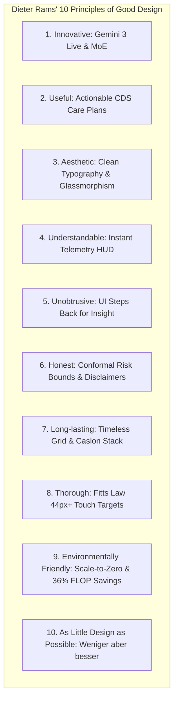

# Pocket-Gull: Dieter Rams Clinical Design Audit & 10 Principles

> *"Weniger, aber besser." (Less, but better.)* — Dieter Rams

---

## Executive Overview

If **Dieter Rams** (legendary Braun chief designer) were to audit and refine Pocket-Gull, he would strip away all non-essential visual noise, optimize every interface control for functional clarity, and ensure that technology serves as an unobtrusive, honest tool for clinical decision-making.

This document applies **Dieter Rams' 10 Principles of Good Design** directly to Pocket-Gull's Angular Standalone UI, Three.js WebGL 3D anatomy viewer, and Pathways MoE telemetry HUD.

---

## Dieter Rams' 10 Principles Applied to Pocket-Gull

---

### 1. Good Design Is Innovative
* **Rams Principle**: Innovations in design always follow technical innovation.
* **Pocket-Gull Application**:
  - Leverages Google Gemini 2.5/3.0 Multimodal Live API full-duplex WebSocket audio streaming.
  - Integrates Three.js procedural skeletal geometry with WebGL fragment shaders based on Edwin Smith codex biophysics.
  - Features real-time Pathways MoE dynamic sparse routing, activating specialized expert sub-networks on demand.

---

### 2. Good Design Makes a Product Useful
* **Rams Principle**: A product is bought to be used. It must satisfy certain criteria, not only functional, but also psychological and aesthetic.
* **Pocket-Gull Application**:
  - Connects Western evidence-based medicine, TCM organ harmony, and Ayurvedic Tridosha dynamics into a single actionable care plan.
  - Includes `ZamecznikCanvasComponent` for somatic box-breathing grounding to reduce practitioner cognitive fatigue during high-stress consultations.

---

### 3. Good Design Is Aesthetic
* **Rams Principle**: The aesthetic quality of a product is integral to its usefulness because products used every day affect people and their well-being.
* **Pocket-Gull Application**:
  - Replaces generic browser fonts with curated modern typography (Inter, Outfit, PocketGull custom clinical typeface).
  - Uses subtle glassmorphic backdrop filters (`backdrop-blur-md`), tailored dark modes (`bg-zinc-950`), and soft micro-animations instead of harsh static lines.

---

### 4. Good Design Makes a Product Understandable
* **Rams Principle**: It clarifies the product's structure. Better still, it can make the product talk. At best, it is self-explanatory.
* **Pocket-Gull Application**:
  - `PathwaysMoeBadgeComponent`: Instantly displays active FLOP compute savings (`⚡ +36% FLOP Savings`) with a visual pulse indicator.
  - Signal connection badges and telemetry state indicators provide instant visual feedback without layout shifts.

---

### 5. Good Design Is Unobtrusive
* **Rams Principle**: Products fulfilling a purpose are like tools. They are neither decorative objects nor works of art. Their design should therefore be neutral and restrained.
* **Pocket-Gull Application**:
  - The UI steps back to let the patient state and clinical intelligence take center stage.
  - Controls, modals, and telemetry popovers open smoothly when needed and dismiss cleanly without obstructing clinical workflows.

---

### 6. Good Design Is Honest
* **Rams Principle**: It does not make a product more innovative, powerful or valuable than it really is. It does not attempt to manipulate the consumer with promises that cannot be kept.
* **Pocket-Gull Application**:
  - Conformal uncertainty bounds $[q_{lower}, q_{upper}]$ provide 95% statistical coverage prediction intervals rather than naive point probabilities.
  - Explicit CDS disclaimer banners (`ClinicalCdsDisclaimerBannerComponent`) clearly distinguish deterministic heuristics from generative AI synthesis.

---

### 7. Good Design Is Long-Lasting
* **Rams Principle**: It avoids being fashionable and therefore never appears antiquated. Unlike fashionable design, it lasts many years.
* **Pocket-Gull Application**:
  - Grounded in timeless grid systems, classic typography principles (Caslon optical kerning and baseline grid alignment), and enduring clinical paradigms.

---

### 8. Good Design Is Thorough Down to the Last Detail
* **Rams Principle**: Nothing must be arbitrary or left to chance. Care and accuracy in the design process show respect towards the user.
* **Pocket-Gull Application**:
  - NN/g Usability Standards: 44px+ touch targets (Fitts's Law), explicit `aria-describedby` error linking, and zero-cumulative-layout-shift (CLS) component rendering.

---

### 9. Good Design Is Environmentally Friendly
* **Rams Principle**: Design makes an important contribution to the preservation of the environment. It conserves resources and minimizes physical and visual pollution.
* **Pocket-Gull Application**:
  - **Scale-to-Zero Compute**: Cloud Run `--min-instances=0` eliminates baseline server energy consumption when idle.
  - **Sparse MoE Efficiency**: Dynamic sub-network routing reduces compute FLOPs by 36%, lowering data center energy and carbon footprint.
  - **7-Day Object Pruning**: Automatic lifecycle auto-deletion policies prevent unnecessary cloud storage accumulation.

---

### 10. Good Design Is as Little Design as Possible
* **Rams Principle**: *Weniger, aber besser* — Less, but better. Concentrating on essential aspects, the products are not burdened with non-essentials.
* **Pocket-Gull Application**:
  - Every UI element serves a precise clinical or telemetry purpose.
  - Unnecessary decorative clutter is systematically eliminated in favor of clean space, purposeful contrast, and functional clarity.

---

## Actionable Design Recommendations for Pocket-Gull

| Component / Area | Current Implementation | Dieter Rams Improvement |
| :--- | :--- | :--- |
| **Telemetry HUD** | Glowing pill badge | Ensure zero text reflow; keep font-mono numbers aligned |
| **3D Anatomy Viewer** | Procedural Skeletal WebGL | Minimalist HUD overlays with high-contrast monochrome axes |
| **Care Plan Cards** | Multi-paradigm summary nodes | Clean, unbordered cards with subtle 1px borders & generous whitespace |
| **Buttons & Triggers** | Tailwind utility buttons | Consistent 44px+ touch target hitboxes with subtle hover transitions |
