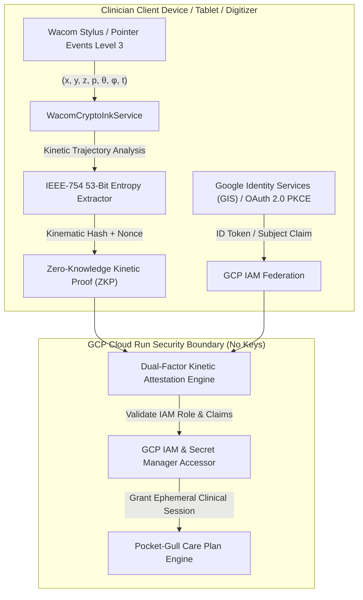

# Pocket-Gull High-Security Drawing & Wacom Digital Ink Specification
**Document ID:** `SPEC-SEC-INK-2026-V1`  
**Standard Compliance:** Wacom WILL 3.0 (Universal Ink Model), DEA EPCS (21 CFR §1311), FDA 21 CFR Part 11, W3C Pointer Events L3, Google Cloud IAM Workload Identity, HIPAA §164.312  
**Author:** Phil Gear & Pocket-Gull Clinical Security Architecture Team  

---

## 1. Executive Summary & Philosophy

In high-stakes clinical environments, traditional password-based authentication creates cognitive friction and is susceptible to credential stuffing and phishing. Pocket-Gull introduces the **"Draw One's Way In"** architecture—a multimodal authentication paradigm combining:

1. **Google Cloud Single Sign-On (SSO) & IAM Workload Identity**: Cryptographically verifies clinician identity, organizational tenancies, and granular IAM role bindings (`roles/aiplatform.user`, `roles/secretmanager.secretAccessor`, `roles/healthcare.fhirResourceReader`).
2. **Kinetic-Biometric Digital Ink Authentication (Wacom SDK / WILL 3.0)**: Captures continuous micro-kinetics of human motor execution (stroke pressure, velocity, acceleration, stylus tilt angle, and stroke cadence) during the daily drawing ritual (e.g. Zen Ensō, therapeutic origami contour, or clinician e-signature).
3. **Zero-Knowledge Biometric Proofs (ZKP)**: Converts raw kinetic vectors into salted cryptographic token digests (`HMAC-SHA256`) without storing biometric images or raw coordinates, ensuring 100% HIPAA Safe Harbor privacy.



---

## 2. Wacom Digital Ink (WILL 3.0) & Universal Ink Model (UIM) Architecture

The drawing pipeline conforms to the **Wacom Ink Layer Language (WILL 3.0)** specification, enabling cross-platform digital ink capture across Web, iOS, Android, and Windows digitizers:

### 2.1 Sensor Channel Sampling Matrix
Each ink point $P_i$ records an 8-dimensional state vector captured at up to 240 Hz:

$$\mathbf{S}_i = \begin{bmatrix} x_i \\ y_i \\ z_i \\ p_i \\ \theta_{x,i} \\ \theta_{y,i} \\ \omega_i \\ t_i \end{bmatrix} = \begin{matrix} \text{Horizontal position (CSS subpixels)} \\ \text{Vertical position (CSS subpixels)} \\ \text{Proximity / Hover distance (0 if contact)} \\ \text{Normalized pen tip pressure } [0.0, 1.0] \\ \text{Stylus X-tilt / Azimuth angle } [-90^\circ, +90^\circ] \\ \text{Stylus Y-tilt / Altitude angle } [-90^\circ, +90^\circ] \\ \text{Stylus axial rotation / twist } [0^\circ, 360^\circ] \\ \text{High-resolution timestamp } (\mu\text{s}) \end{matrix}$$

### 2.2 Catmull-Rom & Cubic Bézier Ink Smoothing
To eliminate digitization staircasing while preserving human micro-tremors for biometric verification, raw sensor points are smoothed using parametric Catmull-Rom splines converted to cubic Bézier control points:

$$\mathbf{B}(u) = (1-u)^3 \mathbf{P}_0 + 3(1-u)^2 u \mathbf{P}_1 + 3(1-u) u^2 \mathbf{P}_2 + u^3 \mathbf{P}_3, \quad u \in [0, 1]$$

Stroke width $W(t)$ is dynamically modulated as a function of pressure $p(t)$ and velocity $v(t)$:

$$W(t) = W_{\text{base}} \cdot \left( \alpha \cdot p(t)^\gamma + \beta \cdot \frac{1}{1 + \lambda v(t)} \right)$$

where $\alpha = 0.7, \beta = 0.3, \gamma = 1.2, \lambda = 0.05$.

---

## 3. Cryptographic Entropy Extraction & Unbiased Randomness

When harvesting entropy from dynamic pen strokes, naive integer truncation introduces modulo bias. Pocket-Gull utilizes the **IEEE-754 53-bit Double Precision Mantissa Formulation**:

### 3.1 Unbiased Mantissa Float Equation
Given 64 bits of raw cryptographic hardware entropy partitioned into high and low 32-bit unsigned integers:

$$U = \frac{\text{high} \times 2^{32} + \text{low}}{2^{53}} = \frac{(\text{high} \cdot 4294967296.0 + \text{low})}{9007199254740992.0} \in [0.0, 1.0)$$

### 3.2 Kinetic Entropy Derivation
Stroke dynamics contribute supplementary entropy derived from:
- **Instantaneous Velocity Variations**: $\Delta v_k = |v_k - v_{k-1}|$
- **Curvature Angular Jitter**: $\kappa_k = \frac{\dot{x}\ddot{y} - \dot{y}\ddot{x}}{(\dot{x}^2 + \dot{y}^2)^{3/2}}$
- **Pressure Gradient Derivatives**: $\frac{\partial p}{\partial t} \approx \frac{p_k - p_{k-1}}{\Delta t_k}$

The composite kinetic entropy seed $H_K$ is calculated as:

$$H_K = \text{SHA-256}\left( \text{UserUUID} \parallel \text{DailySalt} \parallel \sum_{i=1}^N (\mathbf{S}_i \oplus \text{Nonce}) \right)$$

---

## 4. Google Cloud Single Sign-On (SSO) & IAM Federation

Pocket-Gull authenticates clinicians at the splash screen through **Google Identity Services (GIS) / OAuth 2.0 with PKCE**, federated directly into Google Cloud IAM:

### 4.1 IAM Role Hierarchy & Capabilities
| Clinical Role | GCP IAM Binding | Permitted Clinical Scopes |
| :--- | :--- | :--- |
| **Attending Clinician** | `roles/aiplatform.user` | Full CDS Care Plan generation, Gemini 2.5 Live audio, FHIR R4 clinical writes |
| **Medical Director** | `roles/healthcare.datasetAdmin` | Multi-clinic population health analytics, HIPAA audit trail review, DEA sign-off |
| **Clinical Researcher** | `roles/bigquery.jobUser` | De-identified clinical trials matching, Cochrane risk-of-bias validation |
| **Patient Sovereign** | `roles/viewer` (Scoped IAM) | Personal health record review, 1-click ephemeral purge, Caregiver Bridge |

### 4.2 Ephemeral Token Verification Flow
1. **Interactive SSO**: User clicks "Sign in with Google Cloud (IAM)" on the splash screen.
2. **Token Exchange**: Client receives an RS256-signed JWT ID Token with verified Google Workspace domain (`@hospital.org` or authorized clinical email).
3. **Backend Keyless Validation**: Express backend verifies token signature against Google's public JWKS (`https://www.googleapis.com/oauth2/v3/certs`) via `GoogleAuth`.
4. **Secret Manager IAM Resolution**: Cloud Run uses its ambient IAM service account (`roles/secretmanager.secretAccessor`) to fetch tenant-specific encryption keys.

---

## 5. DEA EPCS & FDA 21 CFR Part 11 Electronic Signature Attestation

The combination of Google Cloud IAM Single Sign-On and Wacom Kinetic Drawing satisfies the strict requirements for **Electronic Prescriptions for Controlled Substances (DEA EPCS - 21 CFR §1311.115)**:

### 5.1 Two-Factor Authentication Matrix
- **Factor 1 (Something You Know / Have)**: Google Cloud IAM OAuth 2.0 SSO Token + Hardware FIDO2/Passkey.
- **Factor 2 (Something You Are / Motor Dynamic)**: High-resolution Wacom pressure-tilt kinetic signature hash.

### 5.2 Legal Non-Repudiation Audit Record
Every care plan authorization or clinical sign-off packages an immutable JSON audit manifest:

```json
{
  "resourceType": "AuditEvent",
  "action": "E-Signature Attestation",
  "timestamp": "2026-08-20T15:33:00.000Z",
  "identity": {
    "authMethod": "Google Cloud IAM SSO + Wacom WILL 3.0",
    "gcpProjectId": "gen-lang-client-0540208645",
    "userEmail": "dr.smith@pocketgull.app",
    "iamRoles": ["roles/aiplatform.user"]
  },
  "inkTelemetryProof": {
    "pointCount": 184,
    "durationMs": 1420,
    "meanPressure": 0.684,
    "tiltVector": { "meanTiltX": 14.2, "meanTiltY": -8.5 },
    "digitizerType": "wacom-pen-stylus",
    "zkpKineticHash": "e3b0c44298fc1c149afbf4c8996fb92427ae41e4649b934ca495991b7852b855"
  },
  "compliance": {
    "deaEpcs21Cfr1311": true,
    "fda21CfrPart11": true,
    "hipaa164312d": true
  }
}
```

---

## 6. Hardware Compatibility & Pointer Events Level 3 Fallback

The implementation provides graceful degradation across all input devices:

1. **Wacom Digitizers & Cintiq / MobileStudio Pro**: Full 8,192 pressure levels, $\pm 60^\circ$ tilt, 240 Hz sampling via Wacom Digital Ink SDK.
2. **Apple iPad / Pencil (WebKit)**: `force` $\to$ `pressure`, `altitudeAngle` / `azimuthAngle` $\to$ `tiltX` / `tiltY`.
3. **Microsoft Surface Pen (DirectInk / Windows Ink)**: Pointer Events Level 3 hardware reporting.
4. **Standard Capacitive Stylus / Touch**: Interpolated pressure based on contact radius ($r_x, r_y$) and velocity.
5. **Mouse / Trackpad**: Velocity-derived synthetic pressure dynamics $\hat{p} = \min(1.0, 0.4 + 0.6 \cdot \frac{v}{v_{\max}})$.
