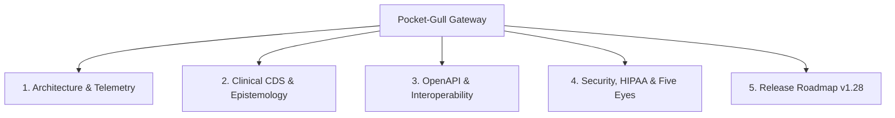

# 🌊 Pocket-Gull Developer Gateway & Knowledge Base

Welcome to the **Pocket-Gull (Understory)** GitHub Knowledge Base. Pocket-Gull is a real-time clinical intelligence engine, multimodal AI consultation platform, and HIPAA-compliant care strategy system powered by Google Gemini 2.5 and Angular 22.

---

## 🧭 Navigation & Knowledge Pillars



### 1. 🏗️ Architecture & Core Stack
* **Frontend**: Angular 22 Standalone Components with unidirectional Angular Signals (`signal`, `computed`, `effect`). Zero NgModules.
* **Server / SSR**: Node.js v24.x LTS with Express and Angular Universal SSR.
* **AI Layer**: Google Gemini 2.5 (`@google/genai`, Google Genkit, `@google/adk` `InMemoryRunner`).
* **Biophysical 3D Viewer**: Three.js WebGL procedural anatomical rendering with Edwin Smith surgical codex biophysical shaders.
* **Scripting & Tooling**: [Randal L. Schwartz Standard](file:///c:/Users/philg/Pocketgull/pocketgull/.github/copilot-instructions.md#3-scripting--tooling-standard-randal-l-schwartz-standard) — prefer **Dart** (`dart run scripts/dart/tool.dart`) over Python for zero virtualenv friction and sound static typing.

### 2. 🩺 Clinical Intelligence & Epistemological Boundaries
* **FDA 520(o) Non-Device CDS**: All AI care plans, symptom radars, and drug-interaction warnings are supportive clinical decision support tools and do not substitute for licensed practitioner judgment.
* **Popperian $H_0$ Falsifiability**: State signals calculate $p$-values against population baseline metrics; findings where $p \ge 0.05$ automatically display skeptical epistemic disclosures.
* **Cochrane RoB 2 Integration**: Literature citations are mapped to Cochrane Risk of Bias tiers (`Level A`, `Level B`, `Level C`).

### 3. 🌐 API & FHIR Interoperability
* **Interactive OpenAPI Portal**: View the full OpenAPI 3.0.3 specification at [`docs/openapi.json`](file:///c:/Users/philg/Pocketgull/pocketgull/docs/openapi.json).
* **HL7 FHIR R4 Bundle Standard**: All clinical state serialization strictly adheres to FHIR R4 standard models (`Patient`, `Condition`, `Observation`, `Consent`, `CarePlan`).
* **Canonical Domain Anchor**: All StructureDefinitions and security labels anchor to `https://pocketgull.app`.

### 4. 🛡️ Security, Privacy & Data Sovereignty
* **HIPAA §164.514 Safe Harbor**: Automatic de-identification stripping all 18 direct/indirect identifiers before LLM ingestion.
* **Five Eyes (FVEY) Statutory Compliance**: Built-in regulatory mapping across US (HIPAA/HITECH), UK (NHS DTAC/DSPT), Canada (PIPEDA/PHIPA), Australia (Privacy Act 1988/TGA SaMD), and New Zealand (HIPC 2020/HISO).
* **CodeQL & Supply Chain**: 100% clean CodeQL scan (JS/TS & Python), CycloneDX 1.6 SBOM attestations, and StepSecurity Harden-Runner enforcement.

### 5. 🗺️ PocketGull Release Roadmap (v1.28+)
* **Multimodal Voice & Full-Duplex WebRTC**: Native Gemini Live bidirectional audio streaming with Web Speech API fallbacks.
* **Solfeggio Cymatics & Spatial Vibroacoustics**: Real-time auditory-haptic biofeedback synthesis.
* **SMART-on-FHIR EHR Connectors**: Epic MyChart, Oracle Cerner, and AthenaHealth clinical chart sync.

---

## ⚡ Quick Start for Developers

```powershell
# 1. Start Client & SSR Server
npm run dev

# 2. Run Fast Pre-Flight Test Chain
node node_modules/typescript/lib/tsc.js -p tsconfig.json --noEmit
npx vitest run
node scripts/sentinel_security_guard.mjs
dart run scripts/dart/verify_agy_skills.dart

# 3. Build Production Bundle
npm run build
```
