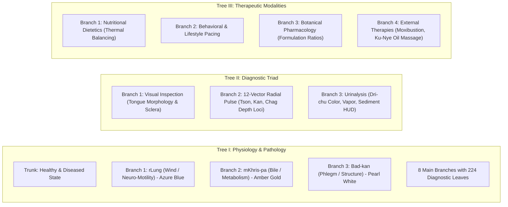

# Global Decad of Healing Systems, Sowa-Rigpa 3D Living Trees & ICD-11 Multi-Coding Architecture

## 1. Executive Summary

Pocket-Gull expands beyond classical tri-paradigm medicine (Biomedicine, TCM, Ayurveda) to synthesize the **Global Decad of Healing Systems** — 10 canonical world medical traditions mapped into a consilience knowledge graph and unified under a modern **WHO ICD-11 Primary Internal Ontology** with projected **ICD-10-CM / SNOMED CT** output layers.

```mermaid
graph TD
    subgraph Global Decad ["10-Paradigm Global Healing Systems Spectrum"]
        P1["1. Western Allopathic (Biomedicine)"]
        P2["2. Osteopathic Medicine (OMT)"]
        P3["3. Traditional Chinese Medicine (TCM)"]
        P4["4. Ayurvedic Medicine"]
        P5["5. Sowa-Rigpa (Himalayan Tibetan Medicine)"]
        P6["6. Unani Tibb (Greco-Arabic Medicine)"]
        P7["7. Kampo Medicine (Classical Japanese)"]
        P8["8. African Traditional Medicine"]
        P9["9. First Nations (Seven Generations Health)"]
        P10["10. Integrative Longevity & Functional Medicine"]
    end

    subgraph Internal Reasoning Engine ["Internal Clinical Decision Support"]
        ICD11["Primary Ontology: WHO ICD-11 MMS Stem Codes + ICTM Chapter 26"]
        VectorRAG["256-D On-Device Semantic Vector Search"]
        ODE["Circadian ODE Differential Solver"]
    end

    subgraph 3D Spatial Visualizer ["Spatial Diagnostic Grounding"]
        Tree1["Tree I: Physiology & Pathology (8 Branches / 224 Leaves)"]
        Tree2["Tree II: Diagnostic Triad (Tongue / 12-Vector Pulse / Urinalysis)"]
        Tree3["Tree III: Therapeutics (Diet / Behavior / Herbs / External)"]
    end

    subgraph Projection Layer ["Zero EDI X12 Clearinghouse Friction"]
        FHIR["HL7® FHIR® R4 Bundle (Dual-Coding)"]
        ICD10["Projected ICD-10-CM Codes (Billing & Claims)"]
        SNOMED["SNOMED CT Clinical Terms"]
    end

    Global Decad --> Internal Reasoning Engine
    Internal Reasoning Engine --> 3D Spatial Visualizer
    Internal Reasoning Engine --> Projection Layer
```

---

## 2. The 3 Living Trees of Sowa-Rigpa (*Gyushi* Spatial Ontology)

The classical Tibetan Medical Tantras (*rGyud bZhi*) organize all medical knowledge into **Three Living Trees**. In Pocket-Gull, these trees are rendered in interactive 3D with biophysical parallax tilt and tri-humoral (*Nyepa Sum*) color resonance:



### Tri-Humoral (*Nyepa Sum*) Dynamics
- **$rLung$ (Wind)**: Mediates nervous impulses, breath, peristalsis, and mental movement. Azure Blue resonance (`hsl(210, 95%, 55%)`).
- **$mKhris-pa$ (Bile)**: Governs thermogenesis, enzymatic digestion, vision, and metabolic transformation. Amber Gold resonance (`hsl(38, 92%, 50%)`).
- **$Bad-kan$ (Phlegm)**: Provides lubrication, structural tissue resilience, lymphatic stability, and joint cohesion. Pearl White resonance (`hsl(200, 20%, 90%)`).

---

## 3. ICD-11 Primary Internal Ontology & Dual-Coding Projection

### Problem Formulation
Legacy clinical applications remain locked into ICD-10-CM (1992 nomenclature), which lacks granular disease mechanisms, molecular subtyping, and standardized traditional medicine terminology. However, U.S. insurance clearinghouses, CMS claims pipelines, and hospital billing systems strictly mandate ICD-10-CM under HIPAA transaction rules.

### The Pocket-Gull Solution
1. **Primary Internal Reasoning**: All AI models, clinical risk calculators, and diagnostic crosswalks operate natively on **WHO ICD-11 MMS** stem codes and **WHO ICTM Chapter 26** traditional medicine concepts.
2. **Dual-Coding Output Projection**: When serializing FHIR R4 resources or generating superbills, [`FhirWhoIctmSerializerService`](file:///c:/Users/philg/Pocketgull/pocketgull/src/services/fhir-who-ictm-serializer.service.ts) automatically projects primary ICD-11 codes into verified ICD-10-CM and SNOMED CT equivalents:

```json
{
  "resourceType": "Condition",
  "id": "cond-001",
  "code": {
    "coding": [
      {
        "system": "http://id.who.int/icd/release/11/mms",
        "code": "BA00",
        "display": "Essential hypertension"
      },
      {
        "system": "http://hl7.org/fhir/sid/icd-10-cm",
        "code": "I10",
        "display": "Essential (primary) hypertension",
        "userSelected": false
      },
      {
        "system": "http://snomed.info/sct",
        "code": "59621000",
        "display": "Essential hypertension (disorder)"
      },
      {
        "system": "http://id.who.int/icd/release/11/mms/ictm",
        "code": "SF50",
        "display": "Liver Yang Rising Pattern (ICTM Chapter 26)"
      }
    ],
    "text": "Essential hypertension with secondary Liver Yang hyperactivity"
  }
}
```

---

## 4. WHO & NIH Strategic Alignment Hub

The **WHO-NIH Strategic Alignment Hub** aligns every individual care plan against macro public health goals:

| Strategic Goal | Target Vector | Computational Mechanism |
| :--- | :--- | :--- |
| **WHO SDG-3 Target 3.4** | Reduce premature mortality from Non-Communicable Diseases (NCDs) by 33%. | Conformal Prediction 95% uncertainty quantification (UQ) on cardiometabolic decline trajectories. |
| **NIH NCCIH Strategic Plan** | Objective 1: Advance fundamental science and natural products synergy. | Chou-Talalay Botanical Combination Index ($CI < 1.0$) and CYP450 non-displacement verification. |
| **WHO Traditional Medicine Strategy 2025–2034** | Integrate evidence-grounded traditional healing systems into primary health care. | Sowa-Rigpa 3D Living Trees and WHO ICTM Chapter 26 dual-coding ontology. |
| **CDC Healthy People 2030** | Increase health literacy and sleep resilience in chronic illness populations. | Socratic dialogue adaptation, circadian ODE pacing, and Bionic Reading focus. |

---

## 5. Summary of Key Services and Components

- [`src/components/shared/sowa-rigpa-tree-spatial-viewer.component.ts`](file:///c:/Users/philg/Pocketgull/pocketgull/src/components/shared/sowa-rigpa-tree-spatial-viewer.component.ts): Interactive 3D Living Tree visualizer.
- [`src/components/shared/global-decad-healing-spectrum.component.ts`](file:///c:/Users/philg/Pocketgull/pocketgull/src/components/shared/global-decad-healing-spectrum.component.ts): 10-paradigm spectrum tabbed navigator.
- [`src/components/shared/who-nih-healing-alignment-hub.component.ts`](file:///c:/Users/philg/Pocketgull/pocketgull/src/components/shared/who-nih-healing-alignment-hub.component.ts): WHO & NIH strategic milestone dashboard.
- [`src/services/fhir-who-ictm-serializer.service.ts`](file:///c:/Users/philg/Pocketgull/pocketgull/src/services/fhir-who-ictm-serializer.service.ts): Dual-coding FHIR R4 Bundle exporter.
- [`src/services/global-healing-paradigms.service.ts`](file:///c:/Users/philg/Pocketgull/pocketgull/src/services/global-healing-paradigms.service.ts): ICD-11 primary stem code crosswalk registry.
- [`e2e/global-decad-and-who-nih-alignment.spec.ts`](file:///c:/Users/philg/Pocketgull/pocketgull/e2e/global-decad-and-who-nih-alignment.spec.ts): Multi-device Playwright test suite.
