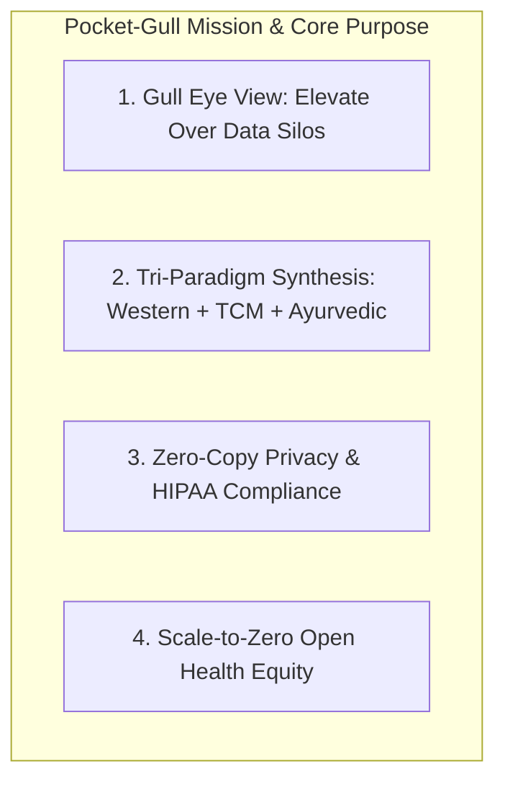

# Pocket-Gull: Mission Statement, Core Purpose & Historical Foundation

> *"To provide practitioners with the 'Gull's Eye View'—the ability to rise above the turbulent sea of medical data and see the clear, actionable patterns beneath."* — Phil Gear (Founding Mission Statement)

---

## Executive Overview

Founded in **February 2026** by **Phil Gear**, Pocket-Gull was built to solve a fundamental crisis in modern healthcare: **practitioner cognitive overload caused by fragmented medical data silos**.

Pocket-Gull rises above single-perspective medicine by synthesizing **multimodal patient data** (3D WebGL spatial anatomy, bi-directional audio dictation, real-time biometrics, and FHIR R4/R5 bundles) across **three distinct clinical paradigms**:
1. 🩺 **Western Evidence-Based Medicine** (Allopathic Biomarkers, LOINC Codes, PubMed RCT Evidence)
2. 🌿 **Traditional Chinese Medicine** (Zang-Fu Organ Harmony, Qi & Blood Stagnation, Meridian Acupoints)
3. 🧘 **Ayurvedic Functional Medicine** (Tridosha Vata/Pitta/Kapha Balances, Agni Fire, Srotas Channel Flow)

---

## The 4 Pillars of the Pocket-Gull Mission

---

### Pillar 1: The Gull's Eye View (Overcoming Cognitive Overload)
In busy clinic shifts, practitioners spend more time clicking through electronic health record (EHR) menus than engaging with patients. Pocket-Gull synthesizes thousands of telemetry points into clean, high-contrast, self-explanatory care plan visual cards.

### Pillar 2: Tri-Paradigm Consilience & Transdisciplinary Integration
No single clinical paradigm holds all answers. Pocket-Gull's `InfiniteClinicalSynthesisService` bridges conventional allopathic lab values directly to traditional meridian pathways and doshic balances (e.g. Zinc $\rightarrow$ Kidney Jing; Magnesium $\rightarrow$ Liver/Heart Qi; Vitamin D3 $\rightarrow$ Yang Vitality).

### Pillar 3: Zero-Copy Privacy & HIPAA-Compatible Protection
Patient data sovereignty is non-negotiable. Pocket-Gull performs zero-copy binary ArrayBuffer transformations (`AdkLiveService`), DOMPurify string sanitization, and de-identification following **HIPAA §164.514 Safe Harbor** standards.

### Pillar 4: Scale-to-Zero Open Infrastructure Economics
High-quality medical AI must be economically sustainable for rural clinics and community health centers. Pocket-Gull enforces GCP Cloud Run `--min-instances=0` scale-to-zero compute and 7-day auto-deletion storage lifecycle policies, capping baseline cloud overhead at **~$\$$0.20/month**.

---

## Historical Milestone Timeline

| Date | Milestone | Core Advancement |
| :--- | :--- | :--- |
| **February 2026** | **Initial Foundation** | Project vision launched by Phil Gear; core tri-paradigm framework established. |
| **July 2026** | **v1.2.0 Release** | 10 Standardized Clinical Assessment Instruments (PHQ-9, GAD-7, C-SSRS, PRAPARE) + 3D Meridian Viewport. |
| **August 2026** | **v1.15.0 Release** | Pathways MoE Sparse Sub-Network Router, ONNX FP16 Engine, Zero-Copy PCM Audio Streaming, and Scale-to-Zero GCP Lifecycle Automation. |

---

## Technical Core References

- **Founding README**: [README.md](file:///c:/Users/philg/Pocketgull/pocketgull/README.md)
- **Clinical Paradigms Guide**: [docs/study/src/pages/clinical-paradigms.mdx](file:///c:/Users/philg/Pocketgull/pocketgull/docs/study/src/pages/clinical-paradigms.mdx)
- **Jeff Dean Systems Architecture**: [docs/SIGARCH_QUANTITATIVE_SYSTEMS_ARCHITECTURE.md](file:///c:/Users/philg/Pocketgull/pocketgull/docs/SIGARCH_QUANTITATIVE_SYSTEMS_ARCHITECTURE.md)
- **Dieter Rams Design Audit**: [docs/DIETER_RAMS_CLINICAL_DESIGN_PRINCIPLES.md](file:///c:/Users/philg/Pocketgull/pocketgull/docs/DIETER_RAMS_CLINICAL_DESIGN_PRINCIPLES.md)
- **Phil Gear Contribution Guide**: [docs/PHIL_GEAR_VISION_AND_CONTRIBUTION_GUIDE.md](file:///c:/Users/philg/Pocketgull/pocketgull/docs/PHIL_GEAR_VISION_AND_CONTRIBUTION_GUIDE.md)
