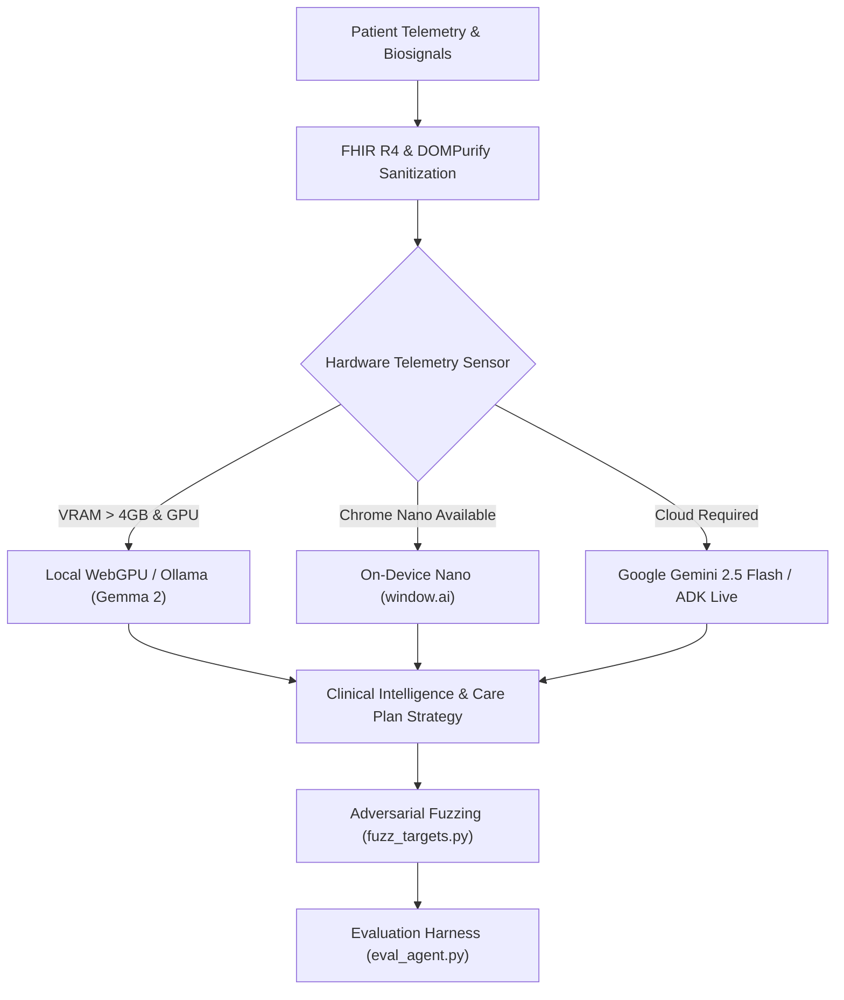

# 🚀 Pocket Gull — SDLC, AIDLC & Strategic Product Roadmap

## 1. AI Development Lifecycle (AIDLC / MLOps & LLMOps)

### Key Pillars:
1. **Multi-Tier Hybrid Execution Pipeline**:
   - **On-Device Nano (`window.ai`)**: Zero footprint, instant offline response for patient literacy & basic symptom intake.
   - **Local WebGPU / Ollama**: WebLLM on discrete GPUs (NVIDIA CUDA / AMD WebGPU) for zero-latency private clinical scoring.
   - **Cloud Gemini 2.5 Flash & ADK Live**: Full-duplex multimodal live audio streaming and enterprise SBAR clinical handoffs.
2. **Shift-Left Alignment & Security Fuzzing**:
   - Continuous evaluation harness via `eval_agent.py` and `evaluate_model.py` assessing diagnostic accuracy against clinical benchmarks.
   - Native Atheris / PyTorch adversarial input fuzzing (`fuzz_targets.py`) preventing injection vulnerabilities.
3. **FHIR R4 & Privacy Compliance**:
   - Automatic DOMPurify HIPAA sanitization on all incoming/outgoing patient payloads before sending to model context.

---

## 2. Software Development Lifecycle (SDLC & Monorepo Governance)

### Quality Gates & Standards:
- **Strict Node.js v24 & Angular 22 Standards**:
  - Standalone components and Angular Signals (`signal`, `computed`, `effect`) strictly favored over RxJS observables for local component state.
  - Mandatory TypeScript typecheck (`tsc --noEmit`) with explicit Node module paths before any PR merge.
- **Python FastAPI Sidecar Standards**:
  - Strict Pydantic V2 request/response schemas with async route handlers.
- **Flutter / Dart Companion App Standards**:
  - Riverpod 2.0 `AsyncNotifier` state management across iOS, Android, and Desktop builds.
- **Accessibility & Ergonomics (Dieter Rams Principles)**:
  - Minimum touch targets ($\ge 44\text{px}$ web, $\ge 48\text{px}$ mobile), high-contrast WCAG AAA typography, and multi-level cognitive output modes (`Standard`, `Simplified`, `Dyslexia`, `Child`).
- **ACM & IEEE Special Interest Group (SIG) Architecture Standards**:
  - **SIGARCH**: [Quantitative Systems Architecture](file:///c:/Users/philg/Pocketgull/pocketgull/docs/SIGARCH_QUANTITATIVE_SYSTEMS_ARCHITECTURE.md) (Zero-copy PCM streams, ONNX FP16 SIMD, Scale-to-Zero GCP Cloud Run).
  - **SIGCHI**: [Spatial 3D Accessibility & WCAG 2.2 AAA](file:///c:/Users/philg/Pocketgull/pocketgull/docs/ACCESSIBILITY_SIGCHI.md) (7:1 contrast ratios, Fitts's Law 44px+ hitboxes, reduced-motion snapping).
  - **SIGBIO / SIGKDD**: [Clinical Knowledge Mining & Graph GNNs](file:///c:/Users/philg/Pocketgull/pocketgull/docs/SIGBIO_SIGKDD_CLINICAL_KNOWLEDGE_MINING.md) (Heterogeneous multi-paradigm graphs, Asymmetric Loss triage, GroupKFold splits).
  - **SIGGRAPH**: [WebGPU & Biophysical Rendering](file:///c:/Users/philg/Pocketgull/pocketgull/docs/SIGGRAPH_WEBGPU_BIOPHYSICAL_RENDERING.md) (60 FPS 3D spatial viewports, Edwin Smith PBR shaders, volumetric DICOM raymarching).
  - **SIGCOMM / IEEE SPS**: [Streaming Audio & Voice Biomarkers](file:///c:/Users/philg/Pocketgull/pocketgull/docs/SIGCOMM_SPS_STREAMING_AUDIO_BIOMARKERS.md) (Zero-copy 16kHz PCM WebSockets, MFCC pitch jitter extraction, adaptive jitter pacing).
  - **SIGSAC / IEEE SIGSEC**: [HIPAA Zero-Trust & Cryptographic Privacy](file:///c:/Users/philg/Pocketgull/pocketgull/docs/SIGSAC_HIPAA_ZERO_TRUST_PRIVACY.md) (HIPAA Safe Harbor §164.514 de-identification, DOMPurify XSS defense, 53-bit IEEE-754 mantissa formulas).
  - **SIGSOFT / SIGPLAN**: [Formally Verified Reactive State](file:///c:/Users/philg/Pocketgull/pocketgull/docs/SIGSOFT_SIGPLAN_REACTIVE_STATE_ARCHITECTURE.md) (Angular Signals DAG, standalone isolation, clinical protocol DSLs).
  - **IEEE PES**: [Energetics & Green Computing](file:///c:/Users/philg/Pocketgull/pocketgull/docs/IEEE_PES_POWER_ENERGY_SUSTAINABILITY.md) (Biophysical metabolic energetics, bedside mobile DVFS battery budgeting, scale-to-zero GCP carbon efficiency).

---

## 3. Strategic Product Roadmap

### Phase 1: 3-Tier Multi-Platform Feature Parity (Current Milestone)
- **Goal**: Elevate Flutter/Dart Mobile Suite to 100% feature parity with Angular Web using `scripts/generate-parity-matrix.js` automated tracking.
- **Key Deliverables**: Mobile local storage (Isar / Hive encrypted cache), mobile 3D body viewer widget, and hardware telemetry API sync.

### Phase 2: Low-Latency Multimodal Live Bedside Assistant
- **Goal**: Full-duplex real-time voice consultations at patient bedside.
- **Key Deliverables**: Gemini ADK Live WebSocket streaming, Web Speech API bi-directional STT/TTS, and 110 BPM CPR haptic metronome entrainment.

### Phase 3: Population Health Federated Edge Analytics
- **Goal**: Enterprise fleet telemetry and predictive clinical epidemiology.
- **Key Deliverables**: Python sidecar SIR/ODE differential equation solvers, BigQuery / Lakehouse federated catalog integration, and automated OpenSSF security scorecard verification.
