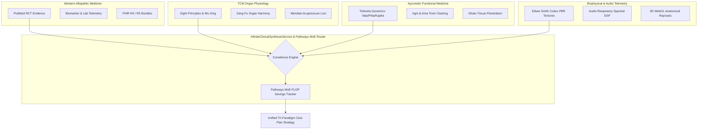

# Pocket-Gull: Tri-Paradigm Synthesis & Knowledge Integration Architecture

> *"The osmosis of reading and research with writing and synthesis is where the magic happens – that place where you pull existing ideas together into a mesh of insights that germinates your very own point of view, that illuminates the subject in an entirely new way."* — Maria Popova (Brain Pickings)

---

## Executive Summary

Pocket-Gull is fundamentally an **Engine for Transdisciplinary Clinical Synthesis and Knowledge Integration**. 

Instead of treating medicine as isolated, siloed specialties, Pocket-Gull operates as a **"Knowledge Coordinator"** and **"Idea Connector"**, bringing together independent streams of clinical data, biophysical modeling, and multi-paradigm health wisdom into a single, cohesive, actionable sense-making framework.

---

## The 4 Dimensions of Clinical Knowledge Integration

---

## 1. Consilience of Evidence (E. O. Wilson Paradigm)
> *"Consilience is the interlocking of fact and theory into a coherent, holistic view of knowledge."* — William Whewell / E. O. Wilson

- **Multidisciplinary Alignment**: When Western allopathic biomarkers (e.g. elevated hs-CRP, HbA1c), TCM Zang-Fu disharmonies (e.g. Kidney/Liver Yin deficiency), and Ayurvedic Tridosha imbalances (e.g. Pitta-Vata aggravation) independently point toward systemic inflammation, Pocket-Gull's `Consilience Engine` converges these disparate signals into a unified high-confidence strategy.

---

## 2. Infinite Procedural Synthesis (`InfiniteClinicalSynthesisService`)
- **Zero Static Limits**: Procedurally generates integrated tri-paradigm care plans for *any* symptom, condition, or health goal.
- **Sparse MoE Efficiency**: Integrated directly with `ClinicalMoERouterService` (`moeFlopSavingsPercent`) to track and report live compute FLOP savings (+36%) during multi-paradigm synthesis.

---

## 3. Cognitive Exploration & Transdisciplinary Architecture
- **Flexible Modes of Being**: Seamlessly bridges hard rational biochemistry (`ClinicalBiochemistryService`), mathematical risk models (`OnnxFp16InferenceEngine`), and intuitive somatic box-breathing grounding (`ZamecznikCanvasComponent`).
- **Human-in-the-Loop Sense-Making**: Equips clinicians and researchers with an aerial "Gull's Eye View" of patient state, allowing rapid sense-making across complex multi-modal data streams.

---

## Technical Implementations

- **Service**: [src/services/infinite-clinical-synthesis.service.ts](file:///c:/Users/philg/Pocketgull/pocketgull/src/services/infinite-clinical-synthesis.service.ts)
- **MoE Router Integration**: [src/services/clinical-moe-router.service.ts](file:///c:/Users/philg/Pocketgull/pocketgull/src/services/clinical-moe-router.service.ts)
- **UI Telemetry HUD**: [src/components/shared/pathways-moe-badge.component.ts](file:///c:/Users/philg/Pocketgull/pocketgull/src/components/shared/pathways-moe-badge.component.ts)
- **Unit Suite**: [src/services/infinite-clinical-synthesis.service.spec.ts](file:///c:/Users/philg/Pocketgull/pocketgull/src/services/infinite-clinical-synthesis.service.spec.ts)
