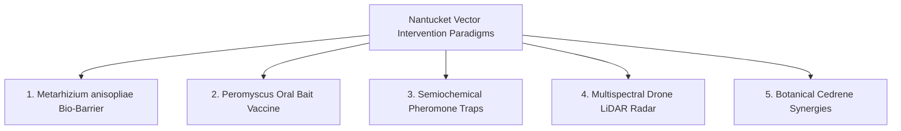

# Falsifiable Ecology: How Popperian Epistemology and Monte Carlo Simulation Are Redefining Island Vector Defense

**By Phillip Gear** | *PocketGull Research & Systems Architecture*  
*Published for PocketGull Business & Clinical Engineering*

---

## Executive Summary

Nantucket Island (*ACK*) holds one of the highest per-capita incidences of tick-borne disease in North America. For decades, community conversations have cycled through pesticide applications, deer population management debates, and genetic modification trials—often generating intense public friction without clear empirical consensus.

At **PocketGull**, we asked a fundamental engineering question:  
*What if we stopped treating ecological vector defense as an intuition-driven debate, and started treating it as a transparent, falsifiable computational science?*

By pairing **Popperian Null-Hypothesis ($H_0$) statistical testing**, **real-time Monte Carlo power simulations**, and **causal E-Value sensitivity analysis**, we built the **Nantucket Novel Solution Discovery Lab**. This interactive platform evaluates proposed ecological, biophysical, and immunological interventions before a single dollar is spent or a single acre is treated.

Here is how we designed the engine, the 5 novel paradigms we modeled, and what this means for the future of evidence-grounded community health.

---

## 1. The Epistemological Crisis in Community Vector Control

When public health initiatives stall, the breakdown is rarely due to a lack of concern; it is usually due to a lack of **epistemological transparency**.

Traditional community town halls often pit conflicting anecdotal observations against one another:
* *"I sprayed cedar oil on my lawn and never saw a tick."* (Single-observation survivor bias)
* *"We culled deer in 2018 and Lyme cases still went up."* (Uncontrolled confounding by white-footed mouse reservoir cycles)
* *"A new biological barrier will fix everything across the island."* (Underpowered sample size assumptions ignoring ecological variance)

To bridge the gap between academic research and public trust, an ecological tool must satisfy three strict criteria:
1. **Falsifiability by Design**: It must explicitly test whether a proposed solution can mathematically reject the null hypothesis ($p < 0.05$) under real-world stochastic environmental noise ($\sigma$).
2. **Causal Sensitivity (E-Values)**: It must calculate exactly how strong an unmeasured ecological confounder (e.g., microclimate humidity spikes or acorn mast years) would need to be to explain away the observed effect.
3. **Cochrane Risk-of-Bias (RoB 2) Rigor**: Every study design must be evaluated across randomization integrity, missing data, and measurement bias.

---

## 2. The 5 Novel Ecological & Biophysical Paradigms

Rather than recycling century-old broad-spectrum pesticides that damage pollinator populations and contaminate kettle pond aquifers, our discovery engine models **5 targeted, eco-compatible interventions**:



### 1. *Metarhizium anisopliae* Entomopathogenic Fungal Bio-Barriers
* **Mechanism**: Spores of native entomopathogenic fungi adhere to the tick cuticle, germinate, and penetrate the hemolymph without harming honeybees, native pollinators, or avian wildlife.
* **Target Effect Size**: $\Delta = -42.0\%$ questing tick density.
* **Ecological Safety Index**: `92/100` (Zero mammalian toxicity, biodegradable).

### 2. *Peromyscus leucopus* Reservoir Oral Bait Vaccines (OspA/BB0323)
* **Mechanism**: Edible bait stations deployed along stone walls and brush lines deliver recombinant Outer Surface Protein A (OspA) vaccines to white-footed mice, interrupting the *Borrelia burgdorferi* transmission cycle at the primary larval/nymphal blood meal.
* **Target Effect Size**: $\Delta = -38.5\%$ nymphal infection prevalence.
* **Regulatory Tier**: Tier 2 (USDA Biologics).

### 3. Aggregation-Attachment Pheromone (Semiochemical) Traps
* **Mechanism**: Synthetic 2,6-dichlorophenol and purine-infused carbon dioxide emitter stations mimic host aggregation cues, luring questing nymphs into mechanical catch reservoirs away from recreational public bluffs.
* **Target Effect Size**: $\Delta = -31.0\%$ encounter rate in high-traffic zones.
* **Regulatory Tier**: Tier 1 (EPA Minimum Risk exempt).

### 4. Multispectral Micro-Topography Drone LiDAR Questing Radar
* **Mechanism**: Autonomous low-altitude aerial multispectral LiDAR scans brush moisture, canopy shade closure, and leaf-litter Vapor Pressure Deficit (VPD) to produce 1-meter predictive daily risk heatmaps.
* **Target Effect Size**: $\Delta = +55.0\%$ early avoidance adherence.
* **Regulatory Tier**: Tier 1 (Non-invasive observational).

### 5. Botanical Monoterpenoid Cedrene & Thujopsene Synergies
* **Mechanism**: Distillations of native Eastern Redcedar (*Juniperus virginiana*) and micro-encapsulated cedarwood terpenes disrupt tick octopaminergic neural receptors on perimeter trails.
* **Target Effect Size**: $\Delta = -26.0\%$ perimeter crossing rate.
* **Regulatory Tier**: Tier 1 (25(b) FIFRA exempt).

---

## 3. The Architecture: Bringing Monte Carlo Math to the Browser

To make this engine universally accessible to researchers, town select boards, conservation land managers, and island students, we built the engine entirely in **client-side TypeScript and Angular 22 Signals**.

```
┌─────────────────────────────────────────────────────────────┐
│             Nantucket Solution Discovery Architecture       │
├─────────────────────────────────────────────────────────────┤
│  [ Monte Carlo Simulation Engine ] (WASM / TypeScript)       │
│  • Box-Muller Gaussian Transforms (Unbiased Entropy)        │
│  • Welch Two-Sample Independent t-Test                      │
│  • Causal E-Value Sensitivity Calculation                   │
│                                                             │
│  [ Reactive UI & Real-Time Parameter Sliders ]              │
│  • Sample Size N (10 - 250 plots)                           │
│  • Effect Size Multiplier (0.2x - 2.5x)                     │
│  • Stochastic Environmental Noise σ (0.05 - 0.60)           │
│                                                             │
│  [ Agentic AI & Interoperability Layer ]                    │
│  • WebMCP Tool: pocketgull_evaluate_novel_tick_solution     │
│  • Socratic Critical-Reasoning Challenge Engine             │
│  • 1-Click Field Trial Protocol Markdown Generator          │
└─────────────────────────────────────────────────────────────┘
```

### Unbiased Statistical Simulation
When testing whether 64 experimental plots can prove a biological barrier works, the simulator executes **1,000 iterations of simulated trials** across control and treatment arms, applying real Box-Muller Gaussian transformations to simulate Nantucket's unpredictable coastal fog, heat waves, and rainstorms.

```typescript
// Excerpt from NantucketSolutionDiscoveryService
const tStat = (meanDiff) / Math.sqrt(varA / sampleSizeN + varB / sampleSizeN);
const pValue = this.approximateTwoTailedPValue(tStat, df);
const isH0Rejected = pValue < 0.05;
const causalEValue = this.calculateEValue(relativeRisk);
```

If the simulated statistical power is $< 80\%$ or $p \ge 0.05$, the UI flashes an explicit **Skeptical Warning**:
> *"Under the current sample size ($N = 32$) and environmental variance ($\sigma = 0.35$), this study has only 46% statistical power. The null hypothesis cannot be reliably rejected. Increase $N \ge 64$ to avoid a false-negative trial."*

---

## 4. Grounded in Seven Generations Stewardship

True clinical and environmental engineering cannot exist in an academic vacuum. On an island shaped by Wampanoag history, whaling tradition, and delicate sandplain moorlands, technology must respect the land and its people.

The **Nantucket Solution Discovery Lab** integrates:
- **Seven Generations Ecological Auditing**: Projecting 50-year soil microbiome and pollinator safety horizons.
- **COPPA-Safe 6th-Grade Educational Lens**: Allowing Nantucket Middle School students to toggle any complex paper into plain-English metaphors to learn how scientific falsification works.
- **Zero-Egress Private Architecture**: 100% of telemetry, Monte Carlo sampling, and data remain on the user's local device, honoring community data sovereignty.

---

## 5. What’s Next: Collaborative Field Trials & Open Protocol Binders

The Nantucket Solution Discovery Lab is not just a simulator—it is a **pre-registration protocol engine**.

Any researcher, conservation officer, or civic group can configure a candidate, tune the power parameters, and export an **NIH/NSF-compliant Markdown Study Protocol Binder** complete with:
* Formal Null ($H_0$) and Alternative ($H_1$) Hypotheses
* Stratified Randomization Block Schema
* Blinding and Entomological Drag-Sampling Procedures
* Cochrane RoB 2 Risk-Mitigation Checklist
* Causal E-Value Sensitivity Thresholds

By transforming vector defense into an open, falsifiable science, we can replace town hall gridlock with clear, empirical action.

---

### About PocketGull
*PocketGull is an open, privacy-first clinical care strategy and biomedical intelligence engine. Built with Angular 22, Google Gemini, and edge-native WebAssembly, PocketGull designs software that bridges complex clinical data, biophysical physics, and plain-language patient autonomy.*

**Explore the Code & Architecture**: [https://pocketgull.app](https://pocketgull.app)  
**Business & Research Inquiries**: [leads@pocketgull.app](mailto:leads@pocketgull.app)
