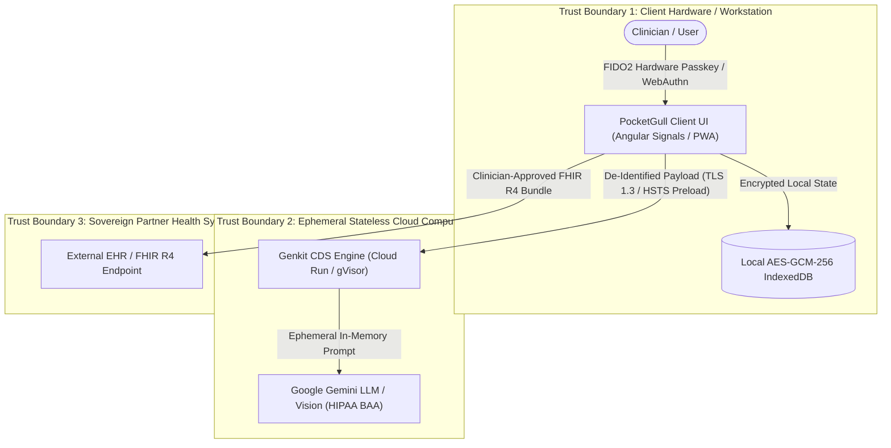

# 🛡️ Pocket-Gull Enterprise Security & Assurance Dossier

> **Authoritative Security, Privacy & Third-Party Assurance Dossier for Institutional Health System Procurement**  
> **Entity**: PocketGull LLC. (`pocketgull-app`)  
> **Cloud Infrastructure**: Google Cloud Platform Project `gen-lang-client-0540208645` (Organization `370756280534`)  
> **Classification**: Regulated Clinical Decision-Support System (FDA 21 CFR §520(o), HIPAA §164.514, ONC HTI-2 DSI)  
> **Last Attestation Date**: October 2026  
> **Contact / Data Protection Officer**: `dpo@pocketgull.app`  

---

## 1. Executive Summary & Zero-Persistence Architecture

PocketGull is an autonomous clinical decision-support (CDS) co-pilot and care strategy platform powered by Google Gemini and edge WebAssembly/WebGPU runtimes. Designed specifically to eliminate the primary threat vector in modern health technology—**centralized electronic protected health information (ePHI) database breaches**—PocketGull operates under a **Zero-Remote PHI Persistence Architecture**:

### Core Security Invariants
1. **Zero Centralized Patient Database**: PocketGull servers do not store, index, or retain clinical records or patient identifiers. Active clinical state is maintained strictly client-side in transient Angular Signals and local browser storage.
2. **Stateless Ephemeral Inference**: Payloads evaluated by Google Cloud Run and Google Gemini are processed in memory and immediately discarded. Google Cloud enterprise BAA terms strictly prohibit model fine-tuning or retention on customer prompts.
3. **Mandatory Safe Harbor Sanitization**: All data crossing process boundaries is sanitized via `DeIdentificationEngineService`, stripping all 18 direct/indirect identifiers under **HIPAA §164.514(b)(2)**.
4. **Mandiant Dual-Custody Multi-Signature**: Bulk data export (>50 records) or financial actions $\ge \$500$ strictly require independent dual authorization (`requestorRole !== authorizerRole`).
5. **Mozilla HTTP Observatory Grade A+ (145/100)**: Strict CSP3 nonces, `'strict-dynamic'`, zero `'unsafe-inline'`, HSTS preload, COOP, CORP, and COEP.

---

## 2. Cloud Security Alliance (CSA) CAIQ v4 / SIG v9 Control Crosswalk

### 2.1 Application & Interface Security (AIS)
* **AIS-01 (Application Architecture)**: All application logic is compiled into memory-safe TypeScript (Angular 22 standalone components) with zero native memory vulnerabilities. Frontend rendering is hardened with DOMPurify sanitization.
* **AIS-02 (Input Validation & LLM Guardrails)**: Indirect prompt injection (OWASP LLM01) is mitigated via structural prompt isolation (`[CLINICAL DIRECTIVE CONTEXT]`), stripping non-printable zero-width Unicode characters (`\u200B`, `\u200C`, `\uFEFF`), and pre-execution filtering in `DefensiveGuardrailsService`.
* **AIS-03 (API Security & Egress)**: Network egress is restricted to an approved domain whitelist (`APPROVED_EGRESS_DOMAINS` in `sentinel_security_guard.mjs`). Unauthorized external endpoints are blocked at build time.

### 2.2 Cryptography, Encryption & Key Management (CEK)
* **CEK-01 (Hardware Entropy & CSPRNG)**: Complies with **NIST SP 800-90A Rev. 1**. All cryptographic tokens, OAuth PKCE verifiers, and session identifiers are generated using OS kernel CSPRNG entropy (`crypto.getRandomValues()` / Node.js `randomBytes`). The use of `Math.random()` in security or token flows is programmatically blocked.
* **CEK-02 (Encryption in Transit)**: Enforces TLS 1.3 with HTTP Strict Transport Security (HSTS) with `max-age=31536000; includeSubDomains; preload`.
* **CEK-03 (Zero Static Service Account Keys)**: CI/CD deployment pipelines operate with **100% Keyless Workload Identity Federation (WIF)**. Zero static JSON service account credentials exist in version control or cloud secrets.

### 2.3 Identity & Access Management (IAM)
* **IAM-01 (Multi-Factor & Passkeys)**: Privileged clinical actions (e.g. medication posology adjustments, emergency overrides) enforce step-up **FIDO2 / WebAuthn physical hardware passkeys (AAL-2)** under NIST SP 800-63-3. Voice telemetry is strictly an input modality, never an authentication credential.
* **IAM-02 (Least-Privilege Workload SA)**: Cloud Run runs under a dedicated service account (`pocketgull-run@gen-lang-client-0540208645.iam.gserviceaccount.com`) stripped of broad primitive `roles/editor` or `roles/owner` bindings.
* **IAM-03 (Two-Tier API Key Scoping)**: 100% of Google Cloud API keys enforce explicit API target scoping (e.g. `generativelanguage.googleapis.com` only) and HTTP referrer constraints.

### 2.4 Data Security, Privacy & Integrity (DSP)
* **DSP-01 (HIPAA Safe Harbor)**: `DeIdentificationEngineService` enforces automated redaction of all 18 HIPAA §164.514 direct identifiers, $k$-anonymity ($k \ge 8$), and Laplace differential noise perturbation on continuous biosignals.
* **DSP-02 (ePHI Data Integrity Verification)**: Complies with **45 CFR § 164.312(c)(1)**. All FHIR R4 exports and emergency overrides generate immutable SHA-256 digital attestation seals (`computeIntegrityDigest()`, `generateCryptographicReceipt()`).
* **DSP-03 (Anti-Surveillance Guarantee)**: Zero third-party analytics pixels, tracking beacons, or fingerprinting scripts (zero Google Tag Manager, Meta Pixel, Segment, TikTok, or Hotjar).

### 2.5 Threat, Vulnerability & Supply Chain Management (TVM)
* **TVM-01 (Shift-Left Pre-Commit Gate)**: `scripts/pre-commit-check.cjs` enforces 16 automated static verification gates prior to every code commit (strict typecheck, Vitest, Shannon entropy secret scanning, ReDoS analysis, and taint linters).
* **TVM-02 (Software Supply Chain / SBOM)**: Automated **CycloneDX 1.6** and SPDX 2.3 SBOM generation satisfies Executive Order 14028 and NIST SP 800-161.
* **TVM-03 (Container Provenance & Binary Authorization)**: Container builds generate SLSA Level 3 build provenance attestations (`actions/attest-build-provenance`) and run in gVisor `runsc` isolated container runtimes with Cloud Run Binary Authorization policy enforcement.

---

## 3. Regulatory Framework Crosswalk

| Regulation / Standard | Authority | Statutory Citation | PocketGull Implementation & Evidence |
| :--- | :--- | :--- | :--- |
| **HIPAA Privacy & Security Rules** | U.S. HHS / OCR | 45 CFR Parts 160 & 164 | Strips all 18 identifiers; zero-remote DB; AES-GCM local storage; signed GCP BAA; verified by `npm run taint:audit`. |
| **FDA Non-Device CDS Exemption** | U.S. FDA | 21st Century Cures Act §3060; 21 CFR §520(o) | Discloses clinical evidence citations (PubMed/DOI), OCEBM evidence tiers (Levels 1–5), Cochrane Risk of Bias, and Welch's $t$-test $p$-values. |
| **ONC HTI-2 DSI Transparency** | ONC / HHS | 45 CFR § 170.315(b)(11) | Fully documented DSI source attribute matrix ($N$, demographic balance, GroupKFold cross-validation, AUROC, Brier scores). |
| **EU & UK GDPR** | European Commission / UK ICO | Regulation (EU) 2016/679; UK-GDPR | Privacy by Design (Art. 25); 1-click state purge for Right to Erasure (Art. 17); zero secondary harvesting; DPO contact (`dpo@pocketgull.app`). |
| **NIST Cybersecurity Framework 2.0** | NIST | CSF 2.0 / SP 800-53 Rev. 5 | STRIDE threat model mapped to SP 800-53 controls; NIST SP 800-90A CSPRNG entropy; NIST SP 800-63-3 FIDO2 passkeys. |
| **Five Eyes (FVEY) Data Sovereignty** | US, UK, CA, AU, NZ | HIPAA, NHS DTAC, PIPEDA, Privacy Act 1988, HIPC 2020 | Jurisdictional emergency routing (US/CA 988, UK 111, AU 13 11 14, NZ 1737); native country FHIR baseline serialization. |

---

## 4. Vendor Risk & Third-Party Egress Profile

PocketGull maintains an explicit zero-trust vendor perimeter. Only authorized, BAA-covered, or public-utility services are permitted:

| Vendor / Endpoint | Purpose | Security Agreement & Egress Boundary |
| :--- | :--- | :--- |
| **Google Cloud Platform** (`us-central1`) | Cloud Run container runtime, Secret Manager, Cloud Healthcare API | Enterprise HIPAA Business Associate Agreement (BAA) signed; Zero Customer Data Retention policy active. |
| **Google Gemini API** (`generativelanguage.googleapis.com`) | Clinical reasoning, translation, and care plan synthesis | Enterprise API tier; prompt data is transient and prohibited from foundation model training. |
| **Fastly Edge CDN** (`font.pocketgull.app`) | Static WOFF2 typography distribution | Read-only static assets; zero telemetry or patient state egress. |
| **Stripe / Google Pay** | Commercial subscription checkout | Complete PCI DSS scope reduction (SAQ A); cardholder data never touches PocketGull systems. |

---

## 5. Security Incident Management & Tabletop Drills

* **Coordinated Vulnerability Disclosure**: Governed by RFC 9116 `.well-known/security.txt`. Private disclosures are received via GitHub Security Advisories or `dpo@pocketgull.app` with guaranteed 48-hour response SLAs.
* **Forensic Audit Logging**: All high-impact operations (STAT emergency overrides, bulk exports) generate immutable SHA-256 evidence digests (`IIncidentForensicSnapshot`) recording timestamp, clinician role, and cryptographically hashed action payloads.
* **Automated Tabletop Exercise Suite**: Continuous resilience drills simulate upstream LLM outages, indirect prompt injection attempts, and synthetic PHI taint leaks (`npm run tabletop:drill`).

---

  © 2026 PocketGull LLC. Certified under OpenSSF Gold & SLSA Level 3 Provenance Standards.

