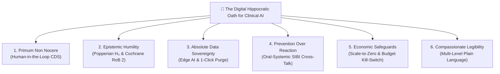

# 📜 The Digital Hippocratic Oath for Clinical AI

At **Pocket Gull**, we believe Generative AI in medicine must be bound by explicit clinical ethics, rigorous epistemological skepticism, patient anti-surveillance sovereignty, and mathematical safety guardrails.

This document establishes the **6 Digital Hippocratic Pledges** governing all software architecture, model integrations, and clinical decision support systems in Pocket Gull.

---

---

## 1. *Primum Non Nocere* (First, Do No Harm & Clinician Sovereignty)

> *"I will abstain from whatever is deleterious and mischievous."*

* **The Pledge**: AI must never act as an un-vetted autonomous diagnostician or generate silent clinical hallucinations.
* **Technical Enforcement**:
  * **FDA 21 CFR §520(o) CDS Compliance**: All generative AI outputs are strictly classified as non-diagnostic decision support requiring human clinician vetting.
  * **Application Guardrails**: `DefensiveGuardrailsService` and DOMPurify sanitize all incoming/outgoing text payloads against prompt injection and malicious markup.
  * **Human-in-the-Loop Task Bracketing**: No AI recommendation can automatically mutate a care plan, diagnostic code, or patient record without explicit clinician verification.

---

## 2. Epistemic Humility (*"I Shall Not Be Ashamed to Say 'I Do Not Know'"*)

> *"I will not be ashamed to say 'I do not know,' nor will I fail to call in my colleagues when the skills of another are needed."*

* **The Pledge**: AI must never present low-confidence correlations as established scientific fact or science-wash ambiguous clinical data.
* **Technical Enforcement**:
  * **Popperian $H_0$ Null-Hypothesis Testing**: `SkepticalEpistemologyService` evaluates clinical observations against population baseline means. Any finding where $p \ge 0.05$ triggers an un-missable `skepticalWarningNotice` disclosing that the observation cannot reject the null hypothesis.
  * **Cochrane Risk of Bias (RoB 2)**: Every literature reference and clinical citation in `ResearchLecturesService` embeds explicit Cochrane RoB 2 domain assessments (randomization, intervention deviation, missing data, and measurement bias).
  * **Evidence Hierarchy Demarcation**: All interventions are explicitly tagged with evidence tiers: `Level A (RCTs)`, `Level B (Cohort)`, or `Level C (Expert Consensus / Plausibility)`.

---

## 3. Absolute Patient Data Sovereignty & Anti-Surveillance

> *"Whatever in connection with my professional practice I see or hear... I will keep secret and will never reveal."*

* **The Pledge**: Patient health state belongs exclusively to the patient and clinician — never to data brokers, ad networks, or foundation model trainers.
* **Technical Enforcement**:
  * **Default to Edge Computation**: `OfflineEdgeAiService` processes real-time telemetry, biophysics equations, and clinical symptom classifications locally on the client device via WebAssembly (WASM), WebGPU, or Web Workers.
  * **Zero Third-Party Telemetry**: Zero Google Analytics, Segment, Mixpanel, Meta Pixels, or passive fingerprinting scripts are permitted.
  * **1-Click Ephemeral State Purging**: `purgeTransientPatientState()` instantly wipes all in-memory signals, transient patient data, and local storage caches.

---

## 4. Prevention Over Reaction (Early Systemic Intervention)

> *"I will prevent disease whenever I can, for prevention is preferable to cure."*

* **The Pledge**: Intercept degenerative multi-organ pathology early before irreversible structural or metabolic clinical damage occurs.
* **Technical Enforcement**:
  * **Teledentistry & Systemic Health Cross-Talk**: `PeriodontalSystemicBridgeService` links FDI 32-tooth odontogram surface caries, Smith & Knight Tooth Wear Index (TWI Grades 0-4), periodontal probing depth ($\text{PPD} \ge 4\text{mm}$), and Bleeding on Probing (BOP) to calculate the Systemic Inflammatory Burden Index (SIBI 0–100).
  * **Predictive Cross-Talk**: Warns clinicians of hidden cardiovascular risk multipliers (1.0x–2.8x) and predicted HbA1c elevation (+0.1%–0.8%).

---

## 5. Economic Safeguards & Financial Protection

> *"I will remember that I remain a member of society, with special obligations to all my fellow human beings."*

* **The Pledge**: Protect clinical institutions, researchers, and patients from runaway cloud costs, un-throttled API billing, and predatory pricing.
* **Technical Enforcement**:
  * **Cloud Run Scale-to-Zero (`minScale: 0`)**: Enforced in `scripts/apply-gcp-lifecycle-policies.mjs` to ensure $0 idle compute baseline cost.
  * **Strict Scaling Upper Bound (`max-instances: 2`)**: Configured in `scripts/deploy.sh` to prevent spammers or load-test loops from spawning hundreds of container nodes.
  * **10-Minute Streaming Safety Timeout**: Imposed in `AdkLiveService.MAX_SESSION_DURATION_MS` to automatically close un-monitored bi-directional WebSocket audio streams.
  * **Automated Cloud Billing Pub/Sub Kill-Switch**: Configured in `scripts/setup-billing-killswitch.mjs` to programmatically freeze Cloud Run scaling if 100% monthly budget threshold is reached.

---

## 6. Compassionate Communication & Plain-Language Legibility

> *"I will remember that there is art to medicine as well as science, and that warmth, sympathy, and understanding may outweigh the surgeon's knife or the chemist's drug."*

* **The Pledge**: Communicate complex medical findings in warm, empathetic, and accessible terms for patients of all ages, reading levels, and neurodiverse backgrounds.
* **Technical Enforcement**:
  * **Multi-Level Translation Engine**: `translateReadingLevel` flow in `ClinicalIntelligenceService` generates `simplified`, `child`, and `dyslexia` friendly reading versions.
  * **Empathetic HD Vocal Prosody**: `AdkLiveService` streams warm, conversational, non-robotic speech with natural cadence and pauses for emphasis.

---

## Code Base Reference Links

- [SECURITY.md](file:///c:/Users/philg/Pocketgull/pocketgull/SECURITY.md) — Security & Safety Filter Policy
- [PRIVACY.md](file:///c:/Users/philg/Pocketgull/pocketgull/PRIVACY.md) — Anti-Surveillance & Ephemeral Data Policy
- [cloud-cost-governance.md](file:///c:/Users/philg/Pocketgull/pocketgull/docs/cloud-cost-governance.md) — Infrastructure Cost Controls & Billing Kill-Switch
- [defensive-guardrails.service.ts](file:///c:/Users/philg/Pocketgull/pocketgull/src/services/defensive-guardrails.service.ts) — Application Guardrails
- [skeptical-epistemology.service.ts](file:///c:/Users/philg/Pocketgull/pocketgull/src/services/skeptical-epistemology.service.ts) — Popperian $H_0$ Testing
- [periodontal-systemic-bridge.service.ts](file:///c:/Users/philg/Pocketgull/pocketgull/src/services/periodontal-systemic-bridge.service.ts) — Oral-Systemic SIBI Cross-Talk
- [webmcp-registration.service.ts](file:///c:/Users/philg/Pocketgull/pocketgull/src/services/webmcp-registration.service.ts) — WebMCP Tool Registration
- [research-lectures.service.ts](file:///c:/Users/philg/Pocketgull/pocketgull/src/services/research-lectures.service.ts) — Cochrane RoB 2 & Socratic Literacy
