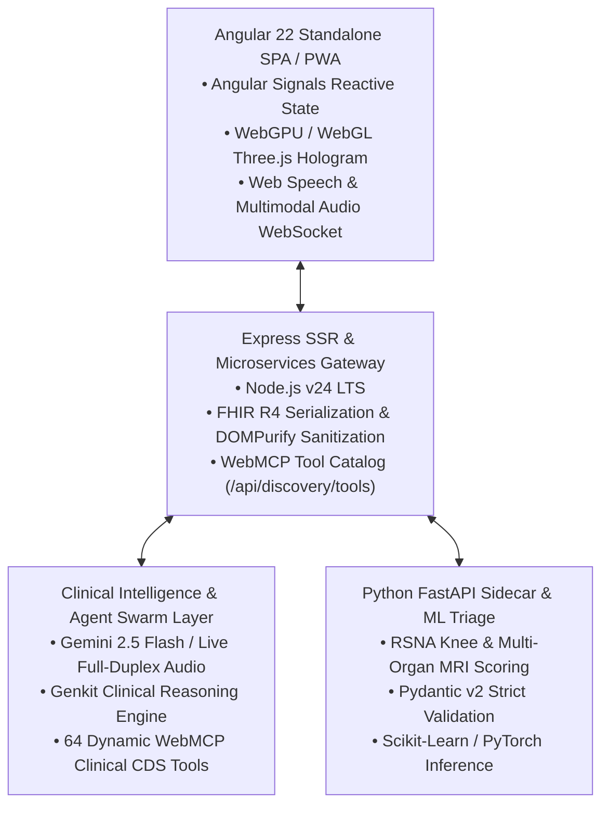

# PocketGull Clinical Intelligence Engine — Platform Architecture Codex

## Overview
PocketGull is an open-source real-time clinical intelligence engine, live multimodal diagnostic co-pilot, and patient state coordinator built on Google Gemini 2.5 Flash / Live audio streaming, Angular 22, and the FHIR R4 Bundle standard.

---

## 1. System Architecture

---

## 2. Core Clinical Principles & Epistemology

### 2.1 Popperian Null-Hypothesis ($H_0$) Testing
Every clinical decision support (CDS) recommendation evaluates the null hypothesis ($H_0$: no difference between intervention and placebo/standard-of-care). If $p \ge 0.05$, PocketGull issues an explicit warning disclosing unrejected null hypotheses to prevent clinical overconfidence.

### 2.2 Cochrane Risk of Bias (RoB 2)
Literature citations are automatically scored across five bias domains:
1. Randomization process
2. Deviations from intended interventions
3. Missing outcome data
4. Measurement of the outcome
5. Selection of reported results

### 2.3 HIPAA §164.514 Safe Harbor De-Identification
All patient state, consult transcripts, and serialized FHIR payloads strip all 18 direct identifiers. String fields are sanitized via DOMPurify to eliminate XSS/SSRF vulnerabilities.

---

## 3. Dynamic WebMCP Tool Architecture (64 Registered Tools)

PocketGull registers **64 native WebMCP agentic tools** directly on the browser `modelContext`, providing autonomous LLM agents with verifiable clinical capabilities:

* **Diagnostic & Tri-Paradigm Synthesis**: Hegelian dialectics, Matt Might precision algorithm, and rare disease triage.
* **Maternal & Women's Health**: 4th-trimester ACOG AIM postpartum sentinel, INOCA cardiac atypical ischemia, and endometriosis delay reducer.
* **Geriatric & Intergenerational Health**: Transgenerational Resilience Index (TRI), grandmother longevity genetics, and Oslerian bedside gestalt.
* **Youth & Trainee Scaffolding**: Digital dopamine load reset, Kaplan Attention Restoration nature intervals, and medical student diagnostic safety nets.
* **Clinical Social Work**: Automated SDoH ICD-10 Z-codes (`Z59.0`, `Z59.41`, `Z59.87`, `Z63.6`) and Zarit Caregiver Burden respite scoring.
* **Future Planning**: 10/20/30-year multi-decade healthspan forecasting, values-based advance care directives (POLST/MOLST), and FHIR R4 `Consent`.

---

## 4. API Endpoints & Discovery

| Endpoint | Method | Purpose |
| :--- | :--- | :--- |
| `/api/health` | `GET` | Telemetry, uptime, registered tool count, and HIPAA compliance probe. |
| `/api/discovery/tools` | `GET` | Schema.org WebMCP JSON-LD tool catalog for autonomous AI discovery. |
| `/api/discovery/status` | `GET` | WebGPU, WASM Edge AI, and system health status. |
| `/api/billing/art-checkout` | `POST` | Fine art archival giclée print Stripe Checkout creator. |
| `/llms.txt` | `GET` | Standardized agent manifest for LLM context crawlers. |
| `/privacy-policy` | `GET` | HIPAA §164.514 de-identification and data sovereignty charter. |
| `/terms-of-service` | `GET` | Clinical Decision Support CDS legal and ethical terms. |

---

## 5. Security, Scale & Zero-Jank Mandates

* **Hardware Compositing**: Keyframes exclusively animate `transform: translate3d()` and `opacity` with `will-change: transform`.
* **Universal 48px Touch Target**: Minimum 48px $\times$ 48px hitboxes across all interactive controls.
* **Scale-to-Zero Cloud Run**: Google Cloud Run services scale to 0 instances when idle, minimizing idle cloud spend.
* **Artifact Lifecycle**: Automated 7-day retention policy (`olderThan: 604800s`, `keepCount: 3`) on Artifact Registry and GCS build buckets.
