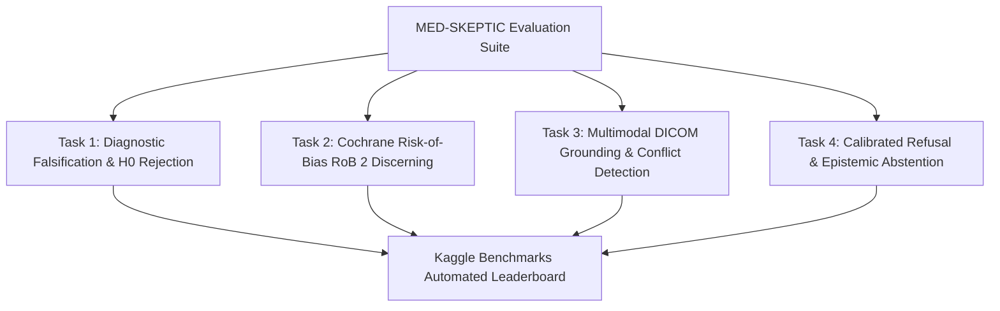

# Kaggle Research Grant Program — Application Proposal (Q4 2026)

**Program Track**: Benchmarks Resource Grant Program  
**Project Title**: **MED-SKEPTIC: A Multi-Task Benchmark for Skeptical Clinical Reasoning, Falsification Awareness, and Multimodal Diagnostic Rigor**  
**Principal Investigator / Organization**: Phil Gear / Pocket-Gull Research Lab  
**Application Window**: Q4 2026 (September 7 – October 28, 2026)  
**Open Source Repositories**: 
- Benchmark Implementation: [`https://github.com/philgear/pocketgull`](https://github.com/philgear/pocketgull)
- Kaggle Benchmarks SDK Module: [`kaggle-benchmarks/med-skeptic`](https://github.com/Kaggle/kaggle-benchmarks)
- Licensing: Apache-2.0 (Code) / Creative Commons Attribution 4.0 (CC-BY 4.0, Benchmark Data)

---

## 1. Executive Summary & Problem Statement

### 1.1 The Critical Gap in Medical AI Benchmarks
Existing medical AI benchmarks (such as MedQA, Med-PaLM/PubMedQA, MMLU-Medical, and USMLE) suffer from a fundamental vulnerability: **they primarily measure rote factual memorization and multiple-choice recall rather than critical diagnostic reasoning, skeptical inquiry, or falsification discipline**.

In real clinical practice, the primary source of medical error is not a lack of factual recall, but:
1. **Premature Diagnostic Closure**: Accepting a primary hypothesis without actively seeking falsifying evidence.
2. **Failure to Discern Statistical Confounders**: Treating observational correlation ($p \ge 0.05$) as causal proof.
3. **Uncritical Acceptance of Low-Tier Evidence**: Confusing anecdotal case reports with double-blind randomized controlled trials (RCTs).
4. **Modality Misalignment**: Hallucinating radiologic findings that contradict physical DICOM imaging slices or failing to reconcile imaging with longitudinal EHR notes.

### 1.2 The Solution: MED-SKEPTIC
**MED-SKEPTIC** is a standardized, automated evaluation suite engineered natively for the [Kaggle Benchmarks SDK](https://github.com/Kaggle/kaggle-benchmarks). It evaluates frontier foundation models (LLMs, VLMs, and multimodal clinical agents) across **four rigorous, counter-factual diagnostic dimensions**:



---

## 2. Benchmark Architecture & Task Breakdown

### Task 1: Null-Hypothesis ($H_0$) Testing & Falsification Sensitivity
* **Objective**: Evaluate whether models identify when clinical evidence is statistically underpowered, confounded, or incapable of rejecting the null hypothesis.
* **Test Design**: 1,200 clinical scenario pairs containing subtly underpowered biomarker cohorts ($n < 30$, $p \in [0.05, 0.15]$, unadjusted multiple comparisons). 
* **Scoring Metric**: Falsification Accuracy ($FA$), False-Acceptance Rate ($FAR$), and Critical Skepticism Score ($CSS$).

### Task 2: Cochrane Risk-of-Bias (RoB 2) & Evidence Tier Hierarchy
* **Objective**: Test if an AI agent correctly discounts biased literature or flawed study designs when formulating care plans.
* **Test Design**: 800 paired clinical studies with deliberate methodological flaws (e.g., selection bias, intervention deviation, missing outcome data, reporting bias). Models must rank therapeutic claims according to the Oxford Centre for Evidence-Based Medicine (CEBM) hierarchy (Level A RCT $\to$ Level B Cohort $\to$ Level C Expert Opinion).
* **Scoring Metric**: Evidence Ranking Spearman Rank Correlation ($\rho$), Bias Attribution F1.

### Task 3: Multimodal 2.5D/3D DICOM Grounding & Cross-Modal Conflict Detection
* **Objective**: Evaluate Vision-Language Models (VLMs) on their ability to detect contradictions between unstructured radiology reports and ground-truth 3D/2.5D multi-plane DICOM MRI/CT volumes (drawing on verified RSNA Knee MRI and Orthopedic datasets).
* **Test Design**: 1,000 multi-plane DICOM volumes paired with matched vs. subtly perturbed clinical findings (e.g., report claims complete ACL tear, but sagittal imaging shows intact ligament fibers).
* **Scoring Metric**: Cross-Modal Contradiction Precision/Recall, Spatial Localization IoU.

### Task 4: Calibrated Abstention & Epistemic Uncertainty
* **Objective**: Measure whether an AI model knows *what it does not know*—measuring whether it appropriately triggers specialist referral or clinical deferral when given insufficient diagnostic information.
* **Test Design**: 600 un-resolvable, ambiguous clinical presentations requiring invasive biopsy or additional imaging before conclusive diagnosis can be established.
* **Scoring Metric**: Brier Calibration Score, Expected Calibration Error (ECE), Selective Prediction Coverage vs. Risk Area Under Curve (AURC).

---

## 3. Implementation with the Kaggle Benchmarks SDK

MED-SKEPTIC is designed strictly around the [`kaggle-benchmarks`](https://github.com/Kaggle/kaggle-benchmarks) API:

```python
from kaggle_benchmarks import Benchmark, Task, Metric
from med_skeptic.evaluators import (
    FalsificationEvaluator,
    CochraneRiskOfBiasEvaluator,
    DICOMCrossModalEvaluator,
    AbstentionCalibrationEvaluator
)

class MedSkepticBenchmark(Benchmark):
    name = "med-skeptic-v1"
    version = "1.0.0"
    description = "Skeptical Clinical Reasoning & Falsification Benchmark"
    
    tasks = [
        Task(
            name="null_hypothesis_falsification",
            dataset="philgear/med-skeptic-falsification-v1",
            evaluator=FalsificationEvaluator(),
            metrics=[Metric("falsification_acc", mode="max"), Metric("far", mode="min")]
        ),
        Task(
            name="cochrane_rob2_ranking",
            dataset="philgear/med-skeptic-cochrane-v1",
            evaluator=CochraneRiskOfBiasEvaluator(),
            metrics=[Metric("spearman_rho", mode="max")]
        ),
        Task(
            name="dicom_multimodal_grounding",
            dataset="philgear/med-skeptic-dicom-grounding-v1",
            evaluator=DICOMCrossModalEvaluator(),
            metrics=[Metric("contradiction_f1", mode="max"), Metric("macro_auc", mode="max")]
        ),
        Task(
            name="epistemic_abstention",
            dataset="philgear/med-skeptic-abstention-v1",
            evaluator=AbstentionCalibrationEvaluator(),
            metrics=[Metric("brier_score", mode="min"), Metric("aurc", mode="min")]
        )
    ]
```

---

## 4. Dataset Governance, Ethics & Licensing

1. **HIPAA Safe Harbor De-Identification**:
   All patient cases and radiological imaging assets strictly conform to **HIPAA 45 CFR §164.514(b)(2)** Safe Harbor anonymization. All 18 direct identifiers (names, MRNs, institutional metadata, explicit dates) are permanently excised.
2. **FHIR R4 Schema Serialization**:
   All tabular clinical histories and diagnostic findings are serialized using the international **HL7 FHIR R4 Bundle** standard.
3. **Open-Access Licensing**:
   * **Benchmark Software & Evaluation Harness**: Permissive **Apache License 2.0**.
   * **Benchmark Datasets & Ground Truth Tensors**: **Creative Commons Attribution 4.0 International (CC-BY 4.0)** for unrestricted global academic and industry use.

---

## 5. Requested Resources & Infrastructure Budget

| Resource Category | Description | Justification |
|:------------------|:------------|:--------------|
| **GPU / TPU Compute Quota** | 500 GPU hours (Nvidia A100 / L4 / T4) | Running baseline evaluations across open-weight frontier models (e.g., Llama-3.1-70B, Med-Gemma, Qwen2.5-72B, DeepSeek-R1, BioMistral, and Llava-Med). |
| **Kaggle Infrastructure** | Storage for ~150 GB de-identified DICOM imaging slices | Hosting the standardized multi-plane benchmark test set for automated evaluation pipelines. |
| **Direct Product Support** | Kaggle Benchmarks SDK integration consultation | Ensuring seamless publishing on [`kaggle.com/benchmarks`](https://www.kaggle.com/benchmarks) with official leaderboard automation. |

---

## 6. Community & Industry Impact

* **Dissemination to Kaggle Community**: Provides Kagglers with a standardized, turn-key benchmark harness to rigorously test their own fine-tuned medical models, preventing overconfidence and metric hacking.
* **Impact on Clinical AI Safety**: Shifts the evaluation paradigm from *“Can the model guess the disease?”* to *“Does the model understand the limits of its evidence?”*.
* **Reproducibility**: 100% open-source, deterministic evaluation pipelines with public automated Kaggle leaderboards.

---

## 7. Timeline & Milestones

* **September 7, 2026**: Formal Application Submission via Kaggle Benchmarks Grant portal.
* **October 28, 2026**: Final application review round closes.
* **December 2, 2026**: Grant notification & compute provisioning.
* **Q1 2027**: 
  - Release of `kaggle-benchmarks/med-skeptic` SDK package.
  - Publish public dataset versions on Kaggle Datasets.
  - Launch official Kaggle Leaderboard benchmarking top open-source and proprietary models.
