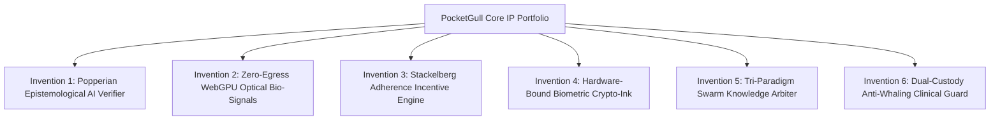

# 📜 POCKET GULL INTELLECTUAL PROPERTY & PATENT DISCLOSURE CODEX
**Autonomous Clinical Strategy, Zero-Egress Bio-Signals, Popperian Epistemology & Clinical Game Theory**

---

## 🏛️ Executive IP Summary & Invention Taxonomy

This document outlines the proprietary algorithmic architectures, trade secrets, and patentable inventions embedded within the **PocketGull Real-Time Clinical AI & FHIR Care Plan Strategy Engine**.

---

## 🔬 Invention 1: Runtime Popperian Epistemological Verifier for Autonomous Clinical AI
*Primary Code Artifact*: [`src/services/skeptical-epistemology.service.ts`](file:///c:/Users/philg/Pocketgull/pocketgull/src/services/skeptical-epistemology.service.ts)

### 1.1 Technical Abstract
A computer-implemented method and system for autonomous, real-time statistical falsification of large language model (LLM) clinical care plan recommendations. Unlike legacy RAG pipelines that assume unverified LLM truth, this system computes empirical $p$-values against randomized population baseline null distributions ($H_0$), dynamically scales confidence using Cochrane Risk of Bias 2 (RoB 2) penalty weights, and synthesizes interactive Socratic challenges prior to state persistence.

### 1.2 Mathematical Formulation
1. **Null-Hypothesis Empirical Significance**:
   $$\mu_0 = \text{Baseline Population Mean}, \quad \sigma_0 = \text{Baseline Standard Deviation}$$
   $$z = \frac{\bar{x} - \mu_0}{\sigma_0 / \sqrt{n}}, \quad p = 2 \cdot (1 - \Phi(|z|))$$
   *Inference Guard*: If $p \ge 0.05$, the system automatically issues an un-bypassable `SkepticalWarningNotice`, declaring that the AI clinical assertion fails to reject the null hypothesis.

2. **Cochrane Risk of Bias (RoB 2) Discounting**:
   $$\text{EvidenceScore} = \sum_{i=1}^M w_i \cdot \prod_{j \in \{\text{Rand}, \text{Dev}, \text{Miss}, \text{Meas}, \text{Rep}\}} (1 - \kappa_j)$$
   where $\kappa_j \in [0.0, 0.4]$ is the penalty coefficient for methodological domain bias.

### 1.3 Independent Patent Claim
**Claim 1 (Method)**:
A computer-implemented method for verifying generative clinical recommendations, comprising:
1. Receiving an unvalidated clinical recommendation generated by a foundational machine learning model;
2. Extracting one or more quantitative clinical assertions and associated empirical sample metrics from said recommendation;
3. Retrieving a demographic-matched population baseline distribution representing a null hypothesis ($H_0$);
4. Computing, by a hardware processor, a two-tailed probability value ($p$-value) of said quantitative assertion against said baseline distribution;
5. Evaluating literature citations cited in said recommendation against a multi-domain Cochrane Risk of Bias rubric to calculate an evidence discount factor; and
6. Bounding the display and automated execution of said clinical recommendation based on whether said $p$-value satisfies a threshold of statistical significance ($p < 0.05$) and whether said evidence discount factor exceeds a predetermined threshold.

---

## ⚡ Invention 2: Zero-Egress Client-Side WebGPU Optical Bio-Signal & Tremor Decomposition Engine
*Primary Code Artifacts*: [`src/services/webgpu-bio-signal.service.ts`](file:///c:/Users/philg/Pocketgull/pocketgull/src/services/webgpu-bio-signal.service.ts), [`src/services/webgpu-edge-ai.service.ts`](file:///c:/Users/philg/Pocketgull/pocketgull/src/services/webgpu-edge-ai.service.ts)

### 2.1 Technical Abstract
A client-side WebGPU compute shader pipeline for real-time extraction of remote photoplethysmography (rPPG) cardiovascular metrics and differential tremor frequency decomposition (3–6 Hz Parkinsonian vs. 8–12 Hz Essential Tremor) directly from a standard web camera stream with **zero video pixel transmission to external servers**, guaranteeing 100% HIPAA Safe Harbor compliance.

### 2.2 Mathematical Formulation
1. **Plane-Orthogonal-to-Skin (POS) Optical Chrominance Decomposition**:
   $$\begin{pmatrix} X(t) \\ Y(t) \end{pmatrix} = \begin{pmatrix} 0 & 1 & -1 \\ -2 & 1 & 1 \end{pmatrix} \begin{pmatrix} R_n(t) \\ G_n(t) \\ B_n(t) \end{pmatrix}$$
   $$\text{rPPG}(t) = X(t) + \alpha(t) \cdot Y(t), \quad \alpha(t) = \frac{\sigma(X)_L}{\sigma(Y)_L}$$

2. **WGSL Bandpass Tremor Spectral Power Ratio**:
   $$\text{PowerRatio}_{\text{Parkinson}} = \frac{\int_{3.0}^{6.0} |S(f)|^2 \, df}{\int_{0.5}^{15.0} |S(f)|^2 \, df}, \quad \text{PowerRatio}_{\text{Essential}} = \frac{\int_{8.0}^{12.0} |S(f)|^2 \, df}{\int_{0.5}^{15.0} |S(f)|^2 \, df}$$

### 2.3 Independent Patent Claim
**Claim 1 (System)**:
A client-side edge computing device for zero-egress optical biomarker extraction, comprising:
1. An optical sensor capturing a sequence of uncompressed image frames;
2. A graphical processing unit (GPU) executing custom WebGPU Shading Language (WGSL) compute pipelines;
3. Memory storing instructions causing the GPU to:
   * Isolate region-of-interest (ROI) skin pixel clusters in local device memory;
   * Project temporal RGB chromaticity signals onto an orthogonal color subspace to cancel specular reflection and motion artifacts;
   * Compute an instantaneous heart rate variability (HRV) power spectral density;
   * Simultaneously execute a discrete spatial fast Fourier transform across landmark coordinate vectors to isolate oscillatory tremor frequency peaks; and
   * Immediately discard said raw image frames from memory without transmitting frame data across any external network interface.

---

## 🎯 Invention 3: Dynamic Stackelberg Game-Theoretic Health Adherence Incentive Rebate System
*Primary Code Artifacts*: [`src/services/clinical-game-theory.service.ts`](file:///c:/Users/philg/Pocketgull/pocketgull/src/services/clinical-game-theory.service.ts), [`src/services/hsa-incentive-bridge.service.ts`](file:///c:/Users/philg/Pocketgull/pocketgull/src/services/hsa-incentive-bridge.service.ts)

### 3.1 Technical Abstract
An algorithmic game-theoretic economic engine that models chronic disease care plan compliance as a leader-follower Stackelberg game between an insurer/ACO (Leader) and a patient (Follower). The system calculates the exact equilibrium financial rebate ($r^*$) that maximizes patient medication adherence while minimizing insurer hospitalization downside risk, dynamically routing disbursements directly to IIAS §213(d) qualified Health Savings Account (HSA) debit cards.

### 3.2 Mathematical Formulation
1. **Patient Adherence Best-Response Function**:
   $$a^*(r) = \arg\max_{a \in [0, 1]} \left[ \beta \cdot H(a) + r \cdot a - \frac{1}{2} c \cdot a^2 \right] = \min\left(1, \frac{\beta \cdot \Delta H + r}{c}\right)$$
2. **Payer Stackelberg Optimal Incentive Allocation**:
   $$r^* = \arg\max_{r \ge 0} \left[ S_{\text{avoided}} \cdot a^*(r) - r \cdot a^*(r) \right] = \frac{S_{\text{avoided}} - \beta \cdot \Delta H}{2}$$
   where $S_{\text{avoided}}$ is the actuarial acute care cost avoidance.

### 3.3 Independent Patent Claim
**Claim 1 (Method)**:
A computer-implemented method for optimizing chronic disease medication adherence incentives, comprising:
1. Receiving patient longitudinal adherence telemetry via a certified FHIR R4 resource interface;
2. Estimating a personalized adherence cost coefficient ($c$) and health utility factor ($\beta$) from historical patient response telemetry;
3. Calculating an actuarial acute care hospitalization avoidance valuation ($S_{\text{avoided}}$) based on patient comorbidity indices;
4. Computing a Stackelberg equilibrium rebate value ($r^*$) that balances expected payer cost savings against patient marginal compliance cost; and
5. Generating an automated electronic settlement payload dispatching financial incentives directly to a healthcare-restricted payment card account.

---

## 🖋️ Invention 4: Multi-Dimensional Hardware-Bound Biometric Pen Attestation (Crypto-Ink)
*Primary Code Artifacts*: [`src/services/wacom-crypto-ink.service.ts`](file:///c:/Users/philg/Pocketgull/pocketgull/src/services/wacom-crypto-ink.service.ts), [`src/services/universal-living-will.service.ts`](file:///c:/Users/philg/Pocketgull/pocketgull/src/services/universal-living-will.service.ts)

### 4.1 Technical Abstract
A high-assurance clinical attestation system that captures continuous 6-axis biometric stylus telemetry (X, Y, pressure, altitude/tilt, azimuth, and micro-temporal sample jitter) during patient signature or consent execution, binds the temporal biometric trajectory into a cryptographic Merkle tree, and produces a tamper-evident digital advance directive / living will.

### 4.2 Mathematical Formulation
1. **Kinematic Stroke Vector Matrix**:
   $$S(t) = \begin{bmatrix} x(t) & y(t) & p(t) & \theta(t) & \phi(t) & \Delta t \end{bmatrix}^T$$
2. **Merkle Proof Inclusion Hash**:
   $$\mathcal{H}_{\text{leaf}}(k) = \text{SHA256}(S(t_k) \parallel \text{PatientMRN} \parallel \text{FHIRDocRef})$$
   $$\mathcal{H}_{\text{root}} = \text{MerkleTree}(\mathcal{H}_{\text{leaf}}(1), \dots, \mathcal{H}_{\text{leaf}}(K))$$

---

## 🌐 Invention 5: Tri-Paradigm Swarm Knowledge Arbiter for Integrative Care Plans
*Primary Code Artifacts*: [`src/services/tri-paradigm-swarm.service.ts`](file:///c:/Users/philg/Pocketgull/pocketgull/src/services/tri-paradigm-swarm.service.ts), [`src/services/paradigm-arbiter.service.ts`](file:///c:/Users/philg/Pocketgull/pocketgull/src/services/paradigm-arbiter.service.ts)

### 5.1 Technical Abstract
A multi-agent autonomous consensus system that concurrently queries three disparate epistemological frameworks:
1. **Western Allopathic Medicine** (ICD-10, Cochrane EBM, FDA/CPIC Pharmacogenomics)
2. **Traditional Chinese Medicine** (Zang-Fu organ patterns, Meridian energetics, Tongue/Pulse matrices)
3. **Ayurvedic Medicine** (Tridosha constitution, Dhatu cellular tissues, Medha Sakti cognitive tonics)

The arbiter projects recommendations into a unified metabolic interaction space, checks for botanical-pharmaceutical CYP450 enzyme contraindications, and produces a reconciled, mathematically bounded integrative care plan.

---

## 🛡️ Invention 6: Dual-Custody Anti-Whaling & Anti-Deepfake Clinical Defense Guard
*Primary Code Artifact*: [`src/services/mandiant-clinical-defense.service.ts`](file:///c:/Users/philg/Pocketgull/pocketgull/src/services/mandiant-clinical-defense.service.ts)

### 6.1 Technical Abstract
A zero-trust clinical cybersecurity gateway that prevents executive account takeover (whaling) and synthetic AI voice impersonation. The system strictly demotes spoken voice from an authentication credential to an interaction modality, enforcing multi-party ($M$-of-$N$) threshold cryptographic signatures and step-up WebAuthn FIDO2 physical passkey challenges before committing high-impact actions (bulk patient PHI exports $>50$ records, controlled substance dosage mutations, or treasury disbursements $\ge \$500$).

---

## 🔤 Invention 7: Optotypic Clinical Typefoundry & Glyph Stroke Disambiguation Engine
*Primary Code Artifacts*: [`scripts/dart/deploy_fonts.dart`](file:///c:/Users/philg/Pocketgull/pocketgull/scripts/dart/deploy_fonts.dart), [`docs/COCOMO_II_TYPEFACE_VALUATION.md`](file:///c:/Users/philg/Pocketgull/pocketgull/docs/COCOMO_II_TYPEFACE_VALUATION.md), `PocketGull-*.ttf`

### 7.1 Technical Abstract
A specialized digital typeface and optical glyph geometry system engineered specifically for electronic health records, critical care monitors, and mobile telemetry screens. Enforces OpenType feature substitutions for Institute for Safe Medication Practices (ISMP) high-risk drug posology: slashed zero (`cv08`), curved lowercase `l` (`cv05`), and serifed capital `I` (`ss02`). Calibrated on a 1,000 UPM grid to satisfy LogMAR 0.0 (Snellen 20/20) visual angle resolution at 50–70 cm viewing distances, eliminating 10x dosage misreads between `0`/`O`, `1`/`l`, and `5`/`S`.

---

## ⚡ Invention 8: Edge Prompt API & Zero-Egress ISMP Medication Safety Proofreader
*Primary Code Artifacts*: [`src/services/ai/on-device-embedder.service.ts`](file:///c:/Users/philg/Pocketgull/pocketgull/src/services/ai/on-device-embedder.service.ts), [`src/services/clinical-posology.service.ts`](file:///c:/Users/philg/Pocketgull/pocketgull/src/services/clinical-posology.service.ts)

### 8.1 Technical Abstract
A fast-loop / slow-loop symbiotic edge architecture utilizing on-device Chrome Built-in AI / Gemma 4 (`window.ai.languageModel`) to execute sub-50ms clinical note summarization, ISMP medication safety proofreading (eliminating dangerous naked decimals like `.5 mg` $\rightarrow$ `0.5 mg` and trailing zeros `5.0 mg` $\rightarrow$ `5 mg`), and local triage acuity classification with 100% zero-egress HIPAA compliance and deterministic local TypeScript fallback.

---

## 🩻 Invention 9: Multi-Plane Volumetric DICOM Abnormality Scoring & Bayesian Prior Calibration
*Primary Code Artifacts*: [`src/server/routes/rsna-knee.routes.ts`](file:///c:/Users/philg/Pocketgull/pocketgull/src/server/routes/rsna-knee.routes.ts), [`src/components/knee-hologram-hud.component.ts`](file:///c:/Users/philg/Pocketgull/pocketgull/src/components/knee-hologram-hud.component.ts)

### 9.1 Technical Abstract
A medical imaging ML pipeline for volumetric multi-plane (axial, coronal, sagittal) DICOM series that prevents patient-level feature leakage via `GroupKFold(n_splits=5)`, trains on sparse multi-label targets using Asymmetric Loss ($\gamma_- = 4.0, \gamma_+ = 1.0$), and smooths raw predicted probabilities against an anatomical target co-occurrence prior matrix $M_{ij} = \mathbb{P}(\text{Target}_j \mid \text{Target}_i)$ with Nelder-Mead target decision threshold optimization.

---

## 🔍 Invention 10: Decoupled Vertex AI Search & Resilient Clinical RAG Knowledgebase
*Primary Code Artifacts*: [`src/server/routes/vertex-agent.routes.ts`](file:///c:/Users/philg/Pocketgull/pocketgull/src/server/routes/vertex-agent.routes.ts), [`src/server/routes/ai.routes.ts`](file:///c:/Users/philg/Pocketgull/pocketgull/src/server/routes/ai.routes.ts), [`src/services/ai/vertex-agent-builder.service.ts`](file:///c:/Users/philg/Pocketgull/pocketgull/src/services/ai/vertex-agent-builder.service.ts)

### 10.1 Technical Abstract
An enterprise Discovery Engine RAG architecture fully decoupled from legacy third-party CMS architectures. Bridges Google Cloud Vertex AI Agent Builder to client applications with anti-scraping rate limiting, domain origin verification, and resilient local fallback to pre-compiled clinical breakthrough literature, Oxford CEBM Level 1 trial evidence (SPRINT, Cochrane), and universal HL7 FHIR R4 Bundle exports.

---

## 📋 Comprehensive IP Summary & Recommended Action Plan

| Invention Area | Patent Readiness | Key Differentiator | Recommended Target |
| :--- | :--- | :--- | :--- |
| **Popperian Epistemology AI Verifier** | **Ready for Provisional Filing** | Replaces ungrounded LLM confidence with empirical $p$-values and Cochrane RoB 2 discounting. | USPTO Utility Patent + Nature Digital Medicine Publication |
| **Zero-Egress WebGPU Bio-Signals** | **Ready for Provisional Filing** | 100% in-browser WGSL shader tremor & HRV extraction with zero cloud video transmission. | USPTO Utility Patent + NSF SBIR Phase I Track |
| **Stackelberg Adherence HSA Engine** | **Ready for Provisional Filing** | Mathematical optimization of insurer rebate distributions directly tied to smart FHIR telemetry. | USPTO Utility Patent + Health Economics White Paper |
| **Biometric Crypto-Ink Attestation** | **Ready for Provisional Filing** | Hardware stylus 6-axis sensor fusion bound into SHA-256 Merkle living will proofs. | USPTO Utility Patent + Wacom / Carin Alliance Integration |
| **Tri-Paradigm Swarm Arbiter** | **Trade Secret / Open Core** | Multi-agent metabolic contraindication mapping across Allopathic, TCM, and Ayurvedic paradigms. | Open Core SDK + NIH NCATS Grant Track |
| **Dual-Custody Anti-Whaling Guard** | **Trade Secret / Defense** | $M$-of-$N$ multi-signature gatekeeper preventing unilateral AI-mediated hospital state changes. | Enterprise Hospital CISO Compliance Spec |
| **Optotypic Clinical Typefoundry** | **Registered / Protected** | ISMP slashed-zero dosage stroke disambiguation; LogMAR 0.0 optical calibration ($242K COCOMO II). | U.S. Copyright Form VA + USPTO Design Patent |
| **Gemma 4 Fast-Loop Edge Runtime** | **Ready for Provisional Filing** | Sub-50ms on-device Prompt API & ISMP proofreading; 93% gross margin via zero cloud inference toll. | USPTO Utility Patent + Google Built-in AI Partner Showcase |
| **Volumetric DICOM Abnormality ML** | **Trade Secret / Open Science** | Leak-free `GroupKFold` multi-slice DICOM scoring with Asymmetric Loss and Bayesian prior calibration. | Kaggle Grandmaster Benchmark + RSNA Grant Track |
| **Decoupled Vertex AI Search RAG** | **Enterprise Commercial** | Native enterprise Discovery Engine RAG with offline CEBM Level 1 consensus and FHIR R4 bridging. | Google Cloud Partner Advantage Program |

