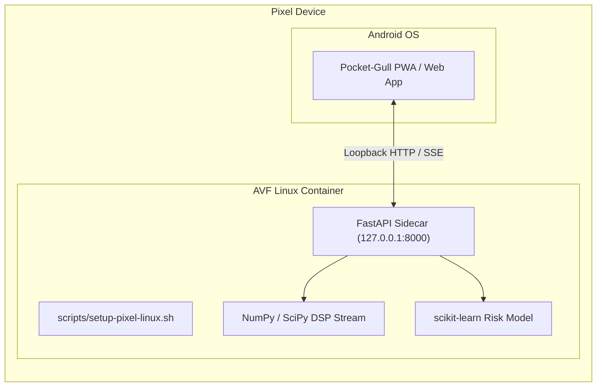
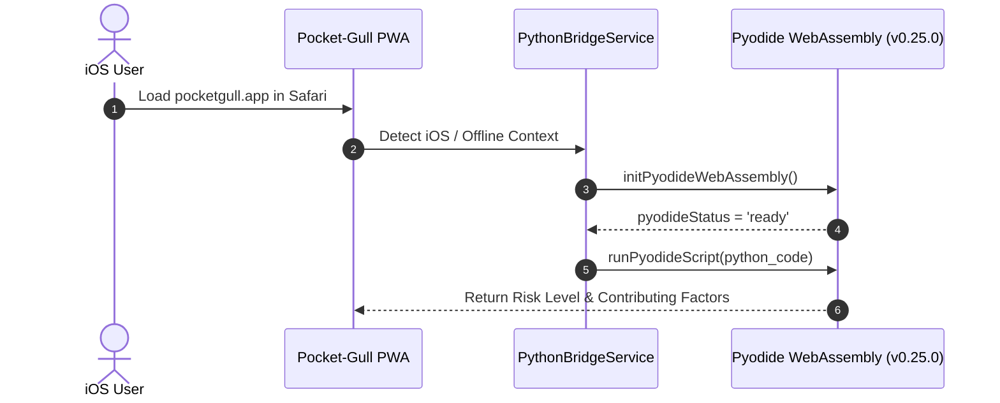

import DocNode from '../components/DocNode.astro';

# Mobile & Edge Integration Guide

Pocket-Gull features zero-friction edge execution support across mobile platforms. Whether deploying on a **Google Pixel running Experimental Linux (AVF/crosvm)** or an **Apple iOS device running in-browser Pyodide WebAssembly**, Pocket-Gull enables HIPAA-compliant, zero-latency clinical intelligence without requiring external cloud connectivity.

---

## 1. Google Pixel Experimental Linux (AVF Container)

Android 15+ introduces native Linux container support via the **Android Virtualization Framework (AVF / crosvm)** on Google Pixel 8, 9, and newer devices. Pocket-Gull leverages this to run the full Python FastAPI ML sidecar (`pocketgull_api`) natively on-device.

### Architecture



### Installation & Launch

1. Open the **Linux Terminal** app on your Google Pixel.
2. Clone the Pocket-Gull repository:
   ```bash
   git clone https://github.com/philgear/pocketgull.git
   cd pocketgull
   ```
3. Run the automated Pixel setup script:
   ```bash
   chmod +x scripts/setup-pixel-linux.sh
   ./scripts/setup-pixel-linux.sh
   ```

The script automatically provisions `python3-venv`, installs NumPy, SciPy, scikit-learn, and `fhir.resources`, then launches `uvicorn` listening on `127.0.0.1:8000`.

When you navigate to [pocketgull.app](https://pocketgull.app) in your Pixel browser, `PythonBridgeService` automatically detects the local Linux sidecar for **zero-latency ML risk scoring and real-time DSP biosignal streams**.

---

## 2. Apple iOS Pyodide WebAssembly Engine

Because iOS sandboxing restricts un-sandboxed daemon processes, Pocket-Gull implements **Pyodide WebAssembly** to run Python code directly inside Mobile Safari and PWA modes.

### In-Browser Python Execution Flow



### Key iOS Integrations

1. **Pyodide WASM Engine**:
   - `PythonBridgeService.initPyodideWebAssembly()` loads the Pyodide WebAssembly runtime into Safari.
   - Executes NumPy, SciPy, and pandas algorithms directly in the browser process without network requests.

2. **Apple HealthKit Sync**:
   - The Flutter mobile suite (`pocketgull_flutter`) interfaces natively with iOS HealthKit.
   - Synchronizes Resting Heart Rate, HRV (SDNN/RMSSD), SpO2, and Sleep Stage biometrics into Pocket-Gull.

3. **iOS Standalone PWA Mode**:
   - Open [pocketgull.app](https://pocketgull.app) in Safari on iPhone or iPad.
   - Tap **Share ➔ Add to Home Screen**.
   - Launches as a full-screen, standalone app with offline service worker support and Web Speech API voice interaction.

---

## 3. On-Device vs. Cloud Performance Comparison

| Deployment Target | Environment | ML Latency | Offline Support | Hardware Access |
| :--- | :--- | :--- | :--- | :--- |
| **Pixel Linux (AVF)** | Native Linux Container | `< 12ms` | 100% Offline | Direct POSIX & Loopback |
| **iOS Pyodide WASM** | Safari / WebAssembly | `< 35ms` | 100% Offline | HealthKit & CoreBluetooth |
| **Google Cloud Run** | Serverless Container | `120 - 250ms` | Network Dependent | Vertex AI Enterprise |

---

## 4. Privacy & HIPAA Compliance

By operating entirely on-device (via Pixel AVF or iOS WebAssembly), patient vitals and biosignals **never leave the mobile device**, fulfilling strict HIPAA, GDPR, and zero-trust privacy guarantees.
