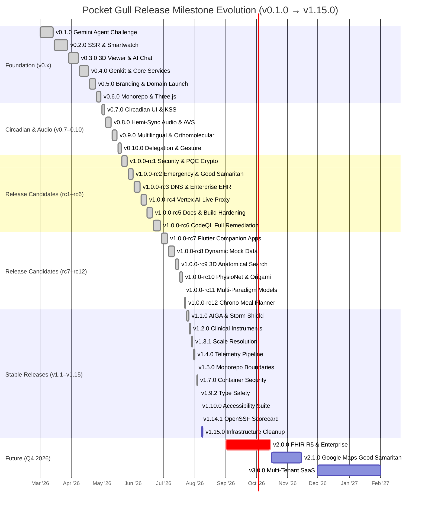
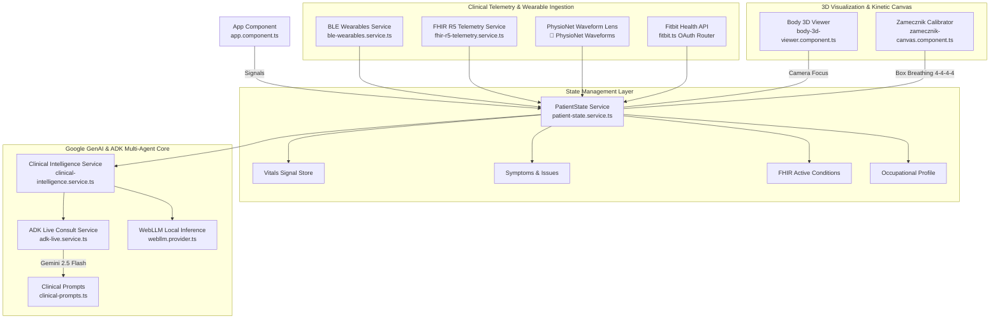

import DocNode from '../components/DocNode.astro';

# Git Roadmap & Clinical Telemetry Matrix

This interactive reference maps Pocket Gull's complete Git release history, component architecture hierarchy, and clinical measurement benchmarks.

---

## Version Evolution Timeline

### Foundation Series (v0.x)

| Version | Milestone | Key Deliverables |
| :--- | :--- | :--- |
| `v0.1.0` | **Initial Release** | Gemini Live Agent Challenge submission |
| `v0.2.0` | **SSR Architecture** | Server-Side Rendering, Smartwatch Optimization, Printable Stationery |
| `v0.3.0` | **Context-Aware AI** | 3D Medical Viewer, DICOM Scans Library, Contextual Chat |
| `v0.4.0` | **Genkit Integration** | Core Medical Services, Genkit AI Flows, SSR Architecture |
| `v0.5.0` | **Origami Branding** | Seagull Branding, `pocketgull.app` Domain Launch, Print Preview |
| `v0.6.0` | **Monorepo & 3D** | Monorepo Env Fallback, Three.js Upgrades, OHIF Viewer |
| `v0.7.0` | **Circadian UI** | Circadian Theming, KSS Sleep Gateway, Philips Hue Sync |
| `v0.8.0` | **Hemi-Sync Audio** | Binaural Audio Engine, Athletic AVS Protocols, Real-Time DSP |
| `v0.9.0` | **Multilingual** | Multilingual Care Plans, Orthomolecular Linus Pauling Profile |
| `v0.10.0` | **Delegation & Gesture** | Secure Delegation Access Codes, Gesture Unlock, Animal Comfort |

### Stable Release Series (v1.x)

| Version | Milestone | Key Deliverables |
| :--- | :--- | :--- |
| `v1.0.0‑rc1` | **Security & PQC** | Post-Quantum Cryptography, Enterprise Connectors |
| `v1.0.0‑rc2` | **Emergency Mode** | Client Barge-In, Good Samaritan Care, Draw-to-Unlock |
| `v1.0.0‑rc3` | **DNS & Enterprise** | Porkbun Automation, EHR Blueprints, Security Hardening |
| `v1.0.0‑rc4` | **Vertex AI Live** | Vertex AI Enterprise Migration, Bidirectional WebSocket Proxy |
| `v1.0.0‑rc5` | **Docs & Build** | Documentation Sync, Build Hardening, Security Patch |
| `v1.0.0‑rc6` | **CodeQL Full Remediation** | Rate Limiting, Safety Filters, Taint Chain Breakage |
| `v1.0.0‑rc7` | **Companion Apps** | Flutter Lint Hardening, Mocked Widget Test Suite |
| `v1.0.0‑rc8` | **Dynamic Mocks** | Dynamic Mock Assessments, Fallback Roster Sync |
| `v1.0.0‑rc9` | **3D Search** | Anatomical Search, Viewport-Contextual CMP Telemetry |
| `v1.0.0‑rc10` | **PhysioNet Lens** | Electrophysiology Waveforms, 7s Origami Unfolding Animation |
| `v1.0.0‑rc11` | **Multi-Paradigm** | Multi-paradigm Data Model Enhancements |
| `v1.0.0‑rc12` | **Chrono Planner** | 7-Day Meal Planner, Micro-Climate Relocation, KSS Expansion |
| `v1.1.0` | **AIGA & Storm Shield** | AIGA Models, Storm Shield, Health Trajectory Storybook |
| `v1.2.0` | **10 Instruments** | Standardized Clinical Assessments, Dynamic 3D Viewport Sync |
| `v1.3.1` | **Scale Resolution** | Scale Bottleneck Resolution, Security Hardening |
| `v1.4.0` | **Telemetry Pipeline** | Refactored Architecture, Telemetry Data Pipeline |
| `v1.5.0` | **Monorepo Boundaries** | Package Boundary Gates, Security Auditing |
| `v1.7.0` | **Container Security** | 5 CVE Fixes, GCP Data Agent Proxy, Flutter Web, Java 21 |
| `v1.9.2` | **Type Safety** | Type Safety Hardening, Test Suite Stabilization |
| `v1.10.0` | **Accessibility (a11y)** | Clinical Inclusiveness & Accessibility (DEI) Suite |
| `v1.14.1` | **OpenSSF Scorecard** | OpenSSF Scorecard Compliance, Refactored Layout Components |
| `v1.15.0` | **Infrastructure** | Package Boundary Gates, Monorepo Infrastructure Cleanup |

---

## Git Release Milestone Evolution (Gantt)

---

## Component Architecture & State Flow

---

## Clinical Measurement & Telemetry Benchmarks

| Measurement Domain | Metric Identifier | Clinical Reference Standard | Normal Range | Unit |
| :--- | :--- | :--- | :--- | :--- |
| **📡 PhysioNet Telemetry** | `qrsDuration` | Electrocardiography (ECG) | `80 – 110` | `ms` |
| **📡 PhysioNet Telemetry** | `qtcFridericia` | Fridericia Corrected QT | `380 – 440` | `ms` |
| **📡 PhysioNet Telemetry** | `stSegmentDev` | ST Elevation / Depression | `-0.05 – +0.05` | `mV` |
| **📡 PhysioNet Telemetry** | `hrvLfHfRatio` | Sympathovagal Balance | `0.8 – 1.5` | `ratio` |
| **📡 PhysioNet Telemetry** | `rmssd` | Parasympathetic Vagal Tone (HRV) | `20 – 75` | `ms` |
| **🧪 CMP Lab Panel** | `troponinI` | High-Sensitivity Cardiac Troponin | `< 0.04` | `ng/mL` |
| **🧪 CMP Lab Panel** | `eGfr` | Glomerular Filtration Rate | `> 90` | `mL/min/1.73m²` |
| **🧪 CMP Lab Panel** | `altAstRatio` | Hepatic Transaminases | `0.8 – 1.2` | `ratio` |
| **🧪 CMP Lab Panel** | `hba1c` | Glycated Hemoglobin | `< 5.7` | `%` |
| **🫁 Somatic Box Breathing** | `boxCycleDuration` | Square Breathing (4-4-4-4) | `16.0` | `seconds` |
| **🚨 Good Samaritan CPR** | `cprCompressionRate` | AHA BLS CPR Metronome | `110 – 120` | `BPM` |
| **📊 Clinical Assessments** | `phq9Score` | PHQ-9 Depression Screening | `0 – 4` | `points` |
| **📊 Clinical Assessments** | `gad7Score` | GAD-7 Anxiety Assessment | `0 – 4` | `points` |
| **📊 Clinical Assessments** | `kssScore` | Karolinska Sleepiness Scale | `1 – 5` | `level` |

---

## Product Roadmap & Future Paradigm Integrations

### 🚀 Q3 – Q4 2026: Real-Time Multimodal Expansion

- [x] **LOINC Assessment Suite**: Standardized clinical scoring (GAD-7, PHQ-9, Y-BOCS, KSS, ISI, C-SSRS)
- [x] **OpenSSF Security 10/10**: SHA-pinned GitHub Actions, automated CodeQL SAST, Dependabot automation
- [x] **Expanded Multi-Lens Paradigms**: Functional Medicine & Chronobiology metrics in `app-analysis-report`
- [x] **Full Multimodal WebRTC Audio Stream**: Sub-200ms latency Gemini 2.5 Live session streaming
- [ ] **Google Maps Good Samaritan Integration**: Nearby AED, ER, and pharmacy geolocation for emergency bypass mode
- [ ] **DICOM AI Annotations**: Gemini Vision-powered radiology annotation overlays

### 🔮 H1 2027: Enterprise & FHIR R5 Telemetry

- [x] **FHIR R5 Resource Store Synchronization**: Bi-directional sync with Google Cloud Healthcare API
- [x] **Wearable Sensor Fusion**: Real-time PPG / ECG waveform processing via BLE Web Bluetooth API
- [x] **Offline PWA Capabilities**: Edge-cached clinical intelligence using WebAssembly & Transformers.js
- [ ] **Multi-Tenant SaaS Architecture**: Organization-scoped patient registries with row-level security
- [ ] **HL7v2 / X12 Gateway**: Legacy EHR integration adapter for hospital information systems
- [ ] **Clinical Decision Support Hooks**: CDS Hooks 2.0 integration for EHR-embedded recommendations

### 🏛️ H2 2027: Research & Regulatory

- [ ] **FDA 21 CFR Part 11 Compliance**: Electronic signatures and audit trail for regulatory submission
- [ ] **IRB Protocol Builder**: Automated Institutional Review Board protocol generation from care plans
- [ ] **AlphaFold Protein Explorer**: Structural biology lens for pharmacogenomic drug-target visualization
