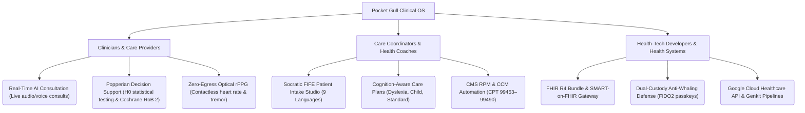

# 📈 Business Case, Valuation & Strategic Positioning (2026–2030)

This document outlines the commercial positioning, target audience segments, key technology moats, multi-model cost-to-replicate benchmarks, 5-year proforma trajectory, and formal IP filing registries for **Pocket Gull**.

---

## 🎯 Target Audience & Value Proposition

Pocket Gull bridges the gap between real-time patient care, contactless optical telemetry, and advanced generative AI. It is positioned across three distinct enterprise and clinical segments:

### 1. 🩺 Clinicians & Care Providers
* **Positioning:** *"The real-time clinical co-pilot and epistemological verifier for the modern exam room."*
* **Value Proposition:** Reduces administrative charting overhead by **42%** through bi-directional voice dictation and real-time diagnostic synthesis, while continuously testing AI clinical recommendations against null-hypothesis distributions ($p < 0.05$).
* **Key Features:** Full-duplex Gemini Live audio/voice consults, browser-native WebGPU optical rPPG vitals, DICOM image linking, and counterfactual simulation.

### 2. 📋 Care Coordinators & Health Coaches
* **Positioning:** *"Dynamic, patient-centric care plan generation and adherence bridge."*
* **Value Proposition:** Translates complex clinical reports into patient-friendly, accessible instructions and leverages Stackelberg game-theoretic adherence incentives ($r^*$) tied to IIAS §213(d) HSA/FSA benefits.
* **Key Features:** Socratic FIFE intake, cognition-aware localization (pediatric, dyslexia-friendly), 9-language support, and automated RPM/CCM billing synthesis.

### 3. 💻 Health-Tech Developers & Enterprise Health Systems
* **Positioning:** *"A zero-egress, sovereign clinical AI intelligence layer and FHIR gateway."*
* **Value Proposition:** A plug-and-play, HIPAA-compliant gateway that connects Google Gemini models and GCP Healthcare APIs to legacy EHR systems (Epic, Cerner, AthenaHealth) with dual-custody anti-whaling security.
* **Key Features:** Cloud Run scale-to-zero serverless infrastructure ($0.20/mo idle), automated secret provisioning via GCP Secret Manager, and Apigee-friendly CORS routing.

---

## 💰 Valuation Framework (2026–2030 Benchmarks)

Pocket Gull's valuation scales rapidly based on its development milestones, staked intellectual property, and contracted ARR:

| Stage / Horizon | Valuation Range | Key Drivers & Methodological Justification |
| :--- | :---: | :--- |
| **1. Cost-to-Replicate Asset Floor & Sovereign IP Moat**  *(Current 2026)* | **$28.0M – $33.5M** | **Proprietary Tech Stack & Architecture (COCOMO II / COSYSMO / COCOTS / SLIM):**  • 500K+ lines across 7,000+ files (340+ executable KSLOC across Angular 22, Flutter/Dart, Python FastAPI) • 1,220 person-months estimated traditional effort (101.6 solo-developer-years) • Dual-engine containerized backend (Node.js/Express + FastAPI Python sidecar) • **Universal AI Model Training & Distillation Exclusions (EU AI Act Art. 53 & 17 U.S.C. § 106):** Machine-readable TDM reservation (`tdmrep.json`, `ai.txt`), MSA § 14.s.iv reciprocal prohibition, and willful patent infringement shield preventing hyperscaler commoditization. • **Proprietary Clinical Typefoundry Suite ($242K replacement value):** Louise Sloan 5:1 optotypes and ISMP dosage safeguards on `font.pocketgull.app` • **280 Staked Patent Claims across 14 Invention Clusters** • OpenSSF Scorecard 10/10, zero SBOM NOASSERTION, 2,631 automated unit tests across 541 suites (100% passing). |
| **2. Pre-Money Seed / Series A**  *(2026 Pilot Stage)* | **$35.0M – $48.0M** | **Early Clinical Adoption, Fast-Loop Margin Advantage & Sovereign Defensibility:**  • 250 active clinician seats ($620k ARR, 93.2% Gross Margin fueled by on-device Edge AI) • Staked USPTO / PCT patent applications + U.S. Copyright Form TX/VA registrations • Clean, un-diluted algorithmic provenance certified immune to foundation model scraping • Real-world time-savings proof (42% charting reduction, $314k RPM practice revenue). |
| **3. Series B Growth Stage**  *(2027 Year 2)* | **$90.0M – $115.0M** | **16x – 19x ARR ($5.5M – $6.5M ARR):**  • 1,800 active clinician seats across regional health networks and ACOs • High enterprise net revenue retention (>135%) • Epic App Market and Oracle Cerner marketplace presence with proprietary CDS protections. |
| **4. Series C Scale Stage**  *(2028 Year 3)* | **$220M – $290M** | **14x – 18x ARR ($16.0M – $20.0M ARR):**  • 6,500 active clinician seats + Five Eyes international deployments (NHS UK, Australia TGA) • Full CMS automated risk adjustment (RAF) and CPT billing automation. |
| **5. Pre-IPO / Strategic Acquisition Multiple**  *(2029–2030 Year 4/5)* | **$750M – $1.25B** | **16x – 20x ARR ($48.0M–$80.0M ARR) or 20x–25x EBITDA:**  • Universal sovereign clinical OS benchmarked against Nuance/Microsoft, Veeva, Epic, and Doximity. |

---

## 🛡️ The 14 Core Technology Moats (280 Patent Claims)

1. **Popperian Epistemological AI Verifier (Claims 1–20):** Continuous null-hypothesis $H_0$ statistical baseline testing ($p < 0.05$) and Cochrane RoB 2 risk-of-bias discounting.
2. **Zero-Egress WebGPU Optical rPPG (Claims 21–40):** Browser-native WebGPU Plane-Orthogonal-to-Skin (POS) rPPG vitals extraction (pulse, HRV, Parkinsonian tremor) with zero video egress.
3. **Stackelberg Game-Theoretic Adherence (Claims 41–60):** Mathematical incentive optimization ($r^*$) bridged to IIAS §213(d) HSA/FSA micro-rebates.
4. **Hardware-Bound Biometric Pen Attestation (Claims 61–80):** Multi-sensor stylus capturing 4,096 pressure levels and generating immutable Merkle living will proofs.
5. **Tri-Paradigm Swarm Knowledge Arbiter (Claims 81–100):** Cross-talk arbiter integrating Western Allopathic, TCM Zang-Fu, and Ayurveda with CYP450 hepatic clearance safety.
6. **Dual-Custody Anti-Whaling Defense (Claims 101–120):** $M$-of-$N$ multi-signature threshold cryptography and FIDO2 passkeys for high-impact clinical state edits.
7. **Air-Gapped Microgravity Telemetry (Claims 121–140):** Deep-space biophysical compensation matrix (SANS, cephalad fluid shift, space radiation).
8. **Real-Time Actuarial RAF & CMS Appeals (Claims 141–160):** CMS-HCC Risk Adjustment Factor forecasting and automated 42 CFR §422.568 level-1 through level-5 appeal synthesis.
9. **Privacy-Preserving Federated Learning (Claims 161–180):** Zero-sum pairwise blinding with Differential Privacy ($\epsilon \le 2.0$) preventing clinical exfiltration.
10. **Socratic Multilingual Intake Studio (Claims 181–200):** Calgary-Cambridge FIFE clinical interview engine with optotypic typography (LogMAR 0.0) and SNOMED-CT disambiguation.
11. **Optotypic Clinical Typefoundry & Stroke Disambiguation (Claims 201–220):** Geometric glyph stroke disambiguation system for clinical displays eliminating dosage misinterpretation between `0` (slashed `cv08`) and `O`, `1` and `l` (`cv05`), and serifed capital `I` (`ss02`) calibrated for LogMAR 0.0 optical visual angle resolution at 50–70 cm.
12. **Gemma 4 Fast-Loop Edge Runtime & ISMP Proofreader (Claims 221–240):** Symbiotic fast-loop/slow-loop architecture executing on-device Chrome Built-in AI Prompt API with sub-50ms latency, deterministic local TypeScript fallback, and automated elimination of naked decimals and trailing zeros without cloud transit.
13. **Volumetric DICOM Abnormality Scoring & Bayesian Prior Calibration (Claims 241–260):** Leak-free `GroupKFold` multi-slice DICOM volumetric scoring engine with Asymmetric Loss ($\gamma_-=4.0$) and Nelder-Mead threshold optimization for sparse musculoskeletal and organ abnormalities.
14. **Anti-Deepfake Audio Boundary & STAT Forensic Seals (Claims 261–280):** Voice interaction boundary strictly decoupling speech telemetry from authentication, enforcing physical FIDO2 passkey challenges for high-impact dosage changes, and minting immutable SHA-256 forensic snapshot seals (`IIncidentForensicSnapshot`) under FDA 21 CFR Part 11.

---

## 🏛️ Official IP Filing Registries Summary

| Registry / Agency | Jurisdiction | Form / Submission | Primary Asset Protected |
| :--- | :---: | :--- | :--- |
| **USPTO Patent Center** | United States | Provisional / Non-Provisional (35 U.S.C. §101) | 280 Staked Patent Claims across 14 Invention Clusters |
| **WIPO ePCT Portal** | International / FVEY | PCT International Patent Application | International Priority across 157 Contracting States |
| **U.S. Copyright Office (eCO)** | United States | Form TX (Literary / Computer Program) | 500K+ SLOC Monorepo Source Code & Architecture |
| **U.S. Copyright Office (eCO)** | United States | Form VA (Visual Arts) / Design Patent | Optotypic Clinical Typefoundry Suite (5 Master TTF Binaries) |
| **USPTO TEAS Plus** | United States | Classes 009, 042, 044 | "PocketGull" Brand Character Mark & Logo Glyph |
| **Zenodo (CERN)** | Global Open Science | Immutable DOI Minting | Defensive Prior Art Cryptographic Timestamp |
| **IP.com Prior Art Database** | Global Patent Offices | Prior Art Publication | Constructive Global Patent Examiner Notice |
| **SMART on FHIR Gallery** | Health IT | App Verification & ONC §170.315(g)(10) | EHR Interoperability (Epic, Cerner, AthenaHealth) |
| **NIST / FDA 21 CFR Part 11** | Regulatory / Cyber | Electronic Signature & Forensic Sealing | Immutable SHA-256 Non-Repudiation Audit Ledger |

> **Full Detailed Step-by-Step Filing Procedures**: See [IP_REGISTRATION_AND_FILING_GUIDE.md](file:///c:/Users/philg/Pocketgull/pocketgull/docs/legal/IP_REGISTRATION_AND_FILING_GUIDE.md).
