# Architecture

Pocket Gull leverages a modern, reactive architecture utilizing [Angular Signals](https://angular.dev/guide/signals "[Google · Angular Team] Reactive state primitives introduced in Angular v16+, replacing zone.js. Signals enable fine-grained reactivity via signal(), computed(), and effect()."), [Cloud Run](https://cloud.google.com/run/docs "[Google Cloud] Fully managed serverless container platform. Automatically scales from zero to thousands of instances. Created by Google Cloud.") orchestration, and the [Google GenAI API](https://ai.google.dev/gemini-api/docs "[Google DeepMind] Client-side JavaScript SDK for accessing Gemini models. Supports streaming, function calling, and multimodal inputs.") stack.

---

## System Diagram

```mermaid
graph TB
    classDef doorway fill:#18181b,stroke:#a855f7,stroke-width:3px,color:#fafafa;
    classDef leftWing fill:#0f172a,stroke:#38bdf8,stroke-width:2px,color:#f8fafc;
    classDef rightWing fill:#0f172a,stroke:#10b981,stroke-width:2px,color:#f8fafc;
    classDef cloudCeiling fill:#0f172a,stroke:#6366f1,stroke-width:2px,color:#f8fafc;
    classDef foundation fill:#0f172a,stroke:#f59e0b,stroke-width:2px,color:#f8fafc;

    %% TOP CEILING: CLOUD & BACKEND RUNTIME
    subgraph CloudCeiling ["⚡ CLOUD CEILING & BACKEND RUNTIME"]
        CloudRun["Google Cloud Run Serverless Service"]
        ExpressProxy["Express.js SSR & Single-Hop Proxy"]
        FastAPISidecar["Python FastAPI Sidecar (ML Risk Scoring)"]
        VertexAI["Vertex AI Enterprise (Gemini 2.5 Flash)"]
    end

    %% LEFT WING: INGESTION & USER PORTALS
    subgraph LeftWing ["📱 LEFT WING — INGESTION & PORTALS"]
        Body3D["Three.js 3D Body Surface & Skeleton Viewer"]
        VoiceSTT["Bi-Directional Voice Assistant & Web Speech API"]
        URLHandoff["Expanded URL State Handoff (?share=...&mode=...)"]
        IntakeForm["Demographics & Vitals Diagnostic Intake"]
    end

    %% CENTER CORE: THE DOORWAY HUB
    subgraph DoorwayHub ["🚪 THE DOORWAY HUB — CENTRAL STATE & AI ORCHESTRATION"]
        PatientState["PatientStateService Signal Store\n(Central Source of Truth)"]
        ADKRunner["@google/adk InMemoryRunner\n(Multi-Agent Orchestrator)"]
        WebMCPCatalog["WebMCP Polyfill & JSON-LD Tool Catalog"]
        CognitiveShield["Cognitive Localization & Shield Filter\n(Grade 4 / Grade 8 / Dyslexia)"]
    end

    %% RIGHT WING: MULTI-PARADIGM LENSES
    subgraph RightWing ["🩺 RIGHT WING — MULTI-PARADIGM LENSES"]
        WesternLens["Western Allopathic Lens\n(Summary, Workup & Monitoring)"]
        TCMLens["Eastern TCM Lens\n(Meridian, Tongue/Pulse & Qi)"]
        AyurvedicLens["Ayurvedic Lens\n(Vata, Pitta, Kapha & Agni)"]
        OrthoLens["Orthomolecular Lens\n(Biomarker & Precision Nutrients)"]
        YBOCsLens["Y-BOCs Diagnostic Screener"]
        CDCSentinel["CDC Sentinel Triage (Levels 1–5)"]
    end

    %% BOTTOM FOUNDATION: STANDARDS & ARCHIVING
    subgraph Foundation ["💾 FOUNDATION — STANDARDS & ARCHIVING"]
        FHIRBundles["FHIR R4 / R5 / R6 / FHIR 7 Bundles"]
        CERNZenodo["CERN Zenodo Open Science (CC0 1.0 + ORCID iD)"]
        IndexedDBCache["Encrypted Offline Browser Cache"]
        PubmedGrounding["NCBI PubMed & Evidence Grounding"]
    end

    %% CONNECTIONS RADIATING FROM & THROUGH THE DOORWAY HUB
    CloudRun --> ExpressProxy
    ExpressProxy <--> FastAPISidecar
    ExpressProxy <--> VertexAI

    Body3D -->|Spatio-Anatomical Signals| PatientState
    VoiceSTT -->|Audio Stream & Transcripts| ADKRunner
    URLHandoff -->|Base64 Payload Restore| PatientState
    IntakeForm -->|Vitals & Symptoms| PatientState

    ExpressProxy <-->|WebSocket & REST| DoorwayHub

    PatientState <--> ADKRunner
    ADKRunner <--> WebMCPCatalog
    PatientState <--> CognitiveShield

    DoorwayHub <--> WesternLens
    DoorwayHub <--> TCMLens
    DoorwayHub <--> AyurvedicLens
    DoorwayHub <--> OrthoLens
    DoorwayHub <--> YBOCsLens
    DoorwayHub <--> CDCSentinel

    PatientState --> FHIRBundles
    FHIRBundles --> CERNZenodo
    PatientState --> IndexedDBCache
    ADKRunner --> PubmedGrounding

    class PatientState,ADKRunner,WebMCPCatalog,CognitiveShield doorway;
    class Body3D,VoiceSTT,URLHandoff,IntakeForm leftWing;
    class WesternLens,TCMLens,AyurvedicLens,OrthoLens,YBOCsLens,CDCSentinel rightWing;
    class CloudRun,ExpressProxy,FastAPISidecar,VertexAI cloudCeiling;
    class FHIRBundles,CERNZenodo,IndexedDBCache,PubmedGrounding foundation;
```

---

## Data Flow

1. **Input** — Clinician enters data via body map interaction, intake forms, or voice dictation ([Web Speech API](https://developer.mozilla.org/en-US/docs/Web/API/Web_Speech_API "[W3C · Web Platform] W3C standard browser API for speech recognition and synthesis. No external dependencies. Supported in Chrome, Edge, and Safari.")).
2. **State** — All inputs flow into the centralized `PatientState` service, which uses [Angular Signals](https://angular.dev/guide/signals "[Google · Angular Team] Fine-grained reactive primitives. signal() creates writable state, computed() derives values, effect() triggers side-effects. Powers all UI reactivity in Pocket Gull.") for granular reactivity.
3. **Analysis** — The Analysis component reads state and invokes the [ADK `InMemoryRunner`](https://google.github.io/adk-docs/ "[Google · Agent Development Kit] Google's open-source framework for building multi-agent AI systems. InMemoryRunner manages agent lifecycle, tool calls, and LLM orchestration in-process."), which orchestrates specialized [`LlmAgent`](https://google.github.io/adk-docs/agents/ "[Google · Agent Development Kit] Core agent class from @google/adk. Configured with a model, system prompt, and optional tools. Each instance focuses on one diagnostic lens.") experts.
4. **Generation** — Each agent streams requests through the Express `/ws/gemini-live` WebSocket proxy (for live audio) or HTTPS REST (for completions) to [Vertex AI Enterprise](https://cloud.google.com/vertex-ai "[Google Cloud] Google Cloud's enterprise-grade AI platform. Provides regional endpoints, IAM-based authentication (ADC), custom safety thresholds, and SLA-backed infrastructure."), which hosts `gemini-2.5-flash` and streams structured JSON chunks back through the runner.
5. **Output** — Streamed chunks are rendered in real-time as a Care Plan organized by diagnostic lens.
6. **Persistence** — Patient state is saved to local session storage with visual "Saving…/Saved ✔" indicators.
7. **Export** — Data is exportable as [FHIR R4 Bundles](https://hl7.org/fhir/R4/ "[HL7 International] Fast Healthcare Interoperability Resources Release 4 — the current standard for electronic health data exchange. Defines resource types like Patient, Condition, and Observation.") (Base64 JSON) or printable PDF stationery.

---

## Technology Stack

| Layer | Technology | Purpose |
|---|---|---|
| **Framework** | [Angular v21.2](https://angular.dev "[Google · Angular Team] Component-based web framework by Google. v21.2 features Signals, Zoneless mode, and SSR with hydration.") (Signals, Zoneless) + SSR | Ultra-reactive UI, minimal change-detection overhead |
| **Visualization** | [Three.js v0.183](https://threejs.org/docs/ "[Ricardo Cabello (mrdoob)] JavaScript 3D library built on WebGL. Created by Ricardo Cabello (mrdoob). Used for procedural skeletal and surface anatomy with particle systems.") | Real-time 3D anatomical modeling |
| **Intelligence** | [Vertex AI Enterprise](https://cloud.google.com/vertex-ai "[Google Cloud] Enterprise AI platform with regional endpoints, IAM/ADC authentication, and custom safety thresholds. Hosts gemini-2.5-flash for Pocket Gull.") + [`@google/adk`](https://google.github.io/adk-docs/ "[Google · Agent Development Kit] Multi-agent orchestration framework. Supports LlmAgent, SequentialAgent, LoopAgent patterns with built-in tool management.") | LLM inference (enterprise) + multi-agent orchestration |
| **Research** | [Google CSE](https://programmablesearchengine.google.com/ "[Google] Google Programmable Search Engine — a customizable search engine for specific domains. Pocket Gull uses it for differential diagnostic info."), [NIH PubMed E-utilities](https://www.ncbi.nlm.nih.gov/books/NBK25501/ "[NIH · NLM] NCBI's programmatic interface to PubMed. Returns XML metadata for peer-reviewed biomedical literature. Created by the National Library of Medicine.") | Evidence-based clinical augmentation |
| **Export** | [jsPDF](https://github.com/parallax/jsPDF "[James Hall · Parallax] Client-side PDF generation library. Used for printable clinical stationery and cognition/child export modes."), [FHIR Bundle standard](https://hl7.org/fhir/R4/bundle.html "[HL7 International] A container resource that groups related FHIR resources for atomic transfer. Pocket Gull generates Bundle resources containing Patient, Condition, and Observation entries.") | Clinically-compliant data portability |
| **Styling** | [Tailwind CSS](https://tailwindcss.com/docs "[Tailwind Labs (Adam Wathan)] Utility-first CSS framework by Adam Wathan and Tailwind Labs. Pocket Gull extends it with custom Dieter Rams design tokens.") + Dieter Rams design tokens | Consistent, performance-first UI |
| **Speech** | [Web Speech API](https://developer.mozilla.org/en-US/docs/Web/API/Web_Speech_API "[W3C · Web Platform] Bi-directional speech recognition and synthesis standard. Chrome implementation by Google.") | Bi-directional voice interaction |
| **Hosting** | [Cloud Run](https://cloud.google.com/run/docs "[Google Cloud] Serverless container platform with auto-scaling. Pocket Gull deploys as a Docker container serving Express.js + Angular SSR.") + [Express.js](https://expressjs.com/ "[OpenJS Foundation] Minimal web framework for Node.js. Created by TJ Holowaychuk, now maintained by the OpenJS Foundation. Powers the SSR backend and API proxy.") | Serverless, auto-scaling, zero-ops |

---

## Service Orchestration & Multi-Agent Parallelism

Pocket Gull coordinates complex clinical synthesis through a structured, multi-agent orchestration layer designed for low-latency feedback and clinical modularity:

### 1. Parallel Lens Generation
Rather than relying on a single, monolithic LLM request, the `ClinicalIntelligenceService` partitions the Care Plan into six independent clinical dimensions (lenses). These lenses are processed concurrently in the background using `Promise.allSettled()` orchestration:
* **Summary Overview** — Unified clinical assessment, urgency priority list, and measurable timeline goals.
* **Functional Protocols** — Biochemical pathway targets, precision molecule dosing matrices, and HPA axis/circadian guidelines.
* **Nutrition** — Micronutrient deficiency correction, cellular oxidative stress, and whole-food adjustments.
* **Orthomolecular Profiling** — Methylation blocks, heavy metal depletions, and structured JSON biomarker output mapping.
* **Monitoring & Follow-up** — Time-horizon next steps, tracking parameters, and threshold escalation triggers.
* **Patient Education** — Empathetic, de-identified plain-language translations of all recommended strategies.

### 2. Avian Agent Personas
Each clinical lens is orchestrated by a dedicated specialist agent from the *Gull Squadron* with customized prompt boundaries:
* `Gulliver` (Summary Overview) — Synthesis and big-picture overview lead.
* `Swoop` (Functional Protocols, Nutrition, Orthomolecular Profiling) — Precision pathway and dosing specialist.
* `Sentinel` (Monitoring & Follow-up) — Care coordination and vigilance monitor.
* `Scribes` (Patient Education) — Patient-facing plain language translation specialist.

### 3. Dynamic Prompt Compounding
The system compiles system instructions dynamically at runtime by stitching together several layers:
1. **Agent Identity** — Persona role, voice, and diagnostic boundaries.
2. **Clinical Paradigm** — Standard Western guidelines, Eastern (Zang-Fu, 8 Principles, acupoints, pulse), or Ayurvedic (Dosha constitutions, Agni/Ama metabolism, Dhatu tissue mapping) paradigms.
3. **ORCID Research Integration** — Dynamically appends the clinician's publications and research keywords to align AI insights with the practitioner's scholarly background.
4. **Formatting Constraints** — Strict Markdown layouts, citation parameters, and HIPAA de-identification masks.

### 4. Real-time Reactive Streaming
Each parallel agent execution maps directly to a chunked generator stream (`generateReportStream$`). Chunks are consumed as they arrive from Vertex AI and immediately update the respective Angular Signals. This drives fine-grained UI updates card-by-card in real-time, keeping the interface responsive and alive.

---

## Key Infrastructure Files

| File | Responsibility |
|---|---|
| `server.js` | Express.js backend — SSR, PubMed proxy, CSE static serve, WebSocket live proxy, rate limiting |
| `src/services/clinical-intelligence.service.ts` | ADK runner configuration, agent orchestration |
| `src/services/ai/gemini.provider.ts` | Vertex AI Enterprise provider — ADC token resolution, regional endpoints |
| `src/services/ai/adk-live.service.ts` | Bidirectional live audio streaming via `/ws/gemini-live` proxy |
| `src/services/patient-state.service.ts` | Centralized Signals-based state management |
| `src/app.component.ts` | Root layout, MCP tool registration, panel management |
| `scripts/deploy.sh` | Automated Cloud Run deployment script |
| `Dockerfile` | Container build configuration |

---

## 📜 Architecture Evolution Timeline

- **v1.2.0 (2026-07-22)**: 10 Standardized Clinical & Life Sovereignty Assessment Suite (`ClinicalAssessmentsSuiteComponent`), Dynamic 3D Paradigm Viewport Synchronization (`body-viewer.component.ts` & `body-3d-viewer.component.ts`), and Rice Papercraft design system.
- **v1.1.0 (2026-07-21)**: AIGA 2025/2026 Model Augmentation & Telemetry Lens (`aiga-telemetry-lens.component.ts`), Physiological Storm De-escalation Shield (`storm-analysis.component.ts`), and WHO ICD-11 Cross-Border Emergency Health Passport (`cross-border-health-wallet.service.ts`).
- **v1.0.0-rc10 (2026-07-21)**: PhysioNet 2026 Waveform Lens (`clinical-intelligence.service.ts`) & 7-second papercraft origami splash animation (`secure-splash.component.ts`).
- **v0.6.0 (2026-05-17)**: Three.js r183 `THREE.Timer` migration & monorepo `.env.local` fallback resolution.
- **v0.5.0 (2026-03-16)**: Initial Cloud Run serverless deployment, Express.js SSR, and custom domain mapping (`pocketgull.app`).
