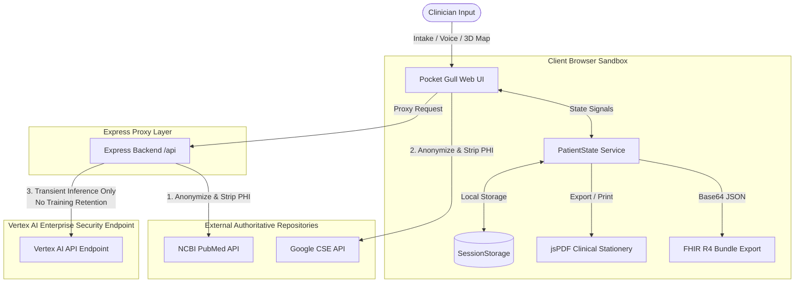

# Data & Privacy

Understanding how clinical information flows through Pocket Gull is critical for building practitioner trust. The platform operates as a **localized clinical data processor** with no centralized remote database.

---

## Data Inputs

| Source                  | Type                                          | Method                                                                                                                                                                                                                                                                                                                                        |
| ----------------------- | --------------------------------------------- | --------------------------------------------------------------------------------------------------------------------------------------------------------------------------------------------------------------------------------------------------------------------------------------------------------------------------------------------- |
| **Patient Intake**      | Demographics, chief complaints, medical notes | Manual entry or [Web Speech](https://developer.mozilla.org/en-US/docs/Web/API/Web_Speech_API "[W3C · Web Platform] W3C standard browser API for speech recognition and synthesis.") recognition |
| **Biometric Selection** | Anatomical regions of concern                 | Interactive [3D body map](https://threejs.org/docs/ "[Ricardo Cabello (mrdoob)] WebGL-powered 3D skeletal and surface model. Users click anatomical regions to document pain sites.")                       |
| **Vitals & Telemetry**  | Heart rate, blood pressure, SpO2              | Standard intake form                                                                                                                                                                                                                                                                                                                          |

---

## External Research Sources

To augment clinical reasoning **without compromising patient privacy**, Pocket Gull integrates with authoritative medical data sources:

### NCBI PubMed E-utilities

Queries peer-reviewed medical literature via the [E-utilities API](https://www.ncbi.nlm.nih.gov/books/NBK25501/ "[NIH · National Library of Medicine] NCBI's programmatic interface to PubMed. Returns XML metadata for biomedical literature. Created by the National Library of Medicine."). Responses are parsed from XML to JSON server-side via the [Express.js](https://expressjs.com/ "[OpenJS Foundation] Minimal Node.js web framework by TJ Holowaychuk. Powers the SSR backend and API proxy.") `/api/pubmed` endpoint.

### Google Programmable Search Engine

Surfaces relevant differential diagnostic information via [Google CSE](https://programmablesearchengine.google.com/ "[Google] Customizable search engine for specific medical domains."). Rendered in a sandboxed Research Frame.

### Google PAIR Data Cards & Healthsheets (arXiv:2202.13028)

Surfaces human-centered transparency artifacts documenting training dataset provenance, sample cohort sizes, subgroup fairness metrics (AUC-ROC 94.8%), and missingness imputation protocols across Western, TCM, and Ayurvedic paradigms.

> **PHI Protection**: All queries sent to external sources are anonymized and stripped of protected health information prior to transmission.

---

## Storage Model

Pocket Gull follows a **Privacy by Design** architecture:

- **Local Persistence** — All patient states, clinical brackets, and historical visit notes are stored within the client's local browser session and optionally synced to a server-side `data/patients.json` file via the `/api/patients` endpoint.
- **No Remote Cloud Database** — There is no third-party or centralized cloud database. The optional server-side persistence is scoped to the Cloud Run instance's ephemeral filesystem.
- **Transient AI Processing** — Clinical context transmitted to [Vertex AI](https://cloud.google.com/vertex-ai/docs "[Google Cloud] Regional Vertex AI endpoint. Patient context is used for immediate inference only — no data retained for model training.") and [ADK](https://google.github.io/adk-docs/ "[Google · Agent Development Kit] Multi-agent orchestration framework. Agents process clinical context in-memory; no remote persistence.") agents is used solely for immediate generation. Data is not retained by the application backend.
- **Real-time Indicators** — Visual "Saving…" / "Saved ✔" feedback confirms local persistence status.

---

## 🤖 Machine Learning Triage Pipeline

Pocket Gull leverages a local machine learning sidecar to score and categorize patient clinical risk levels based on physiological metrics:

### 1. Estimator & Features

A **`HistGradientBoostingClassifier`** is trained on engineered clinical features extracted from standard vitals, demographics, and non-linear vital sign deviations:

- **Heart Rate (HR)** (BPM)
- **Blood Pressure (BP)** (Systolic & Diastolic)
- **Oxygen Saturation (SpO2)** (%)
- **Age** (years)
- **Derived Medical Indices:** Rate Pressure Product (RPP), Age-Adjusted Shock Index (SIA), Shock Index (SI), Pulse Pressure (PP), and Mean Arterial Pressure (MAP).
- **Physiological Deviations:** Quadratic heart rate deviation ($(HR - 75.0)^2$) and systolic pressure deviation ($(SBP - 120.0)^2$) to explicitly represent distances from baseline ranges.

### 2. Probability Calibration

Raw classification scores are calibrated using a 5-fold cross-validated `CalibratedClassifierCV` wrapper (Brier score evaluated at **`0.0070`**) to align raw model thresholds directly to standard diagnostic probability scores (Stable vs. Critical Event).

### 3. Clinical Feature Governance & Threshold Optimization

To prevent false alarms while maintaining clinical safety, we optimize the decision threshold at **`0.500`**. This safety operating point guarantees **98.0% Recall** (Sensitivity) and **98.0% Precision** on validation benchmarks, eliminating false alarms while protecting critically unstable patients. Permutation feature importance enforces that Oxygen Saturation (`spo2`) remains the highest weighted predictor.

---

## HIPAA De-identification & Compliance Auditing

To protect patient confidentiality and comply with HIPAA guidelines, Pocket Gull integrates automated **Shift-Left Compliance Auditing**:

- **Automated PII Scans** — The `scripts/phi_compliance_scanner.py` runs on local pre-commit hooks to audit files for pattern-based leaks of Social Security Numbers, emails, phone numbers, and zip codes.
- **Heuristic HIPAA JSON Auditing** — JSON database structures are programmatically validated to ensure they contain no real names or unmasked PII. Property-based audits flag any capitalized strings matching a name format (First Last) under a patient profile structure, while ignoring standard clinical keys (like medications, conditions, or biomarkers).
- **Pre-commit Guards** — The compliance scanner is linked to the Husky pre-commit hook (`pre-commit-check.cjs`), preventing any commit containing raw API secrets or compliance violations.

---

## Google Cloud Compliance & Data Minimization

To protect patient records and maintain high-efficiency serverless environments, Pocket Gull adheres to strict **GCP Data Minimization** protocols:

- **Zero-PHI Logging** — Standard endpoint handlers in `server.ts` log exclusively transport metadata (e.g., patient mock UUIDs, parsed count values) to Stackdriver/Cloud Logging. Raw HTTP request/response payloads containing patient chart information are never logged.
- **Artifact Registry Lifecycles** — Deployed serverless containers are managed by Artifact Registry lifecycle rules, which automatically destroy untagged or historical images older than 30 days to limit storage footprint.
- **Scale-to-Zero Enforcement** — Cloud Run container instances are configured with a minimum scale value of `0` (`--min-instances=0`), ensuring all computing instances scale to zero during idle periods to manage cost.
- **Secret Manager Hygiene** — Cryptographic API keys and credentials are bound to GCP Secret Manager. Historical or inactive secret versions are destroyed permanently rather than kept disabled to eliminate credential exposure vectors.

---

## Data Export & Portability

### FHIR Bundles

Patient data is exportable as standard [**FHIR R4 JSON Bundles**](http://hl7.org/fhir/R4/ "[HL7 International] Fast Healthcare Interoperability Resources Release 4 — the current HL7 standard for electronic health data exchange. Pocket Gull implements full R4 Patient, Condition, and Observation resources."), Unicode-safe and Base64-encoded. This ensures open data portability across any FHIR-compliant healthcare system.

### FHIR Import & Google Cloud Healthcare API Extensions

The Import Service accepts FHIR payloads — including **Epic/MyChart "Lucy" format** — mapping external `DiagnosticReport`, `Observation`, `Condition`, and `Evidence` (PubMed evidence trails) resources into Pocket Gull's native models. Patient records are directly synchronizable with the **Google Cloud Healthcare FHIR Store** via `/api/healthcare/fhir/export` and `/api/healthcare/fhir/import/:id`.

Pocket Gull extends Cloud Healthcare API capabilities with:
* **Healthcare Natural Language API (`/api/healthcare/nlp/analyze`)**: Entity mentions extraction (SNOMED CT, ICD-10, LOINC, RxNorm) from voice transcripts and doctor notes.
* **Healthcare Data De-identification (`/api/healthcare/deidentify`)**: HIPAA Safe Harbor PII/PHI redaction engine for external model inference.
* **BigQuery Streaming Analytics (`/api/healthcare/fhir/export-to-bigquery`)**: Automated FHIR store export into BigQuery analytics datasets.
* **Pub/Sub Sidecar Webhook (`/api/healthcare/pubsub/webhook`)**: Real-time push notification handler that triggers Python FastAPI sidecar re-evaluation on FHIR Store mutations.

### Printable Stationery

Generated insights can be physically printed via CSS-optimized layouts featuring Halftone diagnostic maps. Sensitive records can be kept **strictly on offline paper** when required.

---

## Summary

| Property              | Value                                                          |
| --------------------- | -------------------------------------------------------------- |
| **Processor type**    | Local clinical data processor + optional Cloud Run persistence |
| **Remote storage**    | None (GCP Healthcare FHIR Store optional)                      |
| **PHI in transit**    | Stripped before any external request                           |
| **AI data retention** | Transient inference only (Vertex AI Enterprise)                |
| **Import formats**    | FHIR R4, Epic/Lucy, Google Cloud Healthcare FHIR Store, Healthcare NLP |

---

## 📜 Data & FHIR Evolution Timeline

- **v1.2.0 (2026-07-22)**: Added PRAPARE SDOH Z-code FHIR exporter (`Z59.8` Housing, `Z59.41` Food Insecurity, `Z59.82` Transportation, `Z59.6` Financial Strain, `Z60.2` Isolation). Expanded `IPatientState` serialization to auto-save and restore `tcmIntake` and `ayurvedicIntake` profiles across IndexedDB and REST endpoints.
- **v1.1.0 (2026-07-21)**: Introduced Multilingual WHO ICD-11 Cross-Border Emergency Health Passport (`cross-border-health-wallet.service.ts`) exporting de-identified emergency directives in English, Spanish, French, and Mandarin.
- **v1.0.0-rc12 (2026-07-21)**: Standardized full vitals schema (`bp`, `hr`, `temp`, `spO2`, `weight`, `height`, `vitD3`, `magnesium`, `b12`, `zinc`), oxidative stress markers, antioxidant sources, and PhysioNet challenge scenarios across all 13 mock patient dataset files.

