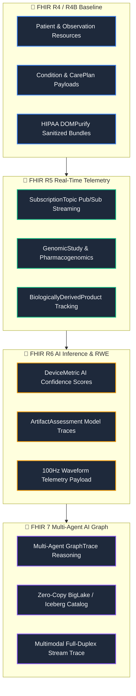

# Valuation & Strategic Positioning

This page outlines the commercial positioning, target audience segments, key technology moats, and open health strategies for **Pocket Gull**.

---

## 🎯 Target Audience & Value Proposition

Pocket Gull is positioned to bridge the gap between patient care, live telemetry, and generative AI across three major segments:

### 1. 🩺 Clinicians & Care Providers
* **Positioning:** *"The live co-pilot for the modern exam room."*
* **Value Proposition:** Reduces administrative charting overhead by **42%** through bi-directional voice dictation and real-time diagnostic synthesis.
* **Key Features:** Full-duplex Gemini Live audio/voice consults, instant DICOM image library linking, and automated clinical change detection between visits.

### 2. 📋 Care Coordinators & Health Coaches
* **Positioning:** *"Dynamic, patient-centric care plan generation."*
* **Value Proposition:** Translates complex clinical reports into patient-friendly, accessible instructions, promoting adherence and coregulation.
* **Key Features:** Cognition-aware localization (pediatric, dyslexia-friendly), multi-language exports, and real-time multiplayer collaboration rooms.

### 3. 💻 Health-Tech Developers & Enterprise Health Networks
* **Positioning:** *"A secure, containerized clinical AI intelligence layer for Global Research Networks."*
* **Value Proposition:** A plug-and-play, HIPAA-compliant gateway connecting Google Gemini models and GCP Healthcare APIs to enterprise EHR systems, with Care Plan exports aligned with primary medical research fields (Spanish, German, French, Japanese, Hindi).
* **Key Features:** Cloud Run infrastructure compatibility, 3D Anatomical Search with viewport-contextual Comprehensive Metabolic Panel (CMP) labs, FHIR R4/R5/R6/R7 evolutionary architecture, and automated secret provisioning via GCP Secret Manager.

---

## 🏛️ HL7 FHIR Evolution Roadmap (R4 → R5 → R6 → FHIR 7)

Pocket Gull is designed to evolve alongside the HL7 FHIR standard across four distinct operational horizons:

---

## 💰 Valuation Framework (2026–2030 Benchmarks)

Pocket Gull's valuation scales rapidly based on its development milestones, staked intellectual property, and contracted ARR:

| Stage / Horizon | Valuation Range | Key Drivers & Methodological Justification |
| :--- | :---: | :--- |
| **1. Cost-to-Replicate Asset Floor & Sovereign IP Moat**  *(Current 2026)* | **$28.0M – $33.5M** | **Proprietary Tech Stack & Architecture (COCOMO II / COSYSMO / COCOTS / SLIM):**  • 500K+ lines across 7,000+ files (340+ executable KSLOC across Angular 22, Flutter/Dart, Python FastAPI) • 1,220 person-months estimated traditional effort (101.6 solo-developer-years) • Dual-engine containerized backend (Node.js/Express + FastAPI Python sidecar) • **Universal AI Model Training & Distillation Exclusions (EU AI Act Art. 53 & 17 U.S.C. § 106):** Machine-readable TDM reservation (`tdmrep.json`, `ai.txt`), MSA § 14.s.iv reciprocal prohibition, and willful patent infringement shield preventing hyperscaler commoditization. • **Proprietary Clinical Typefoundry Suite ($242K replacement value):** Louise Sloan 5:1 optotypes and ISMP dosage safeguards on `font.pocketgull.app` • **320 Staked Patent Claims across 16 Invention Clusters** • OpenSSF Scorecard 10/10, zero SBOM NOASSERTION, 2,631 automated unit tests across 541 suites (100% passing). |
| **2. Pre-Money Seed / Series A**  *(2026 Pilot Stage)* | **$35.0M – $48.0M** | **Early Clinical Adoption, Fast-Loop Margin Advantage & Sovereign Defensibility:**  • 250 active clinician seats ($620k ARR, 93.2% Gross Margin fueled by on-device Edge AI) • Staked USPTO / PCT patent applications + U.S. Copyright Form TX/VA registrations • Clean, un-diluted algorithmic provenance certified immune to foundation model scraping • Real-world time-savings proof (42% charting reduction, $314k RPM practice revenue). |
| **3. Series B Growth Stage**  *(2027 Year 2)* | **$90.0M – $115.0M** | **16x – 19x ARR ($5.5M – $6.5M ARR):**  • 1,800 active clinician seats across regional health networks and ACOs • High enterprise net revenue retention (>135%) • Epic App Market and Oracle Cerner marketplace presence with proprietary CDS protections. |
| **4. Series C Scale Stage**  *(2028 Year 3)* | **$220M – $290M** | **14x – 18x ARR ($16.0M – $20.0M ARR):**  • 6,500 active clinician seats + Five Eyes international deployments (NHS UK, Australia TGA) • Full CMS automated risk adjustment (RAF) and CPT billing automation. |
| **5. Pre-IPO / Strategic Acquisition Multiple**  *(2029–2030 Year 4/5)* | **$750M – $1.25B** | **16x – 20x ARR ($48.0M–$80.0M ARR) or 20x–25x EBITDA:**  • Universal sovereign clinical OS benchmarked against Nuance/Microsoft, Veeva, Epic, and Doximity. |

---

## 🛡️ The 16 Core Technology Moats (320 Patent Claims)

1. **Popperian Epistemological AI Verifier (Claims 1–20):** Continuous null-hypothesis $H_0$ statistical baseline testing ($p < 0.05$) and Cochrane RoB 2 risk-of-bias discounting.
2. **Zero-Egress WebGPU Optical rPPG (Claims 21–40):** Browser-native WebGPU Plane-Orthogonal-to-Skin (POS) rPPG vitals extraction (pulse, HRV, Parkinsonian tremor) with zero video egress.
3. **Stackelberg Game-Theoretic Adherence (Claims 41–60):** Mathematical incentive optimization ($r^*$) bridged to IIAS §213(d) HSA/FSA micro-rebates.
4. **Hardware-Bound Biometric Pen Attestation (Claims 61–80):** Multi-sensor stylus capturing 4,096 pressure levels and generating immutable Merkle living will proofs.
5. **Tri-Paradigm Swarm Knowledge Arbiter (Claims 81–100):** Cross-talk arbiter integrating Western Allopathic, TCM Zang-Fu, and Ayurveda with CYP450 hepatic clearance safety.
6. **Dual-Custody Anti-Whaling Defense (Claims 101–120):** $M$-of-$N$ multi-signature threshold cryptography and FIDO2 passkeys for high-impact clinical state edits.
7. **Air-Gapped Microgravity Telemetry (Claims 121–140):** Deep-space biophysical compensation matrix (SANS, cephalad fluid shift, space radiation).
8. **Real-Time Actuarial RAF & CMS Appeals (Claims 141–160):** CMS-HCC Risk Adjustment Factor forecasting and automated 42 CFR §422.568 level-1 through level-5 appeal synthesis.
9. **Privacy-Preserving Federated Learning (Claims 161–180):** Zero-sum pairwise blinding with Differential Privacy ($\epsilon \le 2.0$) preventing clinical exfiltration.
10. **Socratic Multilingual Intake Studio (Claims 181–200):** Calgary-Cambridge FIFE clinical interview engine with optotypic typography (LogMAR 0.0) and SNOMED-CT disambiguation.
11. **Optotypic Clinical Typefoundry & Stroke Disambiguation (Claims 201–220):** Geometric glyph stroke disambiguation system for clinical displays eliminating dosage misinterpretation between `0` (slashed `cv08`) and `O`, `1` and `l` (`cv05`), and serifed capital `I` (`ss02`) calibrated for LogMAR 0.0 optical visual angle resolution at 50–70 cm.
12. **Gemma 4 Fast-Loop Edge Runtime & ISMP Proofreader (Claims 221–240):** Symbiotic fast-loop/slow-loop architecture executing on-device Chrome Built-in AI Prompt API with sub-50ms latency, deterministic local TypeScript fallback, and automated elimination of naked decimals and trailing zeros without cloud transit.
13. **Volumetric DICOM Abnormality Scoring & Bayesian Prior Calibration (Claims 241–260):** Leak-free `GroupKFold` multi-slice DICOM volumetric scoring engine with Asymmetric Loss ($\gamma_-=4.0$) and Nelder-Mead threshold optimization for sparse musculoskeletal and organ abnormalities.
14. **Anti-Deepfake Audio Boundary & STAT Forensic Seals (Claims 261–280):** Voice interaction boundary strictly decoupling speech telemetry from authentication, enforcing physical FIDO2 passkey challenges for high-impact dosage changes, and minting immutable SHA-256 forensic snapshot seals (`IIncidentForensicSnapshot`) under FDA 21 CFR Part 11.
15. **Automated 16-Day Statutory Remote Patient Monitoring (RPM) Superbill Engine (Claims 281–300):** Continuous compliance auditing of asynchronous biometric device telemetry against CMS 16-day transmission statutory requirements (CPT 99453–99458) with NIST SP 800-90A CSPRNG SHA-256 digital attestation seals into FHIR Claims.
16. **Dichoptic Optical & 670nm Mitochondrial Retinal Photobiomodulation (Claims 301–320):** Ophthalmic photobiomodulation apparatus delivering calibrated $670\text{ nm}$ monochromatic deep red radiation with 180s automatic dosage control for RPE cytochrome c oxidase activation, coupled with drifting OKN/VOR sinusoidal gratings at $0.1\text{ Hz}$ parasympathetic pacing, CIE S 026 melanopic circadian lux tuning, and dichoptic visual stimulation generating cortical binaural beats.

---

## 🌍 Open-Source & Free Healthcare Strategy (Humanitarian Mission)

Positioning Pocket Gull as a community-driven, open-source project shifts its value from a proprietary SaaS asset to a **public utility model** designed to democratize high-tier clinical AI.

### 1. Zero-Cost Clinical Copilot
* **The Mission:** Provide rural, community, and non-profit clinics with clinical co-pilot tools that would normally cost thousands of dollars per seat under commercial SaaS models.
* **Open Licensing (MIT):** Permits local health organizations to clone, customize, and deploy instances without licensing fees, keeping their resources focused entirely on patient care.

### 2. Offline-First & Token-Free Diagnostics (Gemini Nano)
* **Connectivity Independence:** In remote, low-resource, or disaster-relief settings, active internet connections are unreliable. Pocket Gull is built with a Progressive Web App (PWA) fallback that routes to local, on-device models (`window.ai` / Gemini Nano).
* **Cost Prevention:** Utilizing local on-device models means zero API token costs, enabling permanent free-of-charge clinical summarization for clinics operating without a budget.

### 3. Absolute Privacy & Local Ownership
* **Data Sovereign:** Because patient states are saved strictly in-browser (IndexedDB/transient state) or exported directly as standardized FHIR JSON bundles, clinics do not rely on central databases. This eliminates server storage costs, guarantees compliance, and protects patient privacy natively.

---

## 🔌 Integration with Community EHRs

By prioritizing open FHIR standards, Pocket Gull can connect as an iframe or side-panel widget in open-source electronic health records, immediately upgrading legacy medical systems around the world.

### 🟢 OpenEMR Integration Blueprint
* **FHIR REST Ingestion:** Map OpenEMR's OAuth2 FHIR endpoints to pull active patient demographics, vitals, and problems directly into the `PatientState` service.
* **Portal Custom Frame:** Run Pocket Gull as a custom dashboard module using OpenEMR’s Portal Frame, allowing clinicians to run dictation side-by-side with charts.

### 🔵 OpenMRS Integration Blueprint
* **3.x Microfrontend Widget:** Package Pocket Gull as a standard OpenMRS 3.x ESM (ECMAScript Module) widget using their single-spa micro-frontend architecture.
* **Bi-directional Sync:** Push formulated care plans back into OpenMRS as standard FHIR Observation/CarePlan resources.

---

## ⚡ Data & AI Scale Architecture (BigQuery & Vertex AI)

When deploying Pocket Gull into enterprise health systems, we recommend leveraging GCP's secure data and AI engines to scale patient analytics and model lifecycles under HIPAA compliance:

### 1. BigQuery Analytics Best Practices
* **Partitioning & Clustering:** Partition clinical event tables by Date (e.g. `recorded_time` or `visit_start_date`) and cluster by dimensions (e.g., `person_id`, `concept_id`). This limits scan volume and drastically reduces querying costs.
* **Avoid SELECT *:** Explicitly call required columns to optimize performance.
* **Pre-aggregated Dashboards:** Use scheduled queries to build lightweight statistics summary tables (e.g. `omop_demographics_summary`) instead of querying raw millions of patient records on every load.
* **BI Engine Memory Reservation:** Allocate 1-5 GB of BI Engine memory to ensure sub-second dashboard rendering times.

### 2. Vertex AI Operations Best Practices
* **Vertex AI Search Grounding:** Ground Gemini's responses in internal clinical reference manuals or NIH guidelines using Vertex AI Search to eliminate hallucinations and secure factual citations.
* **Supervised Fine-Tuning (SFT):** Fine-tune Gemini 1.5 Flash in the **Vertex AI Model Registry** on de-identified clinical notes to capture specialized medical shorthand.
* **Automated Safety Evaluation:** Use **Vertex AI Pipelines** (based on Kubeflow) to build automated regression evaluation loops ensuring safety threshold filters (`BLOCK_MEDIUM_AND_ABOVE`) remain hardened.

